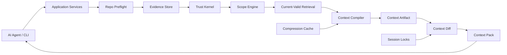

# Grape

Grape is a local-first incremental context compiler for AI coding agents.

It helps agents stop rereading the same repository context by compiling safe, current, task-specific context artifacts and returning only the context delta an agent needs next.

Grape is not another coding assistant. It is context infrastructure for coding agents.

## Status

Grape is in V1 implementation-preparation mode.

The public documentation architecture is being established before production code begins. The project is not ready for production use yet.

What exists today:

- committed V1 implementation contract in `docs/v1/SPEC.md`
- documentation architecture and implementation guardrails
- state machine, trust, artifact, diff, compression, storage, security, test, and benchmark standards

What does not exist yet:

- published package
- working CLI
- MCP server
- production storage schema
- benchmark harness

## Why Grape

AI coding agents repeatedly spend context window and tool calls rediscovering:

- repository structure
- active project rules
- branch and worktree state
- relevant code, tests, and config
- prior decisions and failures
- context already sent earlier in the same agent session
- stale or invalid assumptions that should not be reused

Traditional retrieval can find related text. Grape is designed to compile a safe, dependency-tracked context artifact and then diff it against what the agent has already seen.

The goal is token savings without hiding uncertainty, stale evidence, or safety-critical constraints.

## What Grape Does

Grape V1 is designed to:

- create branch-aware repo and worktree snapshots
- store raw evidence separately from trusted claims
- require proof before durable claims are persisted
- resolve scope before current-valid retrieval
- compile task-specific context artifacts
- track sent context per agent session
- resend pinned safety-critical context
- invalidate stale claims, proofs, compression artifacts, and context packs
- use compression as derived cache, never as truth
- expose safe context deltas through MCP and CLI

## Core Concept

```text
repo state
+ worktree state
+ task type
+ active rules
+ proof-backed claims
+ relevant code, tests, and config
+ reusable deterministic compression cache
+ previous context sent to this agent session
+ dependency hashes
-> context artifact
-> context diff
-> safe context pack
```

The central product objects are:

- `ContextArtifact`: the compiled, dependency-tracked context for a task.
- `ContextDiff`: the session-scoped delta between the new artifact and what the agent has already seen.
- `ContextPackItem`: a structured item sent to the agent as `NEW`, `CHANGED`, `PINNED`, `INVALIDATE_PREVIOUS`, or `RESTORE_AVAILABLE`.

## Architecture



## Planned Quick Start

The intended V1 setup is provisional:

```bash
npm install -g grape-context
grape init --connect
```

During normal use, an MCP-capable coding agent should call:

```text
grape_get_context
```

Manual inspection and debugging will be available through commands such as:

```bash
grape status
grape doctor
grape artifacts
grape stale
grape conflicts
grape omitted
```

These commands are not implemented yet.

## V1 Scope

V1 focuses on the smallest useful context compiler loop:

- local-first storage with SQLite
- file hashing and incremental sync
- source trust classification
- proof-backed claims
- current-valid retrieval
- deterministic context artifacts
- session-scoped context diffing
- deterministic compression cache
- MCP server
- CLI inspection tools
- benchmark and safety test harness

V1 does not aim to be:

- a coding assistant
- a general chatbot over a codebase
- a cloud memory platform
- a full runtime tracing system
- a complete code intelligence engine
- an autonomous patch applier

## Documentation

- [Documentation Index](docs/README.md)
- [V1 Documentation Index](docs/v1/README.md)
- [Architecture](docs/v1/architecture/overview.md)
- [State Machine](docs/v1/architecture/state-machine.md)
- [Trust Model](docs/v1/core/trust-model.md)
- [Context Artifact](docs/v1/contracts/context-artifact.md)
- [Context Diff](docs/v1/contracts/context-diff.md)
- [Compression](docs/v1/core/compression.md)
- [MCP Tools](docs/v1/interfaces/mcp-tools.md)
- [CLI](docs/v1/interfaces/cli.md)
- [Storage](docs/v1/core/storage.md)
- [Testing](docs/v1/quality/testing.md)
- [Benchmarks](docs/v1/quality/benchmarks.md)
- [Security](docs/v1/core/security.md)
- [Invariants](docs/v1/architecture/invariants.md)
- [Implementation Phases](docs/v1/planning/implementation-phases.md)
- [Agent Operating Rules](AGENTS.md)

## Engineering Principles

- Keep code simple and inspectable.
- Prefer explicit state transitions over implicit side effects.
- Prefer deterministic validation over model judgment.
- Prefer typed interfaces over loosely shaped objects.
- Preserve trust and correctness before optimizing token savings.
- Keep compression as cache, not truth.
- Require tests for every state transition, invariant, compiler policy, and schema migration.

## Contributing

Grape is not ready for broad feature work yet. The current priority is documentation, standards, state machine discipline, tests, benchmarks, and implementation guardrails.

Before contributing, read:

- [Contributing Guide](CONTRIBUTING.md)
- [Agent Operating Rules](AGENTS.md)
- [V1 Invariants](docs/v1/architecture/invariants.md)
- [V1 Implementation Phases](docs/v1/planning/implementation-phases.md)

## License

License information has not been finalized yet.
