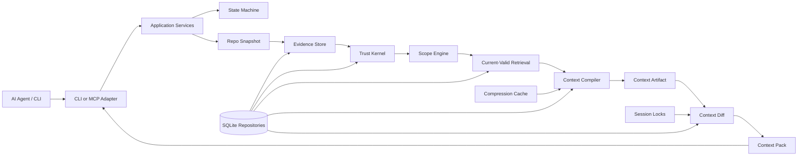

<p align="center">
  
</p>

<h1 align="center">Grape</h1>

<p align="center">
   Better context transport for AI agents.
</p>

<p align="center">
  <a href="docs/README.md"><strong>Documentation</strong></a>
  ·
  <a href="docs/README.md"><strong>Architecture</strong></a>
  ·
  <a href="ROADMAP.md"><strong>Roadmap</strong></a>
  ·
  <a href="CONTRIBUTING.md"><strong>Contributing</strong></a>
</p>

<p align="center">
  
  
  
  
</p>

---

Grape is the build system for AI coding-agent context.

It automatically tracks what context an agent has seen, invalidates stale context when repo state changes, and sends only the safe delta needed for the next turn. Install Grape in two commands. Keep using your coding agent normally. Grape handles context diffs, stale invalidation, pinned safety context, and restorable omissions in the background.

Instead of making agents reread the same files, rediscover the same rules, and repeat the same mistakes, Grape turns repository knowledge into dependency-tracked context artifacts that can be diffed, restored, and invalidated.

Grape is not a coding assistant, chatbot, memory toy, or generic search layer. It is the missing context runtime for agentic software development: built to make coding agents cheaper to run, harder to mislead, and more consistent on real codebases.

## Why Grape Exists

AI coding agents repeatedly spend context window and tool calls rediscovering the same facts:

- repository structure
- active project rules
- branch and worktree state
- relevant code, tests, config, and decisions
- prior failures and stale assumptions
- context already sent earlier in the same session

Search, embeddings, repo maps, and graph retrieval can find related information. Grape’s wedge is different: it treats context like a build artifact. It compiles what is safe and current, remembers what this exact agent session already received, and sends only what is new, changed, pinned, restorable, or invalidated.

The goal is not just smaller prompts. The goal is trustworthy incremental context: token savings without hiding uncertainty, stale evidence, or safety-critical constraints.

## What Grape Is Building

Grape is designed around a few hard rules:

- **Runs on repository state directly.** Context is built from the working tree, branch state, proofs, rules, and session ledger.
- **Proof before durable truth.** Raw evidence, assistant summaries, and durable claims stay separate.
- **Current-valid before relevance.** Stale, branch-invalid, dirty-scope, private, or contradicted facts are filtered before ranking.
- **Compression is cache, not truth.** Summaries can orient; they cannot prove behavior.
- **Diffs are session-scoped.** One agent session cannot omit context just because another session saw it.
- **Pinned safety context is resent.** Rules and high-risk context are not optimized away.
- **Every artifact has dependencies.** Context can be invalidated when files, proofs, rules, config, branches, or manifests change.

## Product Model

```text
repo snapshot
+ worktree state
+ task policy
+ active rules
+ proof-backed claims
+ relevant code, tests, and config
+ dependency hashes
+ prior sent context for this session
-> ContextArtifact
-> ContextDiff
-> ContextPack
```

Core objects:

| Object | Purpose |
|---|---|
| `ContextArtifact` | A compiled, dependency-tracked context artifact for a task. |
| `ContextDiff` | The session-scoped delta between the latest artifact and what the agent has already seen. |
| `ContextPackItem` | A structured item sent as `NEW`, `CHANGED`, `PINNED`, `OMIT_UNCHANGED`, `INVALIDATE_PREVIOUS`, or `RESTORE_AVAILABLE`. |
| `Trust Kernel` | The rules that prevent unproven, stale, private, or assistant-generated claims from becoming durable truth. |
| `Compression Cache` | Deterministic derived cache used for token savings, never proof. |

## Current Status

Grape is a controlled public alpha. The context transport slice is published as [`grape-context@0.1.0-alpha.3`](https://www.npmjs.com/package/grape-context/v/0.1.0-alpha.3) and is ready for serious pre-beta review of the install flow, CLI/MCP transport, session contract, and diff semantics.

Implemented today:

- committed implementation contract
- documentation architecture and agent operating rules
- explicit state machine and invariants
- in-memory context artifact and diff proof
- durable SQLite session-ledger storage
- durable context build proof for first-turn send, second-turn omission, stale manifest invalidation, and rollback
- alpha.2 npm package and GitHub release for the transport wedge
- alpha.3 hardening release with README/product-promise refresh, storage repository ownership split, session reset benchmark, restore-path goldens, mismatch exit classification, green local release gates, npm `latest`/`alpha` tags, and GitHub tag/release
- first local setup CLI slice: `grape init --connect`, `grape help`, `grape status`, `grape doctor`, and `grape mcp --print-config`
- bootstrap project detection during `grape init --connect` for language/framework, package manager, scripts, test command, entry points, config files, confidence levels, and non-durable candidate rules
- setup/status scan diagnostics for visible and rejected files, including ignored, private, unreadable, oversized, and binary-file rejection counts without exposing skipped file bodies
- first CLI context compile fallback: `grape compile --task <text>` auto-bootstraps local state, compiles from real repo inputs, evaluates optional token budgets, persists session diff rows, and writes inspectable `.grape/artifacts/ctx_*.json` and `.md` context-pack artifacts
- hardened Markdown context-pack artifacts with artifact summary, diff counts, item input refs, omitted/restore metadata, dependency details, token/budget status, and warnings/safety fields
- compiled current-valid narrow source-excerpt claims in context artifacts with claim/proof dependencies
- deterministic `symbol_outline`, `rule_digest`, and prior-turn `context_pack_summary` compression records with input hashes and non-proof artifact orientation sections
- artifact inspection through `grape artifacts`, `grape artifacts --artifact <id>`, and MCP `grape_get_artifact`
- session and stale-invalidation debugging through `grape sessions` and `grape stale`
- active narrow claim inspection through `grape claims --active` and MCP `grape_get_claims`
- proof inspection through `grape proofs`, `grape proofs --proof <id>`, and MCP `grape_get_proofs`
- conflict inspection through `grape conflicts` and MCP `grape_get_conflicts`, reading recorded claim conflict edges without resolving them
- fixture benchmark shell through `grape bench --fixture <name>`, measuring first-turn and second-turn token costs, omitted unchanged tokens, restore hints, stale sends, unsafe omissions, and wall-clock timings against copied fixture repos
- four-fixture in-repo benchmark suite covering clean omission, branch-switch invalidation, stale-source invalidation, and explicit session-reset invalidation
- external benchmark workspace pass of 13/13 scripted scenarios when run with the documented methodology and stable task/session contract
- restore-path protocol golden coverage for `RESTORE_AVAILABLE` restore IDs, session-bound lookup, restored body shape, and MCP output without absolute root paths
- dedicated task/session mismatch exit classification through CLI exit code `6`
- alpha.3 package-lock metadata alignment and alpha.2 external benchmark workspace dependency alignment
- first MCP stdio server: `grape mcp --stdio` supports `initialize`, `tools/list`, `grape_get_context`, `grape_get_artifact`, `grape_get_claims`, `grape_get_proofs`, `grape_get_rules`, `grape_get_omitted_item`, `grape_get_stale_items`, `grape_get_conflicts`, `grape_get_status`, `grape_record_candidate`, `grape_record_command_result`, `grape_record_test_result`, `grape_record_user_decision`, and `grape_request_user_confirmation` over framed stdio
- MCP rule inspection through `grape_get_rules`, returning current Git-visible, hash-verified, secret-scanned rule excerpts without absolute root paths
- restricted MCP candidate, command/test result, user-decision, and confirmation-request tools as temporary evidence/request surfaces without raw command/output/prompt/response persistence or durable claim promotion
- Grape-observed command/test execution through `grape run` and `grape test`, recording trusted redacted source evidence with observed run IDs and command/output hashes and promoting narrow observed-run result proofs/claims
- omitted context restore lookup through `grape omitted --session <id> --token <restoreToken>` and `grape_get_omitted_item`
- recovery guidance through `grape status`, `grape doctor`, unsafe compile output, lock-conflict errors, stale restore output, privacy/redaction failures, and safe malformed-config repair during bootstrap
- TypeScript, behavior tests, storage checks, docs checks, architecture-boundary checks, package dry-run checks, and install smoke

Still alpha:

- this is a local context transport slice, not a full memory platform
- stable task/session identity is required for reliable second-turn omission
- broader durable current-valid retrieval is still scaffold-backed in places
- broader runtime truth from Grape-observed command/test runs beyond the narrow observed-run result claim
- full repository indexing and richer exact-span ranking
- broader durable claim types, parsed durable rules, and conflict creation/resolution
- real clean-repo MCP client trials beyond scripted smoke before beta sign-off

## Documentation

Start here:

- [Documentation Index](docs/README.md)
- [V1 Documentation](docs/v1/README.md)
- [Implementation Contract](docs/v1/SPEC.md)
- [Architecture](docs/v1/architecture/overview.md)
- [State Machine](docs/v1/architecture/state-machine.md)
- [Invariants](docs/v1/architecture/invariants.md)
- [Roadmap](ROADMAP.md)
- [Contributing](CONTRIBUTING.md)

Core contracts:

- [Trust Model](docs/v1/core/trust-model.md)
- [Context Artifact](docs/v1/contracts/context-artifact.md)
- [Context Diff](docs/v1/contracts/context-diff.md)
- [Agent Sessions](docs/v1/interfaces/agent-sessions.md)
- [Compression](docs/v1/core/compression.md)
- [Storage](docs/v1/core/storage.md)
- [Security](docs/v1/core/security.md)
- [MCP Tools](docs/v1/interfaces/mcp-tools.md)
- [CLI](docs/v1/interfaces/cli.md)
- [Testing](docs/v1/quality/testing.md)
- [Benchmarks](docs/v1/quality/benchmarks.md)

## Architecture



## Alpha Usage

**Alpha status:** The context transport slice is published as [`grape-context@0.1.0-alpha.3`](https://www.npmjs.com/package/grape-context/v/0.1.0-alpha.3) and gated by `npm run check`, package checks, install smoke, benchmark smoke, and alpha e2e smoke. Requires **Node.js 22.13+**. See [ROADMAP.md](ROADMAP.md) for the alpha, beta, and 1.0 split.

For reproducible alpha.3 testing:

```bash
npm install -g grape-context@0.1.0-alpha.3
grape init --connect
```

The two-command target for normal alpha users is:

```bash
npm install -g grape-context
grape init --connect
```

`grape init --connect` creates `.grape/`, writes `.grape/config.json`, applies SQLite migrations to `.grape/grape.db`, captures the initial Git snapshot, reports bootstrap and scan diagnostics, and prints MCP connection guidance. The npm package includes compiled CLI output and runtime SQL migrations in `dist/`.

If npm appears to keep older alpha code after installing alpha.3, clear the cache and reinstall the exact package:

```bash
npm cache clean --force
npm install -g grape-context@0.1.0-alpha.3
```

An MCP-capable coding agent will request context through:

```text
grape_get_context
```

For continued turns, keep the same task/query and session identity. The alpha.3 session contract is strict by design: different task wording with the same explicit session is a mismatch, and derived MCP sessions change when the query changes. See [Agent Sessions](docs/v1/interfaces/agent-sessions.md) for the examples, recovery paths, exit-code notes, and JSON-RPC framing details.

Manual CLI commands are debugging and fallback surfaces:

```bash
grape compile --task "Explain the files I need to edit"
grape compile --task "Explain the files I need to edit" --token-budget 4000
grape artifacts
grape artifacts --artifact <id>
grape proofs
grape proofs --proof <id>
grape status
grape doctor
grape mcp --print-config
grape mcp --stdio
grape omitted --session <id>
grape omitted --session <id> --token <restoreToken>
grape stale
grape conflicts
grape bench --fixture clean-typescript-app
grape bench --fixture branch-switch-typescript-app
grape bench --fixture stale-source-typescript-app
grape bench --fixture session-reset-typescript-app
```

`grape compile --task <text>`, `grape artifacts`, `grape proofs`, `grape sessions`, `grape stale`, `grape conflicts`, `grape bench --fixture <name>`, `grape status`, `grape doctor`, `grape mcp --print-config`, `grape mcp --stdio`, `grape omitted`, `grape run`, and `grape test` are implemented for local inspection, CLI-first fallback context generation, proof-row inspection, stale-invalidation inspection, conflict-edge inspection, scripted fixture benchmarking, omitted-context restore, Grape-observed command/test evidence, narrow observed-run result proof/claim promotion, and the first MCP context retrieval path. MCP also exposes stale invalidation inspection through `grape_get_stale_items`, conflict inspection through `grape_get_conflicts`, and the restricted write surface through non-promoting candidate, command/test observation, user-decision, and confirmation-request tools. Conflict detection/resolution, broader durable artifact retrieval, claim-linked proof inspection, and broader durable proof types are not implemented yet.

## Development

Requirements:

- Node.js 22.13+
- npm

Run the full local gate:

```bash
npm ci
npm run check
```

The check suite currently covers documentation structure, fixtures, in-memory context loop checks, architecture boundaries, storage migrations, TypeScript typechecking, package dry-run contents, and behavior tests.

Run the extended beta-readiness gate before release sign-off:

```bash
npm run beta:check
```

After installing the published package globally, run the global smoke:

```bash
npm run global:smoke
```

## Contributing

Grape is not ready for broad feature work yet. Contributions should preserve the implementation contract and avoid expanding product surface before the current roadmap goal is proven.

Before contributing, read:

- [Contributing Guide](CONTRIBUTING.md)
- [Invariants](docs/README.md)
- [Roadmap](ROADMAP.md)

Implementation standards are strict:

- no godfiles
- no generic utility dumps
- no hidden state transitions
- no direct SQLite outside storage repositories
- no summaries as proof
- no MCP writes that promote durable truth
- no stale dependency manifests in returned context

## Repository Status

This repository is public-facing alpha software. APIs, schemas, command names, and setup guidance may change before 1.0, and the current package is not a broad beta or production memory platform.

## License

[MIT](LICENSE)
