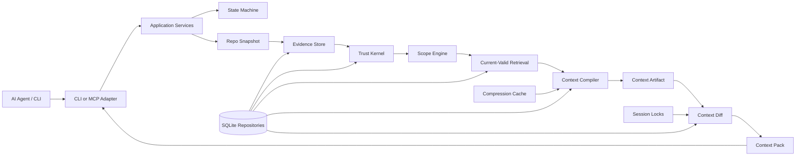

<p align="center">
  
</p>

<h1 align="center">Grape</h1>

<p align="center">
   Better context transport for AI coding agents.
</p>

<p align="center">
  <a href="docs/README.md"><strong>Documentation</strong></a>
  ·
  <a href="docs/v1/architecture/overview.md"><strong>Architecture</strong></a>
  ·
  <a href="ROADMAP.md"><strong>Roadmap</strong></a>
  ·
  <a href="CONTRIBUTING.md"><strong>Contributing</strong></a>
</p>

<p align="center">
  
  
  
  
</p>


Grape is a local-first context compiler and context transport layer for AI coding agents.

Instead of making agents reread the same files, rediscover the same rules, and repeat the same mistakes, Grape turns repository knowledge into dependency-tracked context artifacts that can be diffed, restored, and invalidated.

Grape is not a coding assistant, chatbot, broad agent memory platform, vector database, correctness prover, repo graph daemon, or generic search layer. It is session-scoped, proof-backed context transport: built to make coding agents cheaper to run, harder to mislead, and more consistent on real codebases.

After MCP setup, the agent calls `grape_get_context` each turn with stable session identity. Grape tracks what that session has already seen, invalidates stale context when repo state changes, and ships only the safe delta (`NEW`, `CHANGED`, `PINNED`, `RESTORE_AVAILABLE`, `INVALIDATE_PREVIOUS`) without manual compile/diff commands. Install Grape once, configure your agent through MCP, and keep using your coding agent normally.

## Quickstart

**1.0 beta transport slice:** Grape ships as `grape-context@1.0.0-beta.0` on npm under the `beta` dist-tag. It requires **Node.js 22.13+**.

**Install the published beta:**

```bash
npm install -g grape-context@beta
grape init --connect
```

To pin the exact prerelease:

```bash
npm install -g grape-context@1.0.0-beta.0
grape init --connect
```

npm still lists `0.1.0-alpha.3` on `latest` and `alpha`. Use `@beta` or `@1.0.0-beta.0` for the current transport slice. Alpha install docs are historical: [Alpha era legacy](docs/v1/legacy/alpha/README.md).

`grape init --connect` creates `.grape/`, applies local SQLite migrations, captures the initial Git snapshot, reports scan diagnostics, and prints MCP integration guidance plus an agent instruction block you can paste into Cursor, Claude Code, or other MCP clients.

Run `grape doctor --privacy` after setup to review local-first defaults, ignored paths, and scanner coverage without exposing file bodies or secret values.

An MCP-capable coding agent then requests context through:

```text
grape_get_context
```

Grape only omits context already sent to the **same session**. If the MCP client changes session ID, Grape resends rather than unsafe-omit. Restore is session-bound. Branch, source, and dependency changes may invalidate prior sent context.

For continued turns, keep the same task/query and session identity. The beta session contract is strict by design: different task wording with the same explicit session is a mismatch, and derived MCP sessions change when the query changes. See [Agent Sessions](docs/v1/interfaces/agent-sessions.md) for examples and recovery paths.

## Security And AI Context Safety

Grape is local-first and does not send repository content, proofs, artifacts, embeddings, telemetry, or summaries to a remote service by default. It respects Git and local privacy ignores, rejects local `.grape/` runtime state from snapshots, blocks common raw secret shapes before artifact output, and keeps generated local state out of Git through `.git/info/exclude`.

Repository content is still untrusted input. Source files, docs, comments, rules, and fixtures can contain prompt-injection text or private implementation details that may be delivered to an AI agent as evidence. Review generated context before pasting or forwarding it to an LLM, and keep secrets in ignored files rather than relying on any scanner as the only control.

## Why Grape Exists

AI coding agents repeatedly spend context window and tool calls rediscovering the same facts:

- repository structure
- active project rules
- branch and worktree state
- relevant code, tests, config, and decisions
- prior failures and stale assumptions
- context already sent earlier in the same session

Search, embeddings, repo maps, and graph retrieval can find related information. Grape’s wedge is different: it treats context like a build artifact. It compiles what is safe and current, remembers what this exact agent session already received, and sends only what is new, changed, pinned, restorable, or invalidated.

The goal is not just smaller prompts. The goal is trustworthy incremental context: safe omission of unchanged context without hiding uncertainty, stale evidence, or safety-critical constraints.

Internally, Grape context is graph-shaped: source refs, symbols, package manifests, proofs, dependency refs, pack items, omissions, restore handles, and invalidations are connected. Language-specific parsers only add optional orientation edges. TypeScript/JavaScript graph extraction is the strongest current signal. Python, Java, Kotlin, Go, Rust, C#, Ruby, PHP, Swift, C, C++, shell, JSON, YAML, TOML, Markdown, and other allowed text files must still be handled safely through exact source, path, and lexical fallback until providers prove stronger graph coverage.

## What Grape Does

Grape compiles safe, current repository context into a dependency-tracked artifact, diffs it against what the current agent session already received, and sends a structured context pack:

- `NEW` for context the agent has not seen
- `CHANGED` for updated context
- `PINNED` for safety-critical context that must be resent
- `OMIT_UNCHANGED` for safe omission of unchanged context
- `RESTORE_AVAILABLE` for omitted content that can be fetched back
- `INVALIDATE_PREVIOUS` for stale prior context

## Core Guarantees

Grape is designed around a few hard rules:

- **Runs on repository state directly.** Context is built from the working tree, branch state, proofs, rules, and session ledger.
- **Proof before durable truth.** Raw evidence, assistant summaries, and durable claims stay separate.
- **Current-valid before relevance.** Stale, branch-invalid, dirty-scope, private, or contradicted facts are filtered before ranking.
- **Compression is cache, not truth.** Summaries can orient; they cannot prove behavior.
- **Diffs are session-scoped.** One agent session cannot omit context just because another session saw it.
- **Pinned safety context is resent.** Rules and high-risk context are not optimized away.
- **Every artifact has dependencies.** Context can be invalidated when files, proofs, rules, config, branches, or manifests change.

## Product Model

```text
repo snapshot
+ worktree state
+ task policy
+ active rules
+ proof-backed claims
+ relevant code, tests, and config
+ dependency hashes
+ prior sent context for this session
-> ContextArtifact
-> ContextDiff
-> ContextPack
```

Core objects:

| Object | Purpose |
|---|---|
| `ContextArtifact` | A compiled, dependency-tracked context artifact for a task. |
| `ContextDiff` | The session-scoped delta between the latest artifact and what the agent has already seen. |
| `ContextPackItem` | A structured item sent as `NEW`, `CHANGED`, `PINNED`, `OMIT_UNCHANGED`, `INVALIDATE_PREVIOUS`, or `RESTORE_AVAILABLE`. |
| `Trust Kernel` | The rules that prevent unproven, stale, private, or assistant-generated claims from becoming durable truth. |
| `Compression Cache` | Deterministic derived cache used to reduce repeated transport cost, never proof. |

## Current Status

Grape 1.0 beta is a local-first context transport slice for coding agents. It compiles repository evidence into session-aware context packs through CLI and MCP. Official benchmark superiority claims are pending proper post-publish benchmark runs.

Implemented in the 1.0 beta transport slice:

- global npm install and `grape init --connect`
- local SQLite session ledger and dependency manifests
- CLI and MCP `grape_get_context` transport
- session-scoped `NEW`, `PINNED`, `OMIT_UNCHANGED`, `RESTORE_AVAILABLE`, and `INVALIDATE_PREVIOUS` context packs
- branch switch, stale source, and explicit session reset invalidation
- omitted-context restore through CLI and MCP
- exact source/rule proof rows, narrow current-valid claims, parsed project rules, and conservative conflict inspection
- deterministic TypeScript/JavaScript AST graph indexing for common imports, exports, symbols, calls, and related test hints
- safe exact/path/lexical fallback for Python, Java, Kotlin, Go, Rust, C#, Ruby, PHP, Swift, C, C++, shell, JSON, YAML, TOML, and explicit Markdown paths, with broad language-aware graph providers still pending
- Grape-observed `grape run` / `grape test` evidence and narrow observed-run result claims
- local checks for docs, architecture boundaries, storage, typechecking, package contents, install smoke, behavior tests, benchmarks, alpha e2e smoke, and the automated beta client trial

Not in the 1.0 beta promise:

- this is local context transport, not a full memory platform or cloud sync product
- stable task/session identity is required for reliable second-turn omission
- broader runtime truth from Grape-observed command/test runs is not promoted beyond the narrow observed-run result claim
- retrieval has AST-backed TypeScript/JavaScript graph expansion, while Python/Java/Kotlin/Go/Rust/C#/Ruby/PHP/Swift/C/C++/shell/config/docs paths currently rely on safe fallback unless a provider and fixture prove stronger support
- no full semantic ranking, embeddings, complete call graphs, broad language parsing, or broad polyglot/monorepo graph claim yet
- broader durable claim types, nested rule scope resolution, and automatic conflict resolution remain outside the beta transport promise
- automated `npm run beta:client-trial` proves MCP over stdio from a packed install; a literal Cursor or Claude Code UI trial still needs a human run when release policy requires it
- numeric token savings are fixture estimates only; on the recorded 2026-06-13 tarball run at `e8a1656`, all six gated fixtures passed with zero unsafe omissions (see [Benchmarks](docs/v1/quality/benchmarks.md))

## Architecture



## CLI And MCP

Manual CLI commands are debugging and fallback surfaces:

```bash
grape compile --task "Explain the files I need to edit"
grape compile --task "Explain the files I need to edit" --token-budget 4000
grape artifacts
grape artifacts --artifact <id>
grape proofs
grape proofs --proof <id>
grape claims --active
grape sessions
grape status
grape doctor
grape mcp --print-config
grape mcp --stdio
grape omitted --session <id>
grape omitted --session <id> --token <restoreToken>
grape stale
grape conflicts
grape conflicts --resolve <edge_id> --as coexists_with
grape run --session <id> -- <cmd...>
grape test --session <id> -- <cmd...>
grape bench --fixture clean-typescript-app
grape bench --fixture branch-switch-typescript-app
grape bench --fixture stale-source-typescript-app
grape bench --fixture session-reset-typescript-app
grape bench --fixture polyglot-fallback-repo
grape bench --fixture monorepo-lite-repo
```

MCP exposes the same local transport path through `grape mcp --stdio`. Read tools include context retrieval, artifacts, claims, proofs, rules, omitted restore, stale items, conflicts, and status. Restricted write tools can record temporary candidates, command/test observations, user decisions, and confirmation requests, but they cannot promote durable truth directly.

If npm appears to keep an older package after install, clear the cache and reinstall the beta package:

```bash
npm cache clean --force
npm install -g grape-context@beta
```

## Documentation

Start here:

- [Documentation Index](docs/README.md)
- [V1 Documentation](docs/v1/README.md)
- [Implementation Contract](docs/v1/SPEC.md)
- [Architecture](docs/v1/architecture/overview.md)
- [State Machine](docs/v1/architecture/state-machine.md)
- [Invariants](docs/v1/architecture/invariants.md)
- [Roadmap](ROADMAP.md)
- [Contributing](CONTRIBUTING.md)

Core contracts:

- [Trust Model](docs/v1/core/trust-model.md)
- [Context Artifact](docs/v1/contracts/context-artifact.md)
- [Context Diff](docs/v1/contracts/context-diff.md)
- [Agent Sessions](docs/v1/interfaces/agent-sessions.md)
- [Compression](docs/v1/core/compression.md)
- [Storage](docs/v1/core/storage.md)
- [Security](docs/v1/core/security.md)
- [MCP Tools](docs/v1/interfaces/mcp-tools.md)
- [CLI](docs/v1/interfaces/cli.md)
- [Testing](docs/v1/quality/testing.md)
- [Benchmarks](docs/v1/quality/benchmarks.md)
- [Alpha era legacy docs](docs/v1/legacy/alpha/README.md)

## Development

Requirements:

- Node.js 22.13+
- npm

Run the full local gate:

```bash
npm ci
npm run check
```

The check suite currently covers documentation structure, fixtures, in-memory context loop checks, architecture boundaries, storage migrations, TypeScript typechecking, package dry-run contents, and behavior tests.

Run the extended beta-readiness gate before release sign-off:

```bash
npm run beta:check
```

`beta:check` runs `check`, `benchmark:run`, `e2e:alpha`, and `beta:client-trial` (scripted packaged MCP smoke, not a real Cursor/Claude client trial).

`npm run beta:check` runs `npm run check`, then `npm run benchmark:run`, `npm run e2e:alpha`, and `npm run beta:client-trial`.

`npm run beta:client-trial` packs the current build, installs it in a temporary consumer git repo, and exercises MCP `initialize`, `tools/list`, `grape_get_status`, two-turn `grape_get_context` with `OMIT_UNCHANGED` and `RESTORE_AVAILABLE`, omitted-item restore, source invalidation after a file edit, stale restore rejection, task/session mismatch recovery guidance, `resetSession` invalidation and resend, branch invalidation, status and output redaction checks, and ignored secret-looking file rejection. It proves stdio MCP from a packaged install, not a specific IDE UI.

GitHub Actions runs `npm run check` on Ubuntu, macOS, and Windows, then a `beta-smoke` job that runs `npm run benchmark:run`, `npm run e2e:alpha`, and `npm run beta:client-trial`.

After installing the published package globally, run the global smoke:

```bash
npm run global:smoke
```

## Contributing

Grape is not ready for broad feature work yet. Contributions should preserve the implementation contract and avoid expanding product surface before the current roadmap goal is proven.

Before contributing, read:

- [Contributing Guide](CONTRIBUTING.md)
- [Invariants](docs/v1/architecture/invariants.md)
- [Roadmap](ROADMAP.md)

Implementation standards are strict:

- no godfiles
- no generic utility dumps
- no hidden state transitions
- no direct SQLite outside storage repositories
- no summaries as proof
- no MCP writes that promote durable truth
- no stale dependency manifests in returned context

## Repository Status

Grape 1.0 beta is prerelease software. APIs, schemas, command names, and setup guidance may still change before stable 1.0. The beta package is not production-ready and is not a broad agent memory platform.

## Star History
<p align="center">

  <a href="https://www.star-history.com/?repos=gael55x%2FGrape&type=date&legend=top-left">
   <picture>
     <source media="(prefers-color-scheme: dark)" srcset="https://api.star-history.com/chart?repos=gael55x/Grape&type=date&theme=dark&legend=top-left" />
     <source media="(prefers-color-scheme: light)" srcset="https://api.star-history.com/chart?repos=gael55x/Grape&type=date&legend=top-left" />
     
   </picture>
  </a>
</p>

## License

[MIT](LICENSE)
