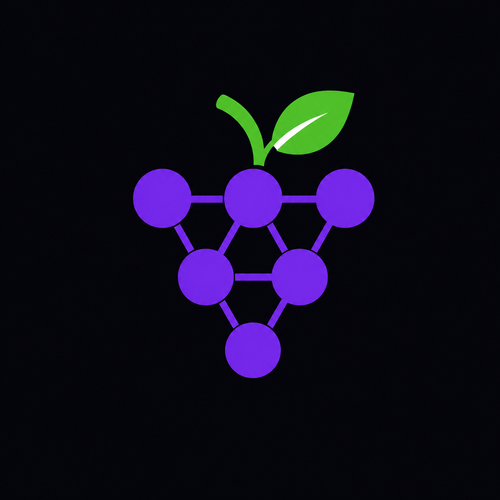
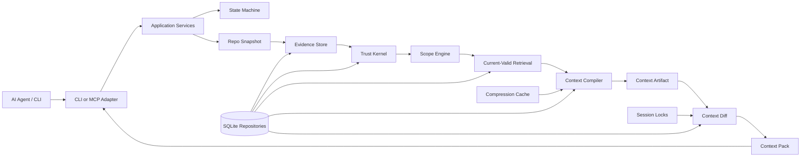

<p align="center">
  
</p>

<h1 align="center">Grape</h1>

<p align="center">
   Better context transport for AI agents.
</p>

<p align="center">
  <a href="docs/README.md"><strong>Documentation</strong></a>
  ·
  <a href="docs/v1/architecture/overview.md"><strong>Architecture</strong></a>
  ·
  <a href="ROADMAP.md"><strong>Roadmap</strong></a>
  ·
  <a href="CONTRIBUTING.md"><strong>Contributing</strong></a>
</p>

<p align="center">
  
  
  
  
</p>

<p align="center">
  <a href="https://star-history.com/#gael55x/Grape&amp;Date">
    
  </a>
</p>

---

Grape is the build system for AI coding-agent context.

It automatically tracks what context an agent has seen, invalidates stale context when repo state changes, and sends only the safe delta needed for the next turn. Install Grape in two commands. Keep using your coding agent normally. Grape handles context diffs, stale invalidation, pinned safety context, and restorable omissions in the background.

Instead of making agents reread the same files, rediscover the same rules, and repeat the same mistakes, Grape turns repository knowledge into dependency-tracked context artifacts that can be diffed, restored, and invalidated.

Grape is not a coding assistant, chatbot, memory toy, or generic search layer. It is the missing context runtime for agentic software development: built to make coding agents cheaper to run, harder to mislead, and more consistent on real codebases.

## Quickstart

**Alpha status:** the current transport slice is published as [`grape-context@0.1.0-alpha.3`](https://www.npmjs.com/package/grape-context/v/0.1.0-alpha.3). It requires **Node.js 22.13+**.

For reproducible alpha.3 testing:

```bash
npm install -g grape-context@0.1.0-alpha.3
grape init --connect
```

The normal alpha install path is:

```bash
npm install -g grape-context
grape init --connect
```

`grape init --connect` creates `.grape/`, applies local SQLite migrations, captures the initial Git snapshot, reports scan diagnostics, and prints MCP connection guidance.

An MCP-capable coding agent then requests context through:

```text
grape_get_context
```

For continued turns, keep the same task/query and session identity. The alpha.3 session contract is strict by design: different task wording with the same explicit session is a mismatch, and derived MCP sessions change when the query changes. See [Agent Sessions](docs/v1/interfaces/agent-sessions.md) for examples and recovery paths.

## Why Grape Exists

AI coding agents repeatedly spend context window and tool calls rediscovering the same facts:

- repository structure
- active project rules
- branch and worktree state
- relevant code, tests, config, and decisions
- prior failures and stale assumptions
- context already sent earlier in the same session

Search, embeddings, repo maps, and graph retrieval can find related information. Grape’s wedge is different: it treats context like a build artifact. It compiles what is safe and current, remembers what this exact agent session already received, and sends only what is new, changed, pinned, restorable, or invalidated.

The goal is not just smaller prompts. The goal is trustworthy incremental context: token savings without hiding uncertainty, stale evidence, or safety-critical constraints.

## What Grape Does

Grape compiles safe, current repository context into a dependency-tracked artifact, diffs it against what the current agent session already received, and sends a structured context pack:

- `NEW` for context the agent has not seen
- `CHANGED` for updated context
- `PINNED` for safety-critical context that must be resent
- `OMIT_UNCHANGED` for safe token savings
- `RESTORE_AVAILABLE` for omitted content that can be fetched back
- `INVALIDATE_PREVIOUS` for stale prior context

## Core Guarantees

Grape is designed around a few hard rules:

- **Runs on repository state directly.** Context is built from the working tree, branch state, proofs, rules, and session ledger.
- **Proof before durable truth.** Raw evidence, assistant summaries, and durable claims stay separate.
- **Current-valid before relevance.** Stale, branch-invalid, dirty-scope, private, or contradicted facts are filtered before ranking.
- **Compression is cache, not truth.** Summaries can orient; they cannot prove behavior.
- **Diffs are session-scoped.** One agent session cannot omit context just because another session saw it.
- **Pinned safety context is resent.** Rules and high-risk context are not optimized away.
- **Every artifact has dependencies.** Context can be invalidated when files, proofs, rules, config, branches, or manifests change.

## Product Model

```text
repo snapshot
+ worktree state
+ task policy
+ active rules
+ proof-backed claims
+ relevant code, tests, and config
+ dependency hashes
+ prior sent context for this session
-> ContextArtifact
-> ContextDiff
-> ContextPack
```

Core objects:

| Object | Purpose |
|---|---|
| `ContextArtifact` | A compiled, dependency-tracked context artifact for a task. |
| `ContextDiff` | The session-scoped delta between the latest artifact and what the agent has already seen. |
| `ContextPackItem` | A structured item sent as `NEW`, `CHANGED`, `PINNED`, `OMIT_UNCHANGED`, `INVALIDATE_PREVIOUS`, or `RESTORE_AVAILABLE`. |
| `Trust Kernel` | The rules that prevent unproven, stale, private, or assistant-generated claims from becoming durable truth. |
| `Compression Cache` | Deterministic derived cache used for token savings, never proof. |

## Current Status

Grape is a controlled public alpha. The current package is ready for serious pre-beta review of install flow, CLI/MCP transport, session identity, context diffing, stale invalidation, and omitted-context restore.

Implemented in the alpha transport slice:

- global npm install and `grape init --connect`
- local SQLite session ledger and dependency manifests
- CLI and MCP `grape_get_context` transport
- session-scoped `NEW`, `PINNED`, `OMIT_UNCHANGED`, `RESTORE_AVAILABLE`, and `INVALIDATE_PREVIOUS` context packs
- branch switch, stale source, and explicit session reset invalidation
- omitted-context restore through CLI and MCP
- exact source/rule proof rows, narrow current-valid claims, parsed project rules, and conservative conflict inspection
- deterministic TypeScript/JavaScript AST graph indexing for common imports, exports, symbols, calls, and related test hints
- Grape-observed `grape run` / `grape test` evidence and narrow observed-run result claims
- local checks for docs, architecture boundaries, storage, typechecking, package contents, install smoke, behavior tests, benchmarks, and alpha e2e smoke

Still alpha / not a full beta promise:

- this is a local context transport slice, not a full memory platform
- stable task/session identity is required for reliable second-turn omission
- broader runtime truth from Grape-observed command/test runs is not promoted beyond the narrow observed-run result claim
- retrieval has AST-backed TypeScript/JavaScript graph expansion, but not full semantic ranking, embeddings, complete call graphs, or broad language parsing
- broader durable claim types, nested rule scope resolution, and automatic conflict resolution remain outside the beta transport promise
- real clean-repo MCP client trials beyond scripted smoke before beta sign-off

## Architecture



## CLI And MCP

Manual CLI commands are debugging and fallback surfaces:

```bash
grape compile --task "Explain the files I need to edit"
grape compile --task "Explain the files I need to edit" --token-budget 4000
grape artifacts
grape artifacts --artifact <id>
grape proofs
grape proofs --proof <id>
grape claims --active
grape sessions
grape status
grape doctor
grape mcp --print-config
grape mcp --stdio
grape omitted --session <id>
grape omitted --session <id> --token <restoreToken>
grape stale
grape conflicts
grape conflicts --resolve <edge_id> --as coexists_with
grape run --session <id> -- <cmd...>
grape test --session <id> -- <cmd...>
grape bench --fixture clean-typescript-app
grape bench --fixture branch-switch-typescript-app
grape bench --fixture stale-source-typescript-app
grape bench --fixture session-reset-typescript-app
```

MCP exposes the same local transport path through `grape mcp --stdio`. Read tools include context retrieval, artifacts, claims, proofs, rules, omitted restore, stale items, conflicts, and status. Restricted write tools can record temporary candidates, command/test observations, user decisions, and confirmation requests, but they cannot promote durable truth directly.

If npm appears to keep older alpha code after installing alpha.3, clear the cache and reinstall the exact package:

```bash
npm cache clean --force
npm install -g grape-context@0.1.0-alpha.3
```

## Documentation

Start here:

- [Documentation Index](docs/README.md)
- [V1 Documentation](docs/v1/README.md)
- [Implementation Contract](docs/v1/SPEC.md)
- [Architecture](docs/v1/architecture/overview.md)
- [State Machine](docs/v1/architecture/state-machine.md)
- [Invariants](docs/v1/architecture/invariants.md)
- [Roadmap](ROADMAP.md)
- [Contributing](CONTRIBUTING.md)

Core contracts:

- [Trust Model](docs/v1/core/trust-model.md)
- [Context Artifact](docs/v1/contracts/context-artifact.md)
- [Context Diff](docs/v1/contracts/context-diff.md)
- [Agent Sessions](docs/v1/interfaces/agent-sessions.md)
- [Compression](docs/v1/core/compression.md)
- [Storage](docs/v1/core/storage.md)
- [Security](docs/v1/core/security.md)
- [MCP Tools](docs/v1/interfaces/mcp-tools.md)
- [CLI](docs/v1/interfaces/cli.md)
- [Testing](docs/v1/quality/testing.md)
- [Benchmarks](docs/v1/quality/benchmarks.md)

## Development

Requirements:

- Node.js 22.13+
- npm

Run the full local gate:

```bash
npm ci
npm run check
```

The check suite currently covers documentation structure, fixtures, in-memory context loop checks, architecture boundaries, storage migrations, TypeScript typechecking, package dry-run contents, and behavior tests.

Run the extended beta-readiness gate before release sign-off:

```bash
npm run beta:check
```

After installing the published package globally, run the global smoke:

```bash
npm run global:smoke
```

## Contributing

Grape is not ready for broad feature work yet. Contributions should preserve the implementation contract and avoid expanding product surface before the current roadmap goal is proven.

Before contributing, read:

- [Contributing Guide](CONTRIBUTING.md)
- [Invariants](docs/v1/architecture/invariants.md)
- [Roadmap](ROADMAP.md)

Implementation standards are strict:

- no godfiles
- no generic utility dumps
- no hidden state transitions
- no direct SQLite outside storage repositories
- no summaries as proof
- no MCP writes that promote durable truth
- no stale dependency manifests in returned context

## Repository Status

This repository is public-facing alpha software. APIs, schemas, command names, and setup guidance may change before 1.0, and the current package is not a broad beta or production memory platform.

## License

[MIT](LICENSE)
