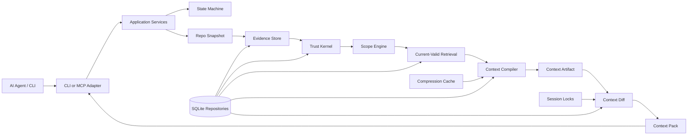

<p align="center">
  
</p>

<h1 align="center">Grape</h1>

<p align="center">
  The context artifact system for AI agents.
</p>

<p align="center">
  <a href="docs/README.md"><strong>Documentation</strong></a>
  ·
  <a href="docs/v1/architecture/overview.md"><strong>Architecture</strong></a>
  ·
  <a href="docs/v1/planning/implementation-roadmap.md"><strong>Roadmap</strong></a>
  ·
  <a href="AGENTS.md"><strong>Agent Rules</strong></a>
</p>

<p align="center">
  
  
  
  
</p>

---

Grape is the build system for AI coding-agent context.

It compiles safe, current repository context and sends only the next safe delta to each agent session. Instead of making agents reread the same files, rediscover the same rules, and repeat the same mistakes, Grape turns repository knowledge into dependency-tracked context artifacts that can be diffed, restored, and invalidated.

Grape is not a coding assistant, chatbot, memory toy, or generic search layer. It is the missing context runtime for agentic software development: built to make coding agents cheaper to run, harder to mislead, and more consistent on real codebases.

## Why Grape Exists

AI coding agents repeatedly spend context window and tool calls rediscovering the same facts:

- repository structure
- active project rules
- branch and worktree state
- relevant code, tests, config, and decisions
- prior failures and stale assumptions
- context already sent earlier in the same session

Search, embeddings, repo maps, and graph retrieval can find related information. Grape’s wedge is different: it treats context like a build artifact. It compiles what is safe and current, remembers what this exact agent session already received, and sends only what is new, changed, pinned, restorable, or invalidated.

The goal is not just smaller prompts. The goal is trustworthy incremental context: token savings without hiding uncertainty, stale evidence, or safety-critical constraints.

## What Grape Is Building

Grape is designed around a few hard rules:

- **Runs on repository state directly.** Context is built from the working tree, branch state, proofs, rules, and session ledger.
- **Proof before durable truth.** Raw evidence, assistant summaries, and durable claims stay separate.
- **Current-valid before relevance.** Stale, branch-invalid, dirty-scope, private, or contradicted facts are filtered before ranking.
- **Compression is cache, not truth.** Summaries can orient; they cannot prove behavior.
- **Diffs are session-scoped.** One agent session cannot omit context just because another session saw it.
- **Pinned safety context is resent.** Rules and high-risk context are not optimized away.
- **Every artifact has dependencies.** Context can be invalidated when files, proofs, rules, config, branches, or manifests change.

## Product Model

```text
repo snapshot
+ worktree state
+ task policy
+ active rules
+ proof-backed claims
+ relevant code, tests, and config
+ dependency hashes
+ prior sent context for this session
-> ContextArtifact
-> ContextDiff
-> ContextPack
```

Core objects:

| Object | Purpose |
|---|---|
| `ContextArtifact` | A compiled, dependency-tracked context artifact for a task. |
| `ContextDiff` | The session-scoped delta between the latest artifact and what the agent has already seen. |
| `ContextPackItem` | A structured item sent as `NEW`, `CHANGED`, `PINNED`, `OMIT_UNCHANGED`, `INVALIDATE_PREVIOUS`, or `RESTORE_AVAILABLE`. |
| `Trust Kernel` | The rules that prevent unproven, stale, private, or assistant-generated claims from becoming durable truth. |
| `Compression Cache` | Deterministic derived cache used for token savings, never proof. |

## Current Status

Grape is under active implementation. This repository is the official home for Grape’s documentation and framework scaffold.

Implemented today:

- committed implementation contract
- documentation architecture and agent operating rules
- explicit state machine and invariants
- in-memory context artifact and diff proof
- durable SQLite session-ledger storage
- durable context build proof for first-turn send, second-turn omission, stale manifest invalidation, and rollback
- first local setup CLI slice: `grape init --connect`, `grape help`, `grape status`, `grape doctor`, and `grape mcp --print-config`
- first CLI context compile fallback: `grape compile --task <text>` auto-bootstraps local state, compiles from real repo inputs, evaluates optional token budgets, persists session diff rows, and writes inspectable V1 `.grape/artifacts/ctx_*.json` and `.md` context-pack artifacts
- artifact inspection through `grape artifacts`, `grape artifacts --artifact <id>`, and MCP `grape_get_artifact`
- first MCP stdio server: `grape mcp --stdio` supports `initialize`, `tools/list`, `grape_get_context`, `grape_get_artifact`, `grape_get_omitted_item`, and `grape_get_status` over framed stdio
- omitted context restore lookup through `grape omitted --session <id> --token <restoreToken>` and `grape_get_omitted_item`
- TypeScript, behavior tests, storage checks, docs checks, and architecture-boundary checks

Not released yet:

- npm package
- full production CLI inspection surface
- full MCP read/write tool surface
- full repository indexing
- benchmark harness
- compression cache implementation

## Documentation

Start here:

- [Documentation Index](docs/README.md)
- [Framework Documentation](docs/v1/README.md)
- [Implementation Contract](docs/v1/SPEC.md)
- [Architecture](docs/v1/architecture/overview.md)
- [State Machine](docs/v1/architecture/state-machine.md)
- [Invariants](docs/v1/architecture/invariants.md)
- [Implementation Roadmap](docs/v1/planning/implementation-roadmap.md)
- [Agent Operating Rules](AGENTS.md)

Core contracts:

- [Trust Model](docs/v1/core/trust-model.md)
- [Context Artifact](docs/v1/contracts/context-artifact.md)
- [Context Diff](docs/v1/contracts/context-diff.md)
- [Compression](docs/v1/core/compression.md)
- [Storage](docs/v1/core/storage.md)
- [Security](docs/v1/core/security.md)
- [MCP Tools](docs/v1/interfaces/mcp-tools.md)
- [CLI](docs/v1/interfaces/cli.md)
- [Testing](docs/v1/quality/testing.md)
- [Benchmarks](docs/v1/quality/benchmarks.md)

## Architecture



## Planned Usage

The intended V1 setup is:

```bash
npm install -g grape-context
grape init --connect
```

The repository now has the first local setup implementation path for that second command. It creates `.grape/`, writes `.grape/config.json`, applies SQLite migrations to `.grape/grape.db`, captures the initial Git snapshot, and prints MCP connection guidance. The npm package is not released yet.

An MCP-capable coding agent will request context through:

```text
grape_get_context
```

Inspection and debugging commands are planned:

```bash
grape compile --task "Explain the files I need to edit"
grape compile --task "Explain the files I need to edit" --token-budget 4000
grape artifacts
grape artifacts --artifact <id>
grape status
grape doctor
grape mcp --print-config
grape mcp --stdio
grape omitted --session <id>
grape omitted --session <id> --token <restoreToken>
grape stale
grape conflicts
```

`grape compile --task <text>`, `grape artifacts`, `grape status`, `grape doctor`, `grape mcp --print-config`, `grape mcp --stdio`, and `grape omitted` are implemented for local inspection, CLI-first fallback context generation, omitted-context restore, and the first MCP context retrieval path. Stale, conflict, final artifact schema, and the full MCP read/write surface are not implemented yet.

## Development

Requirements:

- Node.js 22.5+
- npm

Run the full local gate:

```bash
npm ci
npm run check
```

The check suite currently covers documentation structure, fixtures, in-memory context loop checks, architecture boundaries, storage migrations, TypeScript typechecking, and behavior tests.

## Contributing

Grape is not ready for broad feature work yet. Contributions should preserve the implementation contract and avoid expanding product surface before the current roadmap goal is proven.

Before contributing, read:

- [Contributing Guide](CONTRIBUTING.md)
- [Agent Operating Rules](AGENTS.md)
- [V1 Invariants](docs/v1/architecture/invariants.md)
- [V1 Implementation Roadmap](docs/v1/planning/implementation-roadmap.md)

Implementation standards are strict:

- no godfiles
- no generic utility dumps
- no hidden state transitions
- no direct SQLite outside storage repositories
- no summaries as proof
- no MCP writes that promote durable truth
- no stale dependency manifests in returned context

## Repository Status

This repository is public-facing but pre-release. APIs, schemas, and command names may change until the V1 alpha contract is complete.

## License

License information has not been finalized yet.
