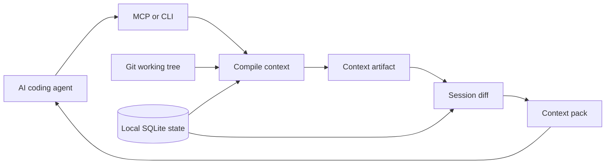

<p align="center">
  
</p>

<h1 align="center">Grape</h1>

<p align="center">
   Better context transport for AI coding agents.
</p>

<p align="center">
  <a href="https://github.com/gael55x/Grape/blob/main/docs/README.md"><strong>Documentation</strong></a>
  ·
  <a href="https://github.com/gael55x/Grape/blob/main/docs/v1/architecture/overview.md"><strong>Architecture</strong></a>
  ·
  <a href="https://github.com/gael55x/Grape/blob/main/ROADMAP.md"><strong>Roadmap</strong></a>
  ·
  <a href="https://github.com/gael55x/Grape/blob/main/CONTRIBUTING.md"><strong>Contributing</strong></a>
</p>

<p align="center">
  
  
  
  
</p>


**Stop making agents rediscover the same repo context every chat.**

AI coding agents are powerful, and they can already read files in the current repo. That is not the hard part.

The hard part is read amplification. Agents reread the same files, rules, decisions, and failure context across chats, tools, clients, and long-running tasks.

They reread the same files.
They rediscover the same project rules.
They forget what changed between turns.
They keep stale assumptions after branch switches and file edits.
They burn tool calls rebuilding context they already had.

Grape is not a repo reader. It is a repo-backed context continuity and guardrail layer for coding agents.

It compiles the useful parts of your repo into dependency-tracked context artifacts, remembers what a specific agent session has already seen, and sends only what is new, changed, pinned, restorable, or stale.

The value is not the first read. The value is avoiding repeated rereads and stale assumptions after the first turn.

## What Grape does

Grape sits between your repository and your AI coding agent.

MCP clients can read files, but they do not automatically preserve task-safe context across chats, tools, clients, and handoffs. Grape gives those clients a stable local surface for session ledgers, restore tokens, invalidation warnings, and proof-backed excerpts.

It helps the agent answer three questions every turn:

1. **What context does this task need?**
2. **What context has this session already received?**
3. **What previous context is now stale because the repo changed?**

Instead of shipping a fresh wall of files every time, Grape returns a structured context pack:

| Item                  | Meaning                                                               |
| --------------------- | --------------------------------------------------------------------- |
| `NEW`                 | Context the current session has not seen yet.                         |
| `CHANGED`             | Context that changed since the session last saw it.                   |
| `PINNED`              | Safety-critical context that must be resent.                          |
| `OMIT_UNCHANGED`      | Context safely omitted because this same session already received it. |
| `RESTORE_AVAILABLE`   | Omitted context that can be fetched back if needed.                   |
| `INVALIDATE_PREVIOUS` | Prior context that should no longer be trusted.                       |

Grape is not trying to replace your coding agent. It makes your existing agent better at carrying repository context across turns.

## Install

Requirements:

* Node.js 22.13 or newer
* npm
* Git

Install Grape:

```bash
npm install -g grape-context@beta
```

Verify the install:

```bash
grape --version
grape help
```

## Quick start

1. Install: `npm install -g grape-context@beta`
2. Initialize: `grape init --connect` (from your repository root)
3. Connect MCP: `grape mcp --install --client cursor`, `grape mcp --install --client claude`, or `grape mcp --install --client codex` when your installed build supports it
4. Agent loop: the agent calls `grape_get_context` each turn with a stable `sessionId` and stable task text

Full walkthrough: [Getting started](https://github.com/gael55x/Grape/blob/main/docs/v1/interfaces/getting-started.md).

Initialize it inside a repository:

```bash
grape init --connect
```

This creates local Grape state, captures the initial repository snapshot, and prints MCP setup guidance for your coding agent.

Check local privacy settings:

```bash
grape doctor
grape doctor --privacy
```

## Use it with an agent

Grape works best through MCP.

For Cursor, write the project-local MCP config when your installed build supports the safe installer:

```bash
grape mcp --install --client cursor
```

This writes or merges `.cursor/mcp.json`.

For Claude Desktop, write the global Claude Desktop MCP config when your installed build supports the safe installer and Grape can resolve the platform path safely:

```bash
grape mcp --install --client claude
```

This writes or merges `claude_desktop_config.json`.

For Codex, write the project-local Codex MCP config when your installed build supports the safe installer:

```bash
grape mcp --install --client codex
```

This writes or merges `.codex/config.toml` for trusted Codex projects. It preserves unrelated TOML and refuses to replace an existing `[mcp_servers.grape]` table unless you pass `--force`.

Preview any change without writing:

```bash
grape mcp --install --client cursor --dry-run
grape mcp --install --client claude --dry-run
grape mcp --install --client codex --dry-run
```

If an existing Grape MCP entry differs, Grape refuses to replace it unless you pass `--force`. Unrelated MCP servers are preserved.

To add project guidance for agents, print a path-neutral AGENTS.md snippet:

```bash
grape mcp --print-agents-snippet
```

Review the snippet before adding it to your repository rules. Grape does not edit AGENTS.md automatically.

Grape also ships a repo-local Codex plugin in `plugins/grape` with a marketplace file at `.agents/plugins/marketplace.json`:

```bash
codex plugin marketplace add .
codex plugin add grape@grape-local
```

Run those commands from the repository root. The plugin exposes `grape mcp --stdio` and a Grape skill for Codex. It assumes the `grape` command is on `PATH`. Use `grape mcp --install --client codex` when you need project-local `.codex/config.toml` with an exact working directory. The plugin does not ship hooks.

To verify the local Codex path without touching your normal Codex config:

```bash
npm run build
npm run codex:check
```

For other MCP clients, or for published beta builds that do not recognize `grape mcp --install`, use the manual config fallback:

```bash
grape mcp --print-config
```

Paste the printed JSON into your MCP client config. Auto-install and manual config both launch:

```bash
grape mcp --stdio --repo <repo-root>
```

Use the repository root for both `cwd` and `--repo`. MCP stdio messages are newline-delimited JSON-RPC objects. Do not use `Content-Length` header framing.

The auto-install commands are separate from the 1.0.0-beta.7 MCP stdio framing fix. Beta.7 made `grape mcp --stdio` connect correctly; it did not write Cursor, Claude Desktop, or Codex config files.

After setup, your MCP-capable coding agent calls:

```text
grape_get_context
```

The agent can then request task-specific repository context without manually rebuilding the same prompt every turn.

Copy-ready agent instruction:

```text
At the start of each repo task turn, call grape_get_context with a stable sessionId and the current task. Treat INVALIDATE_PREVIOUS entries as stale and unsafe. If context is omitted, restore it by token only when needed. For security, auth, payments, data deletion, or deployment tasks, rely on exact proof-backed excerpts rather than summaries.
```

If the client does not connect:

* run `grape --version` in the same environment the client uses
* for Cursor, check `.cursor/mcp.json`
* for Claude Desktop, check `claude_desktop_config.json`
* confirm `cwd` and `--repo` point at the same repository root
* confirm no wrapper script prints banners or logs to stdout
* run `grape doctor` and `grape doctor --privacy`

A typical loop looks like this:

```text
User asks coding agent to fix a task
Agent calls grape_get_context
Grape returns relevant repo context
Agent edits code
Repo changes
Agent calls grape_get_context again
Grape sends only the useful delta and invalidates stale context
```

## What happens on the second turn

On the first turn, Grape sends the context needed for the task and records what the agent saw.

On later turns in the same session, Grape sends only what is new, changed, pinned, stale, or restorable. If a file, rule, dependency, branch, or worktree state changes, Grape tells the agent which previous context must stop being trusted.

That is Grape's main difference from repo graph tools. Graph tools help agents find repo structure. Grape helps agents carry repo context safely across turns.

Second-turn behavior:

* `OMIT_UNCHANGED` means this exact session already received unchanged, safe-to-omit context.
* `RESTORE_AVAILABLE` gives the agent a token to fetch omitted context only if needed.
* `INVALIDATE_PREVIOUS` tells the agent a prior context item is stale and unsafe to keep using.
* `PINNED` context is resent when safety policy requires it.
* high-risk tasks such as security, auth, payments, data deletion, or deployment require exact source, config, or rule evidence instead of summaries.

Manual CLI usage is available for debugging and fallback:

```bash
grape sync
grape compact
grape export
grape purge
grape compile --task "Explain the files I need to edit"
grape diff-context --task "Explain the files I need to edit"
grape status
grape doctor
grape sessions
grape artifacts
grape run --session <id> -- npm test
grape omitted --session <id>
grape stale
grape conflicts
grape bench --fixture <name>
grape mcp --print-config
```

Use `grape sessions` after repeated MCP or CLI turns to see local continuity evidence: what was sent, what was omitted with restore handles, and what stale context was invalidated.

See [Getting started](https://github.com/gael55x/Grape/blob/main/docs/v1/interfaces/getting-started.md), the full [CLI reference](https://github.com/gael55x/Grape/blob/main/docs/v1/interfaces/cli.md), and [MCP tools](https://github.com/gael55x/Grape/blob/main/docs/v1/interfaces/mcp-tools.md).

## Why this matters

Most agent workflows still treat context as disposable text.

That breaks down on larger tasks because the agent needs more than search results. It needs to know:

* which files matter
* which rules apply
* which context it already saw
* which context changed
* which assumptions are stale
* which omitted context can be restored
* which safety constraints must be repeated
* which evidence supports a claim

Grape treats context like a build artifact.

It is compiled from repository state, linked to dependencies, scoped to a session, and invalidated when its inputs change.

## Local-first by design

Grape runs against your local repository.

By default, it does not send repository content, artifacts, proofs, summaries, embeddings, or telemetry to a remote Grape service.

Local runtime state lives under `.grape/`. Grape keeps this state out of Git through `.git/info/exclude`.

Grape also:

* respects Git ignores and local privacy ignores
* excludes `.grape/` runtime state from snapshots
* blocks common raw secret shapes before artifact output
* avoids exposing raw secret values in diagnostics
* separates raw evidence from assistant-written summaries
* prevents summaries from becoming durable proof

Repository content is still untrusted input. Source files, comments, docs, tests, and fixtures can contain prompt-injection text or private implementation details. Review context before forwarding it to an LLM, and keep real secrets in ignored files.

## What Grape stores locally

Grape stores local runtime state under `.grape/`:

* `.grape/config.json` for local project setup
* `.grape/grape.db` for SQLite state, sessions, ledgers, proofs, source metadata, and scan diagnostics
* `.grape/artifacts/` for generated JSON and Markdown context artifacts
* allowed source text rows for local lexical search
* rendered source or rule excerpts inside generated context artifacts
* restore metadata for omitted context
* proof and excerpt metadata for accepted exact source or rule spans
* observed command and test evidence from `grape run` and `grape test`, stored as hashes and metadata instead of raw stdout or stderr bodies

Grape does not send repository content, artifacts, proofs, summaries, embeddings, or telemetry to a remote Grape service by default. Your MCP client or coding agent may still forward returned context to its model provider. Treat Grape output like any other repo context you give an AI tool.

For bounded cleanup, run `grape compact` first. It previews eligible context artifact, compression cache, FTS, symbol metadata, orphan snapshot, and invalidated ledger cleanup. It also reports measured `.grape`, database, WAL, SHM, and artifact bytes before and after the run. It deletes nothing unless you rerun it with `--confirm`. FTS and symbol cleanup delete old rows by whole snapshot from their own tables. Snapshot cleanup deletes only orphan `repo_snapshots` with no source rows, context, indexes, compression rows, or dependencies. Invalidated ledger cleanup deletes old closed invalidation pairs only when the stale sent row and the marker that kept it inactive can be removed together. Compact does not delete source files, source records, claims, or proofs.

To inspect local storage without dumping bodies, run `grape export`. It returns a local inventory with storage bytes, row counts, and a source-text storage disclosure. It omits raw source files, FTS text bodies, context artifact bodies, database bytes, backing-file bodies, command output bodies, and ignored/private rejected file contents.

To remove local Grape state for one repository, preview the deletion first:

```bash
grape purge
```

Then confirm it:

```bash
grape purge --confirm
grape init --connect
```

`grape purge --confirm` deletes only the repo-local `.grape/` directory after safety checks. It refuses symlinked local state, Git-tracked files under `.grape/`, mismatched config roots, and locked or contended sessions. It does not change source files, Git history, editor config, or MCP config.

## How Grape works

Grape has three core stages.

### 1. Compile

Grape reads the working tree, branch state, source excerpts, project rules, manifests, observed command results, and narrow proof-backed claims.

It builds a `ContextArtifact` for the current task.

### 2. Track

Each artifact records the files, rules, proofs, config, branch state, manifests, and dependency hashes that shaped it.

When those inputs change, Grape can detect stale context instead of silently reusing it.

### 3. Diff

Grape compares the latest artifact with what the same agent session already received.

It then returns a `ContextPack` containing only the useful delta.



## Core guarantees

Grape is built around strict context rules:

* **Repository state is the source of truth.** Context comes from the working tree, branch state, rules, evidence, and local session ledger.
* **Diffs are session-scoped.** One session cannot omit context just because another session saw it.
* **Pinned context is resent.** Safety-critical rules and constraints are not optimized away.
* **Stale context is invalidated.** Branch, file, rule, config, manifest, and proof changes can invalidate prior context.
* **Proof is not summary.** Assistant-written summaries cannot promote themselves into durable truth.
* **Compression is cache, not truth.** Summaries may reduce repeated transport cost, but they do not prove behavior.
* **Current context beats merely relevant context.** Stale, private, branch-invalid, dirty-scope, or contradicted context is filtered before ranking.

## What Grape is not

Grape is not:

* a chatbot
* a coding assistant
* a vector database
* a cloud memory platform
* a correctness prover
* a full repo graph daemon
* a replacement for tests or review

Grape does not prove that an agent’s answer is correct. It gives the agent better repository context to work with.

## Language support

Grape currently has its strongest graph signal for TypeScript and JavaScript.

For other languages and text formats, Grape uses safe fallback behavior unless stronger support is proven through fixtures.

Fallback coverage includes:

* Python
* Java
* Kotlin
* Go
* Rust
* C#
* Ruby
* PHP
* Swift
* C
* C++
* shell
* JSON
* YAML
* TOML
* Markdown

Fallback does not mean ignored. It means Grape avoids pretending it has precise graph knowledge when it only has exact source, paths, lexical matches, or explicit references.

## Benchmark evidence

Grape includes benchmark fixtures and scripts for local comparison. Recorded numbers are fixture evidence only. They are not production performance proof or claims that Grape beats naive context, search, or external tools unless a committed result file, command, date, and limits are named together.

Current benchmark output also reports per-turn local storage bytes for the temporary fixture workspace. Those fields help catch `.grape/`, database, WAL, and artifact growth regressions. They are fixture diagnostics, not production storage claims.

### Transport fixtures

`npm run bench` exercises the installed package on six named fixtures. On the three no-change transport fixtures, the second same-session turn reduced body-token context with zero unsafe omissions and zero stale sends:

| Fixture | Turn 1 body tokens | Turn 2 body tokens | Reduction |
| --- | ---: | ---: | ---: |
| `clean-typescript-app` | 2811 | 1663 | 50.4% |
| `polyglot-fallback-repo` | 3132 | 2523 | 31.46% |
| `monorepo-lite-repo` | 3388 | 1885 | 52.07% |

The same run also passed branch-switch, stale-source, and session-reset invalidation fixtures.

That supports the core beta transport claim on these fixtures: Grape can omit unchanged same-session context, keep restore metadata for omitted items, and invalidate prior context when files, branches, or sessions change.

### Published-package baselines

`npm run bench:post-beta` compares the published npm package with naive and search baselines on three small tasks. Results report file-level recall, known-noise ratio, layered output metrics, and rough serialized output size.

Post-beta baselines help answer whether Grape finds the right files and where known-irrelevant paths enter the compiled output. They do not prove token-size savings against naive or search, production readiness, or superiority over external tools.

See [Benchmarks](https://github.com/gael55x/Grape/blob/main/docs/v1/quality/benchmarks.md) for commands, fixture names, result files, and caveats.

## Project status

Grape is currently in 1.0 beta.

The beta focuses on local context transport, session-aware diffs, restore behavior, stale context invalidation, proof separation, and MCP integration.

Implemented today:

* global npm install through `grape-context`
* `grape init --connect`
* local SQLite runtime state
* CLI and MCP context retrieval
* session-aware context packs
* omitted context restore
* branch, source, and session invalidation
* dependency-tracked context artifacts
* exact source and rule proof rows
* narrow current-valid claims
* TypeScript and JavaScript indexing for common imports, exports, symbols, calls, and related test hints
* safe fallback for supported text files
* observed command and test evidence through `grape run` and `grape test`
* local check suite, benchmark fixtures, package smoke, and packaged MCP smoke

Not promised yet:

* production stability
* cloud sync
* broad agent memory
* full semantic ranking
* embeddings
* complete call graphs
* broad language-aware graph extraction
* automatic conflict resolution
* broad durable claim promotion
* benchmark superiority claims
* guaranteed behavior in every IDE MCP client without a human client trial

APIs, schemas, command names, setup guidance, and internal contracts may still change before stable 1.0.

## Development

Install dependencies:

```bash
npm ci
```

Run the local gate:

```bash
npm run check
```

Run the extended beta-readiness gate:

```bash
npm run beta:check
```

`npm run check` covers documentation structure, fixtures, in-memory context loop checks, architecture boundaries, storage migrations, TypeScript typechecking, package dry-run contents, and behavior tests.

`npm run beta:check` runs the local check suite, benchmark fixtures, and packaged beta client trial. The packaged trial validates installed CLI core workflows, Cursor and Claude Desktop install dry-runs, and stdio MCP behavior from an installed package. It is not a replacement for a human Cursor, Claude Desktop, or Claude Code UI trial when release policy requires one.

After installing the published package globally, run:

```bash
npm run global:smoke
```

## Documentation

Start here:

* [Documentation index](https://github.com/gael55x/Grape/blob/main/docs/README.md)
* [V1 documentation](https://github.com/gael55x/Grape/blob/main/docs/v1/README.md)
* [Implementation contract](https://github.com/gael55x/Grape/blob/main/docs/v1/SPEC.md)
* [Architecture overview](https://github.com/gael55x/Grape/blob/main/docs/v1/architecture/overview.md)
* [State machine](https://github.com/gael55x/Grape/blob/main/docs/v1/architecture/state-machine.md)
* [Invariants](https://github.com/gael55x/Grape/blob/main/docs/v1/architecture/invariants.md)
* [Roadmap](https://github.com/gael55x/Grape/blob/main/ROADMAP.md)
* [Contributing](https://github.com/gael55x/Grape/blob/main/CONTRIBUTING.md)

Core references:

* [Trust model](https://github.com/gael55x/Grape/blob/main/docs/v1/core/trust-model.md)
* [Context artifact](https://github.com/gael55x/Grape/blob/main/docs/v1/contracts/context-artifact.md)
* [Context diff](https://github.com/gael55x/Grape/blob/main/docs/v1/contracts/context-diff.md)
* [Agent sessions](https://github.com/gael55x/Grape/blob/main/docs/v1/interfaces/agent-sessions.md)
* [Compression](https://github.com/gael55x/Grape/blob/main/docs/v1/core/compression.md)
* [Storage](https://github.com/gael55x/Grape/blob/main/docs/v1/core/storage.md)
* [Security](https://github.com/gael55x/Grape/blob/main/docs/v1/core/security.md)
* [MCP tools](https://github.com/gael55x/Grape/blob/main/docs/v1/interfaces/mcp-tools.md)
* [CLI](https://github.com/gael55x/Grape/blob/main/docs/v1/interfaces/cli.md)
* [Testing](https://github.com/gael55x/Grape/blob/main/docs/v1/quality/testing.md)
* [Benchmarks](https://github.com/gael55x/Grape/blob/main/docs/v1/quality/benchmarks.md)

## Contributing

Grape is not ready for broad feature expansion yet.

Contributions should preserve the implementation contract and avoid expanding the product surface before the current roadmap goal is proven.

Before contributing, read:

* [Contributing guide](https://github.com/gael55x/Grape/blob/main/CONTRIBUTING.md)
* [Invariants](https://github.com/gael55x/Grape/blob/main/docs/v1/architecture/invariants.md)
* [Roadmap](https://github.com/gael55x/Grape/blob/main/ROADMAP.md)

Implementation standards:

* no godfiles
* no generic utility dumps
* no hidden state transitions
* no direct SQLite access outside storage repositories
* no summaries as proof
* no MCP writes that promote durable truth
* no stale dependency manifests in returned context


## Star History
<p align="center">

  <a href="https://www.star-history.com/?repos=gael55x%2FGrape&type=date&legend=top-left">
   <picture>
     <source media="(prefers-color-scheme: dark)" srcset="https://api.star-history.com/chart?repos=gael55x/Grape&type=date&theme=dark&legend=top-left" />
     <source media="(prefers-color-scheme: light)" srcset="https://api.star-history.com/chart?repos=gael55x/Grape&type=date&legend=top-left" />
     
   </picture>
  </a>
</p>

## License

[MIT](LICENSE)
