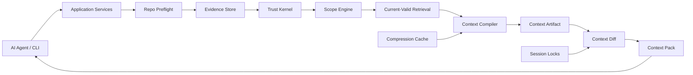

# V1 Architecture

## Purpose

Define the system layers, module boundaries, and dependency direction for Grape V1.

## Required Contents

- high-level architecture diagram
- source tree ownership
- dependency direction rules
- module responsibilities
- forbidden dependencies
- mapping from modules to V1 docs

## Readers

Human engineers and AI agents implementing or reviewing source structure.

## Update Triggers

- a new module is added
- a dependency direction changes
- orchestration moves between layers
- storage, trust, compiler, compression, diff, MCP, or CLI responsibilities change

## Agent Checks

Before editing architecture-related code, agents must verify:

- the module owns the behavior being changed
- core modules do not import CLI or MCP
- storage does not contain business logic
- compression cannot promote claims
- compiler cannot bypass current-valid filtering

## High-Level Architecture



## Dependency Rule

Dependencies flow inward:

```text
CLI/MCP -> app services -> core modules -> storage interfaces/shared types
```

Core modules must not depend on CLI, MCP, test helpers, benchmark helpers, or implementation-specific SQLite details.
