# Grape V1.0 Final Framework Specification

**Status:** Canonical final V1.0 framework contract  
**Canonical source of truth:** This file, `grape_v1_final_framework_spec.md`, is the final V1 implementation contract. If another V1 spec conflicts with this file, this file wins.  
**Product:** Grape — local-first context transport layer for AI coding agents on git repositories  
**Primary goal:** save tokens by compiling safe repository context once per task/session and shipping only the next session-safe context pack diff  
**Safety model:** proof-backed, branch-aware, task-specific context artifacts with explicit uncertainty  
**Runtime:** TypeScript on Node.js 22.13+ for the published alpha package  
**Distribution:** `npm install -g grape-context`  
**Storage:** SQLite + WAL + portable lexical source index
**Integration:** MCP server + CLI  
**Default mode:** local-first, no cloud dependency, no remote embeddings by default  
**V1 target users:** developers using Cursor, Claude Code, Codex, Aider-like CLIs, JetBrains AI, custom internal agents, or any MCP-capable AI coding tool

---

## 0. Executive Summary

Grape V1.0 exists to solve one narrow but expensive problem:

> AI coding agents waste huge amounts of context window and tool calls because they repeatedly rediscover the same repository structure, rules, decisions, failures, tests, and branch-specific facts.

Grape is not another coding assistant. It is the **context infrastructure layer** between a repository and an AI coding agent.

The V1 mechanism is:

```text
repo state
+ branch/worktree state
+ task type
+ active rules
+ proof-backed claims
+ relevant code/test/config evidence
+ reusable compression artifacts
+ previous context sent to this agent session
+ dependency hashes
→ compiled context artifact
→ diffed context pack
→ AI agent receives only what is new, changed, pinned, or invalidated
```

The product is not “memory.” The outward contract is the **ContextPack** diff protocol (`docs/v1/contracts/context-diff.md`). Internally, Grape also produces a **Context Artifact** with a dependency manifest.

V1 product framing (accepted ADR-0010): Grape is a **lightweight extension** agents and repos plug into—enough compile features to be useful, with session-scoped transport as the hero—not a full graph/embedding memory platform in V1.

Grape’s user-visible promise:

> **Grape saves tokens by compiling only the safe, current, task-specific context delta an AI coding agent needs next.**

Grape’s engineering contract:

> **Never save tokens by hiding safety-critical context, stale context, contradictions, missing evidence, or uncertainty.**

The core architecture is built from these layers:

1. Evidence Store
2. RepoSnapshot and WorktreeState
3. Trust Kernel
4. Scope Engine
5. Layer Isolation
6. Claims and Proofs
7. Symbol and Dependency Index
8. Project Rules
9. Current-Valid Retrieval
10. Compression Cache
11. Supersession and Contradiction Engine
12. Dependency Invalidation Engine
13. Task-Specific Context Compiler
14. Token Budget Planner
15. Context Artifact Store
16. Context Diff Engine
17. Session-Scoped Locks
18. MCP/CLI Interfaces
19. Benchmark and Verification Harness

V1.0 succeeds if an AI agent can call `grape_get_context`, and Grape can automatically preflight the repo, sync changed files, compile a task-specific artifact, diff it against what the agent has already seen, and return a safe context delta without manual sync/compile commands.

---

## 1. Problem Definition

Modern AI coding agents are powerful, but their context handling is crude.

Most agents still operate like this:

1. Read files.
2. Search with grep.
3. Infer structure from snippets.
4. Ask for more files.
5. Forget what was already sent.
6. Re-read similar context in the next turn.
7. Repeat the same investigation in future sessions.

This is expensive because code questions are usually structural, not textual.

A developer does not only ask:

> “Where is this string mentioned?”

They ask:

> “What calls this?”  
> “Which tests verify this behavior?”  
> “Is this still true on this branch?”  
> “What did we decide last time?”  
> “Which safety constraints must not be broken?”  
> “What did the agent already see?”  
> “What changed since the last turn?”

Naive RAG does not handle that well. It chunks text, embeds it, retrieves top-k similar chunks, and often misses structure, branch validity, stale proofs, hidden contradictions, and prior context already sent to the model.

The concrete pain points:

| Problem | Real effect |
|---|---|
| Repeated file reading | Token waste and slow agent loops |
| Chunk-based retrieval | Loses call relationships, ownership, and dependency structure |
| Stateless retrieval | Agent forgets decisions and repeats work |
| No branch/worktree awareness | Stale or wrong context appears current |
| No proof model | Assistant speculation can become fake memory |
| No context diffing | Same rules, code spans, and claims are resent repeatedly |
| No dependency invalidation | Old context remains active after files/tests/rules change |
| No explicit uncertainty | Agent over-trusts weak evidence |

Grape focuses on the token-waste problem, but it solves it safely by tracking provenance, scope, invalidation, and session-specific sent context.

---

## 2. Existing Solutions and Gaps

### 2.1 Chunk-based RAG

Traditional RAG works for document Q&A but is weak for codebase work.

It can retrieve semantically similar text, but it does not naturally understand:

- callers and callees
- imports and exports
- routes
- tests linked to code paths
- branch-specific truth
- runtime evidence
- superseded decisions
- what the agent already saw

Main gap:

> It saves some search time, but still wastes tokens and can retrieve stale or structurally incomplete context.

### 2.2 Graphify-style knowledge graphs

Graphify-style systems improve retrieval by representing code, documents, and concepts as graph nodes and edges.

Strengths:

- structural retrieval
- cross-file relationships
- community detection
- better than raw chunk retrieval for structural questions

Gaps:

- often snapshot-oriented
- weak branch/worktree awareness
- weak session memory
- weak contradiction/supersession handling
- weak context diffing
- does not know what the agent already saw

### 2.3 Codebase-Memory-style structural graph systems

These systems index code structure with parsers such as Tree-sitter and expose graph queries through tools or MCP.

Strengths:

- symbol graph
- call-path traversal
- impact analysis
- fast structural queries
- significant token reduction versus raw file exploration

Gaps:

- usually static-structure focused
- weak task/decision memory
- weak branch-specific validity
- weak proof model
- weak context artifact invalidation
- weak context diffing

### 2.4 GraphRAG and hierarchical retrieval

GraphRAG-style systems reduce token use by clustering content and selecting relevant communities.

Strengths:

- hierarchical summarization
- adaptive retrieval
- large corpus summarization
- reduced token cost for global queries

Gaps:

- document-centric
- not code-structure-native
- summaries can become over-trusted
- weak branch/session/worktree semantics
- weak proof and invalidation model

### 2.5 Aider-style repository maps

Aider-style repo maps are practical and useful: build a compact map of important files, symbols, and dependencies, then include budgeted structure in prompts.

Strengths:

- token-aware repository overview
- graph-ranked map
- practical for agents
- low-friction developer workflow

Gaps:

- does not fully solve durable decisions
- does not fully solve proof-backed memory
- does not fully solve branch-specific claim invalidation
- does not fully solve context diffing by session
- does not preserve a dependency-tracked context artifact as a first-class object

### 2.6 AGENTS.md, project rules, and IDE guidelines

Codex, JetBrains, Cursor, and similar tools support persistent instruction files.

Strengths:

- simple
- useful for conventions
- predictable
- low overhead

Gaps:

- rules are broad instructions, not scoped evidence
- no proof system
- no context delta protocol
- no stale rule invalidation beyond file reload
- no dependency manifest tying rules to compiled agent context

### 2.7 Chum-mem / PCKC-style memory

PCKC-style memory is the strongest existing foundation for trustworthy AI coding memory.

Strengths:

- atomic claims
- proofs
- belief gate
- current-valid retrieval
- contradiction/supersession
- layer isolation
- typed retrieval

Gaps:

- memory-focused, not context-artifact focused
- less emphasis on task compiler policies
- less emphasis on session-aware context diffing
- less emphasis on repo/worktree snapshot invalidation as a build-like artifact system

### 2.8 Grape’s actual gap to own

Grape should not claim to beat every system at parsing, code search, memory, or IDE integration.

Grape should own this gap:

> **Incremental, dependency-tracked, proof-safe context compilation for AI coding agents.**

Existing systems retrieve context. Grape compiles and diffs context.

---

## 3. What Grape Aims to Solve

Grape V1.0 solves this:

> Given a current repository state, branch, task, evidence set, project rules, proof-backed claims, and prior sent agent context, produce the smallest safe context delta for the next AI turn.

More concretely, Grape answers:

1. What does the agent need for this task?
2. What has the agent already seen?
3. What changed since then?
4. What is now stale?
5. What must be resent because it is safety-critical?
6. What can be safely omitted?
7. What is omitted but restorable?
8. What is unknown, weak, contradicted, or risky?

### 3.1 The token-saving mechanism

Grape saves tokens through five mechanisms:

| Mechanism | How it saves tokens |
|---|---|
| Incremental repo sync | Does not reparse unchanged files |
| Current-valid filtering | Drops stale/branch-invalid/expired claims before ranking |
| Task-specific compiler | Avoids generic top-k retrieval |
| Compression cache | Uses summaries for routing, never as truth |
| Context diff protocol | Sends only NEW, CHANGED, PINNED, INVALIDATE_PREVIOUS, and restore hints |

The biggest token win is the context diff engine:

```text
Most tools ask: “What should I retrieve again?”
Grape asks: “What did this agent already see, and what actually changed?”
```

### 3.2 The safety mechanism

Grape prevents token savings from becoming unsafe through:

- mandatory proofs for durable claims
- source trust classification before extraction
- deterministic validation
- current-valid retrieval
- dependency manifests
- proof hash checks
- session-scoped sent-item tracking
- pinned safety context
- explicit uncertainty and blind-spot sections
- restoreable omitted context

---

## 4. Product Definition

### 4.1 One-line definition

> **Grape is a local-first incremental context compiler for AI coding agents.**

### 4.2 More precise definition

> **Grape compiles safe, current, proof-backed, branch-aware, task-specific context artifacts, then returns only the context delta an AI agent needs next.**

### 4.3 Mental model

```text
Git tracks source history.
Build systems compile software artifacts.
Test runners verify behavior.
Grape compiles AI coding context.
```

### 4.4 Product object

The central product object is not a vector index, a memory record, or a graph.

The central product object is:

> **Context Artifact**

A Context Artifact is:

- task-specific
- branch-aware
- worktree-aware
- proof-backed
- dependency-tracked
- budgeted
- diffable
- inspectable
- invalidatable
- restorable

### 4.5 V1 product promise

> Grape reduces AI coding context cost after the first turn by tracking what was already sent and only sending safe deltas.

### 4.6 V1 non-negotiable warning

> Grape must never become a token-saving tool that silently hides uncertainty, stale evidence, or safety-critical constraints.

---

## 5. V1 Positioning

### 5.1 What Grape is

Grape V1.0 is:

- a local-first context compiler
- a proof-backed memory kernel
- a branch/worktree-aware context artifact builder
- a session-aware context diff engine
- an MCP-compatible context provider
- a CLI-first inspection/debugging tool
- a token-reduction layer for AI coding agents

### 5.2 What Grape is not

Grape V1.0 is not:

- a coding assistant
- a replacement for Cursor, Claude Code, Codex, Copilot, Aider, or JetBrains AI
- a cloud memory platform
- a complete code intelligence engine
- a full runtime tracing system
- a full patch verifier
- a perfect Git history engine
- a universal parser for every language
- an autonomous patch applier
- a general chatbot over a codebase

### 5.3 V1 priority order

User-visible goal:

1. Token reduction
2. Faster agent turns
3. Less repeated context
4. Better continuity

Engineering priority order:

1. Trust
2. Correctness
3. Setup simplicity
4. Cross-platform reliability
5. Developer inspection/debuggability
6. Token efficiency
7. Automation

Why token efficiency is not first internally:

> If Grape is fast but untrustworthy, it fails. Token savings only matter if the omitted context is safely omitted.

---

## 6. V1 Scope Boundary

### 6.1 Build in V1.0

V1.0 should build the smallest useful infrastructure loop:

- TypeScript/Node.js CLI package
- `npm install -g grape-context`
- `grape init --connect`
- local `.grape/` project directory
- SQLite + WAL + migrations
- local lexical source search
- Git repo detection
- RepoSnapshot and WorktreeState
- file hashing and incremental sync
- ignore policy resolver
- basic secret scanning and redaction
- Evidence Store
- Source/Claim/Proof schema
- Trust Kernel
- Layer Isolation
- Project Rules ingestion
- manual/user-confirmed decisions
- repository-derived code-span claims
- basic Tree-sitter symbol extraction
- current-valid retrieval
- deterministic contradiction/supersession rules
- task-specific compiler policies
- risk overlays
- lightweight Compression Cache for deterministic summaries, outlines, and context-pack digests
- Context Artifact store
- Context Diff Engine
- omitted context restore path
- session-scoped locks
- MCP server
- `grape_get_context`
- inspection/debug CLI commands
- benchmark harness
- bootstrap mode for new projects

### 6.2 Do not build in V1.0

Do not build these in V1:

- full runtime tracing
- production observability integration
- cloud sync
- team sync
- advanced IDE plugin
- universal parser for 20+ languages
- perfect rebase/branch ancestry engine
- advanced graph clustering
- trusted Markdown/Obsidian write-back
- full patch verifier
- autonomous patch application
- automatic huge claim extraction
- complete impact cone guarantee
- multi-repo context graph
- enterprise dashboard
- embeddings by default
- heavy model-based compression cache

### 6.3 V1.1 candidates

Move these to V1.1+:

- heavy/model-based compression beyond deterministic/lightweight summaries
- advanced module summaries
- advanced branch summaries
- advanced session summaries
- embeddings/hybrid semantic search
- advanced claim extraction
- advanced contradiction detection
- framework-specific extractors beyond best-effort
- Rust/Go native indexing helper
- standalone binary distribution
- production observability connectors
- DB/stored procedure introspection

### 6.4 Supported V1 languages/files

Primary:

- TypeScript
- TSX
- JavaScript
- Python
- Markdown
- JSON
- YAML

Best-effort:

- Next.js routes
- Django URLs
- FastAPI decorators
- package scripts
- test configs
- common config files
- lockfiles
- migration files

Fallback:

- unsupported language → file path/text indexing only
- parser failure → file-level lexical indexing
- huge file → skip/truncate with warning
- binary file → skip

---

## 7. High-Level Architecture

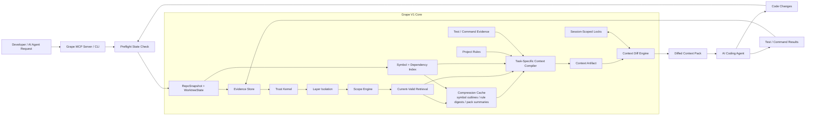

**Compression sits before the compiler, not after it.** It is a reusable derived-cache layer that provides symbol outlines, rule digests, decision digests, failure timelines, test summaries, and previous context-pack summaries. The compiler may use these artifacts to save tokens and route retrieval, but it must still include exact source/proof-backed context for safety-critical sections.

---

## 8. End-to-End Request Lifecycle

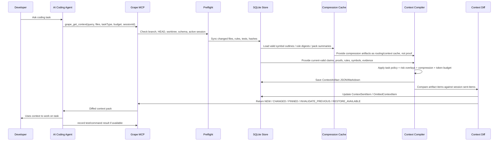

---

## 9. System Parameters

### 9.1 Runtime parameters

| Parameter | V1 value |
|---|---|
| Runtime | Node.js 22.13+ for the published alpha package |
| Language | TypeScript |
| Package | `grape-context` |
| CLI binary | `grape` |
| Storage | SQLite + WAL |
| Search | portable lexical source index |
| Embeddings | off by default |
| Integration | MCP over stdio + CLI |
| Default data location | `.grape/` |
| Cloud sync | off / not V1 |
| Parser | Tree-sitter adapter with fallback |
| Supported OS | macOS, Linux, WSL; Windows native best-effort |

Basic install must not require local native compilation. If SQLite or parser packages need native code, V1 must ship prebuilt binaries for supported platforms or fall back to a pure JS/WASM/file-level mode with an explicit warning.

The published package must contain the compiled `grape` CLI entrypoint and runtime storage migrations needed by local bootstrap. Package verification must fail if build output, SQL migrations, or the documented binary entrypoint would be missing from `npm install -g grape-context`.

The CLI must keep static setup guidance available even when the local Node runtime is below the storage requirement. `grape help`, command-specific `--help`, `grape mcp`, and `grape mcp --print-config` can run without importing SQLite-backed services. Storage-backed commands must fail before importing `node:sqlite` on unsupported runtimes and must return clear recovery guidance.

### 9.2 Default config

```json
{
  "schemaVersion": 1,
  "runtime": "node",
  "storage": "sqlite",
  "defaultEnvironment": "local",
  "mcp": {
    "enabled": true,
    "transport": "stdio"
  },
  "indexing": {
    "languages": ["typescript", "tsx", "javascript", "python", "markdown", "json", "yaml"],
    "maxFileSizeKb": 512,
    "respectGitignore": true,
    "respectAiIgnore": true,
    "respectGrapeIgnore": true
  },
  "context": {
    "defaultTokenBudget": 24000,
    "minimumSafetyBudget": 4000,
    "resendPinnedOnSessionReset": true,
    "restoreOmittedItems": true
  },
  "compression": {
    "enabled": true,
    "mode": "lightweight",
    "allowModelSummaries": false,
    "invalidateOnInputHashChange": true,
    "summaryAsProof": "blocked"
  },
  "privacy": {
    "localOnly": true,
    "secretScan": true,
    "redactEnvValues": true
  },
  "platform": {
    "normalizePaths": true,
    "followSymlinks": false
  }
}
```

### 9.3 Canonical V1 types

These type names are canonical across the V1 contract. Later schemas should reference these aliases instead of redefining narrower local unions.

```ts
type TaskType =
  | "bug_fix"
  | "security_fix"
  | "refactor"
  | "migration"
  | "feature"
  | "test_repair"
  | "analysis"
  | "bootstrap";

type RiskOverlay =
  | "security"
  | "auth"
  | "permissions"
  | "payments"
  | "webhooks"
  | "secrets"
  | "crypto"
  | "migration"
  | "production_config";

type DiffState =
  | "NEW"
  | "CHANGED"
  | "PINNED"
  | "OMIT_UNCHANGED"
  | "INVALIDATE_PREVIOUS"
  | "RESTORE_AVAILABLE";

type SourceType =
  | "repository_file"
  | "git_diff"
  | "test_run"
  | "command_run"
  | "user_message"
  | "tool_call"
  | "runtime_log"
  | "ci_job"
  | "assistant_response"
  | "manual_import"
  | "rule_file"
  | "config_file"
  | "lockfile"
  | "migration_file"
  | "commit_message";

type CompressionArtifactType =
  | "symbol_outline"
  | "rule_digest"
  | "context_pack_summary"
  | "decision_digest"
  | "failure_timeline"
  | "module_outline"
  | "test_summary";

type CompressionMode =
  | "off"
  | "lightweight"
  | "deterministic_only";

type CompressionMethod = "deterministic";

type VerificationStatus =
  | "verified"
  | "partially_verified"
  | "unverified"
  | "refuted"
  | "stale";
```

V1.1+ may add model-based compression methods, `branch_summary`, and `session_summary`, but V1 code and policy must not expose them as active V1 artifact types.

### 9.4 Compile modes

```ts
type CompileMode =
  | "safe_minimum"
  | "partial_with_risk"
  | "broad_context_required"
  | "cannot_compile_safely";
```

| Mode | Meaning |
|---|---|
| `safe_minimum` | Required evidence fits budget and no critical blind spot exists. |
| `partial_with_risk` | Useful context exists, but evidence or graph coverage is incomplete. |
| `broad_context_required` | Impact area is too wide for a small pack; agent should avoid local-only edits. |
| `cannot_compile_safely` | Required exact context is missing or budget is below safety threshold. |

---

## 10. Local Filesystem Layout

```text
.grape/
  grape.db
  config.json
  artifacts/
    ctx_<id>.json
    ctx_<id>.md
  context/
    sessions/
      <session_id>.lock
    branches/
      <branch_hash>.lock
    latest.lock
  logs/
    grape.log
  cache/
    parser/
    lexical/
    compression/
      symbol_outlines/
      rule_digests/
      context_pack_summaries/
      decision_digests/
      failure_timelines/
      module_outlines/
  tmp/
```

Rules:

- Context diff is per session, not global.
- A single global `context.lock` is not enough.
- Artifacts must be generated as both machine-readable JSON and human-readable Markdown.
- Every artifact must have a dependency manifest.
- Final artifacts must pass redaction/secret scan before being stored or returned.

---

## 11. Layer 1 — Evidence Store

Everything starts as evidence.

Evidence is raw, captured input. It is not automatically truth.

### 11.1 Source types

The canonical `SourceType` union is defined in section 9.3. Every source ingested by Grape must use one of those values.

### 11.2 Source schema

```ts
type Source = {
  id: string;
  projectId: string;
  repoId: string;
  repoSnapshotId: string;
  worktreeStateId?: string;

  type: SourceType;
  path?: string;
  branchName?: string;
  commitSha?: string;

  sourceScope: "committed" | "staged" | "unstaged" | "untracked" | "external";

  contentHash: string;
  capturedAt: string;

  trustClass: "trusted" | "temporary" | "untrusted";
  ignoredByPolicy: boolean;

  redactionStatus: "not_needed" | "redacted" | "blocked";

  metadata?: Record<string, unknown>;
};
```

### 11.3 Source trust classification

| Source | Default trust |
|---|---|
| repository file | trusted if not ignored and no secret violation |
| git diff | trusted if produced from local Git state |
| test run | trusted only if Grape observed the command run |
| command run | trusted only if Grape observed the command run |
| agent-reported test result | temporary until verified or explicitly marked external |
| rule file | trusted if not ignored and no secret violation |
| config file | trusted if not ignored and no secret violation |
| lockfile | trusted if not ignored |
| user message | trusted only if explicit decision/confirmation |
| assistant response | temporary only |
| runtime log | trusted only if structured and scoped |
| ci job | trusted only if source metadata is structured, scoped, and verifiable |
| manual import | temporary until promoted |
| commit message | weak context only |
| summary | cache only, never proof |

### 11.4 Source router logic

```ts
function classifySource(source: Source): "trusted" | "temporary" | "untrusted" {
  if (source.ignoredByPolicy) return "untrusted";
  if (source.redactionStatus === "blocked") return "untrusted";

  switch (source.type) {
    case "repository_file":
    case "git_diff":
    case "rule_file":
    case "config_file":
    case "lockfile":
    case "migration_file":
      return "trusted";

    case "test_run":
    case "command_run":
      return source.metadata?.observedByGrape === true ? "trusted" : "temporary";

    case "tool_call":
      return source.metadata?.verifiable === true ? "trusted" : "temporary";

    case "user_message":
      return source.metadata?.containsExplicitDecision === true ? "trusted" : "temporary";

    case "runtime_log":
      return source.metadata?.hasStructuredMetadata === true ? "trusted" : "temporary";

    case "ci_job":
      return source.metadata?.hasStructuredMetadata === true && source.metadata?.verifiable === true
        ? "trusted"
        : "temporary";

    case "assistant_response":
    case "manual_import":
    case "commit_message":
      return "temporary";

    default:
      return "untrusted";
  }
}
```

---

## 12. Layer 2 — RepoSnapshot and WorktreeState

Branch names are not enough. Grape must snapshot actual repo state.

### 12.1 RepoSnapshot

```ts
type RepoSnapshot = {
  id: string;
  projectId: string;
  repoId: string;

  worktreePath: string;
  workspaceRoot?: string;
  serviceRoot?: string;

  branchName: string;
  headCommit: string;
  baseCommit?: string;

  fileManifestHash: string;
  parserVersion: string;
  extractorVersion: string;
  grapeVersion: string;

  status: "complete" | "dirty" | "stale" | "failed";

  createdAt: string;
};
```

### 12.2 WorktreeState

```ts
type WorktreeState = {
  id: string;
  projectId: string;
  repoId: string;
  repoSnapshotId: string;

  dirty: boolean;
  stagedDiffHash?: string;
  unstagedDiffHash?: string;
  untrackedRelevantFilesHash?: string;

  gitStatusSummary: string;
  createdAt: string;
};
```

### 12.3 Worktree rules

- No durable claim, proof, artifact, or rule ingestion should exist without a `repoSnapshotId`.
- If the working tree is dirty, include dirty state in the artifact.
- Working-tree-derived claims are scoped to staged/unstaged/untracked state.
- Working-tree-derived claims are not branch-global.
- Untracked relevant files lower artifact confidence.

### 12.4 Preflight logic

```ts
async function preflight(request: ContextRequest): Promise<PreflightResult> {
  const branch = await git.currentBranch();
  const head = await git.headCommit();
  const status = await git.status();
  const stagedDiffHash = await git.diffHash("staged");
  const unstagedDiffHash = await git.diffHash("unstaged");
  const untrackedHash = await git.untrackedRelevantHash();

  const snapshot = await createOrReuseRepoSnapshot({ branch, head });
  const worktree = await createWorktreeState({ snapshot, status, stagedDiffHash, unstagedDiffHash, untrackedHash });

  await syncChangedFiles(snapshot, worktree);

  if (await repoChangedDuringPreflight(snapshot, worktree)) {
    return preflight(request); // retry once in implementation; then fail clearly
  }

  return { snapshot, worktree };
}
```

---

## 13. Layer 3 — Trust Kernel

The Trust Kernel prevents Grape from becoming a hallucination database.

PCKC belongs here as the trust kernel, not as the entire framework.

### 13.1 Trust Kernel flow

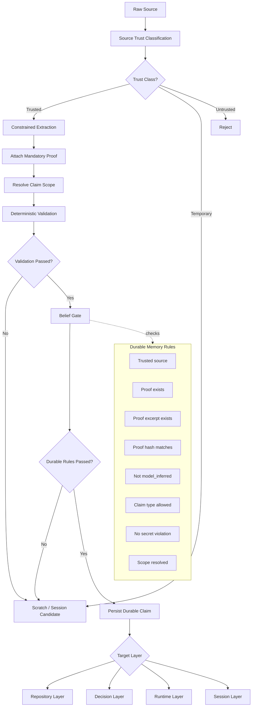

### 13.2 Durable memory rule

A claim becomes durable only if:

```text
source.trustClass = trusted
claim.authorityClass != model_inferred
proof exists
proof excerpt exists in source
proof hash matches source
proof support is compatible with claim type
scope resolution is not mismatch or unknown for durable activation
claim.layer != scratch
claim type is allowed for source type
deterministic validator passes
no secret/redaction violation exists
```

### 13.3 Proof interpretation

| Proof type | What it proves | What it does not prove |
|---|---|---|
| code span | implementation exists | correctness or global behavior |
| AST edge | structural relationship was found | complete call graph |
| test output | observed behavior in one run | product truth or production behavior |
| user confirmation | intent, decision, or belief | repository/runtime behavior |
| command output | command result happened | root cause |
| git diff | code changed | bug fixed |
| commit message | weak context | implementation truth |
| summary | routing/cache value | proof of truth |

### 13.4 Claim extraction rule

V1.0 allowed durable extraction:

- repository facts from code spans
- symbol existence from Tree-sitter
- imports/exports from parser
- obvious AST edges when reliable
- test result claims from Grape-observed test runs
- command result claims from Grape-observed command runs
- explicit user decisions
- project rules from rule files

V1.0 forbidden durable extraction:

- broad model-generated memory mining
- automatic root-cause claims
- large session summarization into durable claims
- automatic architecture decisions from code shape
- production behavior claims without production/runtime evidence

---

## 14. Layer 4 — Scope Engine

Most real contradictions are scope errors.

A claim may be true for one branch, environment, route, feature flag, team, or caller and false elsewhere. Grape may classify source trust before scope is known, but it must resolve scope before belief-gating a durable claim, current-valid retrieval, ranking, supersession, compression, or omission.

### 14.1 Scope schema

```ts
type Scope = {
  repoId: string;
  serviceRoot?: string;
  branch?: string;
  commit?: string;
  sourceScope?: "committed" | "staged" | "unstaged" | "untracked" | "external";
  environment?: "local" | "test" | "ci" | "staging" | "production" | "unknown" | "*";
  featureFlag?: string;
  path?: string;
  symbol?: string;
  route?: string;
  test?: string;
  taskId?: string;
  sessionId?: string;
};
```

### 14.2 Scope match result

```ts
type ScopeMatchStatus =
  | "match"
  | "mismatch"
  | "partial"
  | "unknown";

type ScopeMatchResult = {
  status: ScopeMatchStatus;
  matchedDimensions: string[];
  mismatchedDimensions: string[];
  unknownDimensions: string[];
  reason: string;
};
```

Rules:

- `match` may be used as active task context.
- `partial` may be used only as scoped warning/context unless task policy explicitly accepts it.
- `unknown` must not be promoted to active truth; surface it as missing context or `unknown_scope_overlap`.
- `mismatch` must not be retrieved as current-valid context.

### 14.3 Scope rules

- Branch-specific claims are not global.
- Working-tree claims are not branch-global.
- Staging claims do not supersede production claims.
- Feature-flagged claims do not become unflagged claims.
- User-confirmed claims are scoped to intent/belief unless code/runtime proof exists.
- If two claims conflict but scopes do not overlap, both may be active.
- If two claims conflict and scope overlap is unknown, mark `needs_review` or `unknown_scope_overlap`.

---

## 15. Layer 5 — Layer Isolation

Grape uses five isolated layers.

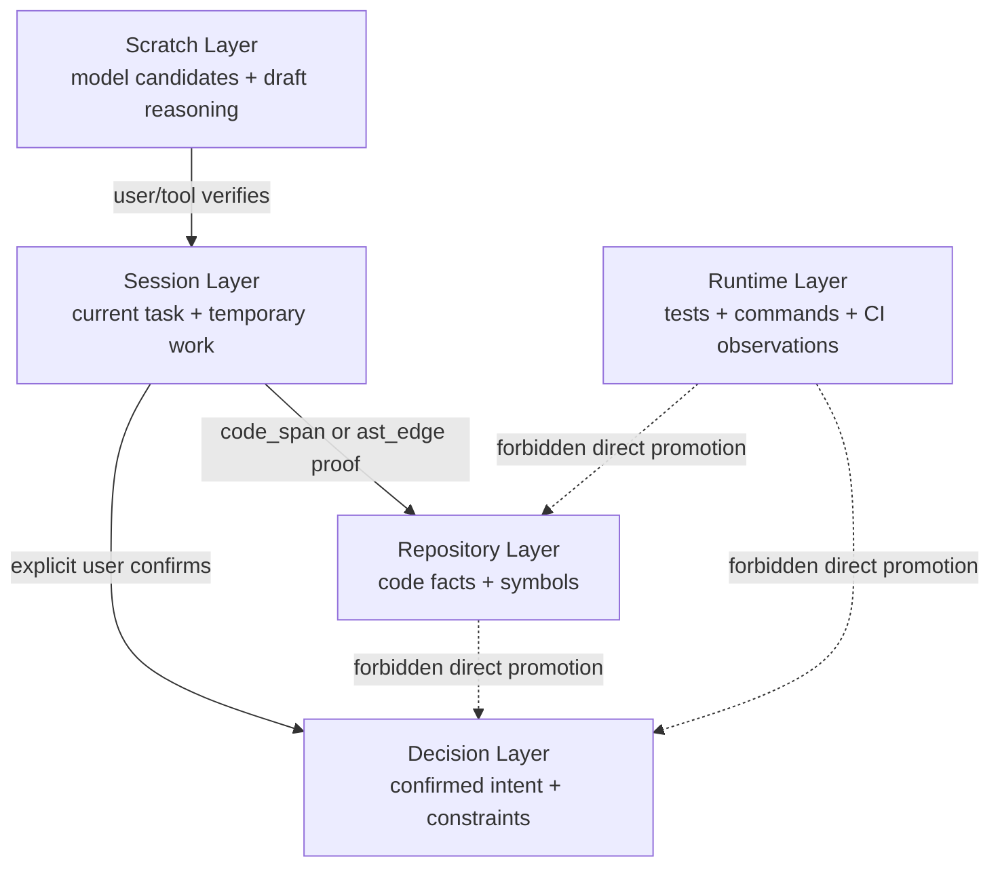

Layer meanings:

| Layer | Meaning |
|---|---|
| Repository | Code facts from files, ASTs, imports, routes, symbols |
| Runtime | Test, command, CI, or structured runtime observations |
| Decision | User-confirmed product, architecture, workflow, and project decisions |
| Session | Current task state, temporary work history, tool calls |
| Scratch | Model candidates, summaries, draft reasoning, hypotheses |

Hard rule:

```text
Repository proves implementation.
Runtime proves observed behavior.
User confirms intent.
The model proposes possibilities.
No layer silently becomes another layer.
```

---

## 16. Layer 6 — Claims and Proofs

### 16.1 Claim schema

```ts
type Claim = {
  id: string;
  projectId: string;
  repoId: string;
  repoSnapshotId: string;

  layer: "repository" | "decision" | "runtime" | "session" | "scratch";

  type:
    | "fact"
    | "decision"
    | "constraint"
    | "invariant"
    | "task"
    | "bug"
    | "fix"
    | "implementation_detail"
    | "test_result"
    | "risk"
    | "open_question"
    | "deployment_note"
    | "architecture_decision"
    | "behavior_hypothesis"
    | "blind_spot";

  subjectKind:
    | "symbol"
    | "file"
    | "directory"
    | "route"
    | "api_endpoint"
    | "database_table"
    | "environment_variable"
    | "feature_flag"
    | "test"
    | "branch"
    | "project"
    | "task"
    | "rule"
    | "unknown";

  subjectRef: string;
  predicate: string;
  object?: string;
  text: string;

  authorityClass:
    | "repository_derived"
    | "test_verified"
    | "user_confirmed"
    | "tool_verified"
    | "model_inferred";

  verificationStatus: VerificationStatus;
  confidence: number;

  scope: Scope;

  status:
    | "active"
    | "superseded"
    | "contradicted"
    | "refuted"
    | "expired"
    | "untrusted"
    | "scratch"
    | "needs_review";

  ttlPolicy?: "none" | "short" | "medium" | "long" | "until_next_deploy" | "until_file_change";
  expiresAt?: string;
  supersededBy?: string;

  contentHash: string;
  scopeHash: string;

  createdAt: string;
  updatedAt: string;
};
```

### 16.2 Atomicity rule

Bad durable claim:

```text
The auth system is broken.
```

Good durable claim:

```text
The auth callback route returns 401 when the session cookie is missing.
```

A durable claim must be:

- atomic
- scoped
- proof-backed
- compatible with its proof
- invalidatable

### 16.3 Proof schema

```ts
type Proof = {
  id: string;
  claimId: string;
  sourceId: string;
  repoSnapshotId: string;

  proofType:
    | "code_span"
    | "ast_edge"
    | "git_diff"
    | "test_output"
    | "command_output"
    | "user_confirmation"
    | "tool_result"
    | "runtime_log"
    | "ci_result"
    | "manual_note";

  authorityClass:
    | "repository_derived"
    | "test_verified"
    | "user_confirmed"
    | "tool_verified"
    | "model_inferred";

  proofScope:
    | "implementation"
    | "behavior"
    | "intent"
    | "configuration"
    | "observation"
    | "historical_context";

  supportsStrength: "direct" | "indirect" | "partial" | "context_only" | "contradicts";
  coverageRelation: "direct" | "partial" | "adjacent" | "unknown";

  repoPath?: string;
  symbolId?: string;
  startLine?: number;
  endLine?: number;

  commitSha?: string;
  branchName?: string;

  command?: string;
  exitCode?: number;

  excerpt: string;
  excerptHash: string;

  verificationStatus: VerificationStatus;

  createdAt: string;
};
```

---

## 17. Layer 7 — Symbol and Dependency Index

V1 needs a basic symbol index, not a perfect code intelligence engine.

### 17.1 SymbolNode

```ts
type SymbolNode = {
  id: string;
  projectId: string;
  repoId: string;
  repoSnapshotId: string;

  path: string;
  language: string;

  name: string;
  kind:
    | "function"
    | "class"
    | "method"
    | "interface"
    | "type"
    | "variable"
    | "constant"
    | "module"
    | "route"
    | "unknown";

  startLine: number;
  endLine: number;

  bodyHash?: string;
  signatureHash?: string;

  confidence: "high" | "medium" | "low";

  createdAt: string;
};
```

### 17.2 SymbolEdge

```ts
type SymbolEdge = {
  id: string;
  projectId: string;
  repoId: string;
  repoSnapshotId: string;

  fromSymbolId: string;
  toSymbolId?: string;

  edgeType:
    | "contains"
    | "imports"
    | "exports"
    | "calls"
    | "references"
    | "routes_to"
    | "configures";

  confidence: "high" | "medium" | "low";
  discoveryMethod?: "ast" | "import_resolution" | "framework_extractor" | "config_scan" | "runtime_trace" | "manual" | "inferred";

  createdAt: string;
};
```

### 17.3 Dependency confidence rule

Use:

```text
impact candidate set
```

Never claim:

```text
complete impact cone
```

V1 static graph blind spots must be surfaced:

- dynamic imports
- reflection
- dependency injection
- event bus
- string-based routing
- framework magic
- stored procedures
- cron jobs
- external services
- manual deployments

---

## 18. Layer 8 — Project Rules

Project rules are persistent instructions and constraints.

### 18.1 Rule sources

Grape should detect:

- `AGENTS.md`
- `.cursor/rules`
- `.cursorrules`
- `.aiassistant/rules`
- `.junie/guidelines.md`
- README sections with explicit conventions
- docs with explicit conventions
- `.grape/rules.md`

### 18.2 ProjectRule schema

```ts
type ProjectRule = {
  id: string;
  projectId: string;
  repoId: string;
  repoSnapshotId: string;

  sourceId: string;
  path?: string;

  ruleType:
    | "coding_style"
    | "architecture"
    | "testing"
    | "security"
    | "workflow"
    | "ignore_policy"
    | "agent_instruction";

  text: string;

  scopePath?: string;
  scope: Scope;

  authorityClass: "rule_file" | "user_confirmed" | "generated_candidate";

  status: "active" | "candidate" | "stale" | "conflicting" | "disabled";

  contentHash: string;
  createdAt: string;
  updatedAt: string;
};
```

### 18.3 Rule handling

- Explicit rule files are active if not ignored.
- Generated bootstrap rules are candidates only.
- Candidate rules are not durable decisions until confirmed.
- Nested rules use nearest applicable scope.
- Conflicting rules are surfaced, not silently merged.
- Rule file changes invalidate artifacts that used the old rule hash.

---

## 19. Layer 9 — Current-Valid Retrieval

Current-valid retrieval is a safety filter before relevance ranking.

### 19.1 Current-valid claim rule

A claim is current-valid if:

```text
status = active
verificationStatus = verified
authorityClass != model_inferred
scope match result = match for current repo/branch/worktree/environment/feature flag
proof source still exists
proof hash still matches
not superseded
not refuted
not contradicted by stronger active claim
not expired
not from ignored file
not blocked by redaction policy
```

`partially_verified` claims are not current-valid truth by default. They may be included as warnings, weak context, or open verification notes only when the task policy allows them. For high-risk overlays, required sections must use verified direct proof; partially verified claims cannot satisfy required exact context.

### 19.2 Retrieval flow

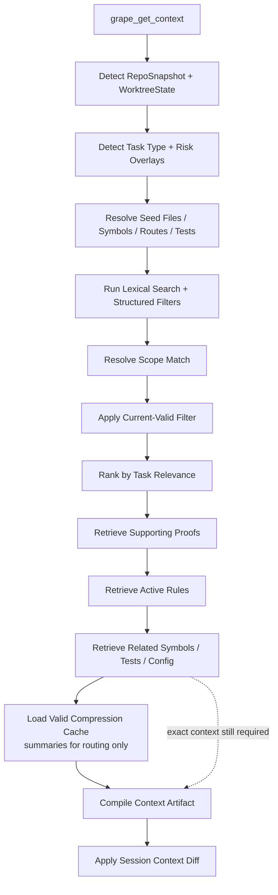

### 19.3 Relevance ranking signals

After current-valid filtering, rank by:

- task relevance
- edited-file proximity
- dependency distance
- matched symbol
- matched route/config/test
- recent failure match
- risk overlay relevance
- proof strength
- authority compatibility
- recency
- environment match
- branch/worktree match

Current V1 implementation note: when task retrieval selects concrete source
refs, scaffold exact-source proof creation and artifact `current-valid-claims`
rendering are scoped to those selected refs plus pinned rule excerpts. Grape
uses the broader exact-source fallback only when retrieval has no selected
source refs, so a task-specific artifact does not fill unused proof/claim slots
with unrelated files from the same commit. Inspection commands such as
`grape claims --active` may still list all current-valid claims for debugging.

---

## 20. Layer 10 — Compression Cache

Compression is a first-class V1 layer because Grape's main goal is token reduction. But compression is **derived cache, not truth**.

The compression layer sits between current-valid retrieval / dependency state and the context compiler:

```text
current-valid claims + proofs + symbols + rules + tests + prior artifacts
→ dependency-checked compression artifacts
→ compiler routing + low-risk summaries + diff-friendly context sections
```

Compression is used for three things:

1. **Routing:** help the compiler decide which modules, decisions, failures, and prior artifacts are worth expanding.
2. **Budget shaping:** replace low-risk repeated background with short summaries when exact source is not required.
3. **Diff efficiency:** summarize unchanged prior context so the agent gets a compact reminder instead of repeated full context.

Compression is never used for:

- proving durable claims
- validating correctness
- superseding claims
- replacing required exact code for high-risk tasks
- hiding stale or contradicted evidence

### 20.1 V1 compression modes

The canonical `CompressionMode` union is defined in section 9.3. V1 supports only `off`, `lightweight`, and `deterministic_only`.

V1 default:

```json
{
  "compression": {
    "enabled": true,
    "mode": "lightweight",
    "allowModelSummaries": false,
    "invalidateOnInputHashChange": true
  }
}
```

For V1, keep compression conservative:

| Artifact | V1 status | Notes |
|---|---:|---|
| `symbol_outline` | required | deterministic from symbol index |
| `rule_digest` | required | deterministic from active rules |
| `context_pack_summary` | required | derived from previously sent artifact items |
| `decision_digest` | optional | only from user-confirmed decisions |
| `failure_timeline` | optional | only from test/command evidence and confirmed bug/fix claims |
| `module_outline` | optional | deterministic outline only; no model summary in V1 |
| `test_summary` | optional | deterministic from Grape-observed test results |

`branch_summary`, `session_summary`, and model-written module summaries are V1.1+ only.

### 20.2 CompressionArtifact schema

```ts
type CompressionArtifact = {
  id: string;

  projectId: string;
  repoId: string;
  repoSnapshotId: string;
  worktreeStateId?: string;

  artifactType: CompressionArtifactType;

  layer: "repository" | "decision" | "runtime" | "session" | "context";
  subjectRef: string;
  scope: Scope;

  summaryText: string;

  inputRefs: Array<{
    kind: "claim" | "proof" | "file" | "rule" | "test" | "symbol" | "context_artifact";
    ref: string;
    hash: string;
  }>;

  inputHash: string;
  tokenCount: number;

  compressionMethod: CompressionMethod;
  trustStatus: "derived_cache" | "stale" | "invalid";

  createdAt: string;
  updatedAt: string;
};
```

### 20.3 Compression rules

```text
Summaries are cache, not truth.
Summaries can guide retrieval.
Summaries can reduce repeated background context.
Summaries can explain omitted unchanged context.
Summaries cannot prove claims.
Summaries cannot supersede claims.
Summaries cannot promote scratch/session memory into durable memory.
Summaries cannot appear in a `Proof`.
Summaries cannot replace active contradictions, stale warnings, missing verification warnings, pinned invariants, or required exact spans.
Summaries must list input refs and input hashes.
Summaries must be listed in the artifact dependency manifest when used.
If an input hash changes, the summary becomes stale.
If stale compression was previously sent, the next diff must emit `INVALIDATE_PREVIOUS`.
`context_pack_summary` must be a deterministic ledger of sent item IDs, labels, hashes, and states, not a freeform model summary.
`context_pack_summary` must be rebuilt from current active sent-ledger rows before it is rendered, and it must exclude invalidated rows, compression rows, and rows from other branch/head scopes.
Summary-as-proof is a critical violation.
```

### 20.4 Compression decision logic

`canUseCompression` means "may this section be represented by a compression artifact instead of exact context?" It does not forbid loading compression artifacts as routing/orientation hints.

```ts
function canUseCompression(section: ContextSection, policy: CompilerPolicy): boolean {
  if (!section.canCompress) return false;
  if (policy.forbiddenOmissions.includes(section.id)) return false;
  if (policy.compressionForbiddenForSections.includes(section.id)) return false;
  if (policy.riskOverlays.length > 0) return false;
  if (section.safetyCritical) return false;
  if (section.containsActiveContradiction) return false;
  if (section.containsStaleInvalidationWarning) return false;
  if (section.containsMissingVerificationWarning) return false;
  if (section.pinned) return false;
  if (section.requiresExactCode) return false;
  return true;
}
```

### 20.5 Compression invalidation

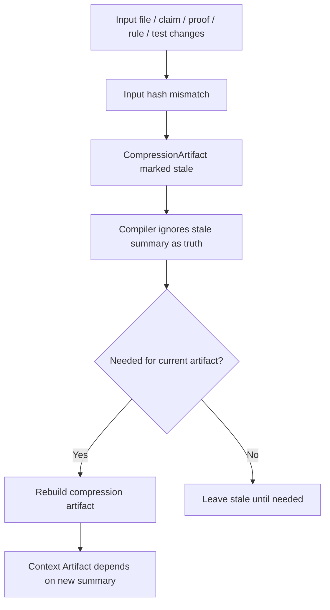

### 20.6 Hard rule for high-risk tasks

For any active `RiskOverlay`:

```text
Compression may provide orientation only.
It must not replace exact required code, config, proof, rule, contradiction,
invariant, stale-warning, or missing-verification sections.
```

---

## 21. Supersession and Contradiction Engine

### 21.1 ClaimEdge schema

```ts
type ClaimEdge = {
  id: string;
  fromClaimId: string;
  toClaimId: string;

  edgeType:
    | "supersedes"
    | "contradicts"
    | "depends_on"
    | "validated_by"
    | "caused_by"
    | "related_to"
    | "narrows"
    | "broadens"
    | "needs_review"
    | "violates"
    | "coexists_with"
    | "variant_of"
    | "unknown_scope_overlap";

  confidence: number;
  reason: string;

  createdBy: "deterministic_rule" | "model_suggestion" | "user_confirmation" | "test_verification";
  createdAt: string;
};
```

### 21.2 Supersession rule

Never use this rule:

```text
newer + higher authority = automatically correct
```

A claim can supersede another claim only if:

```text
same project
same resolved subject
same claim type group
overlapping branch scope
overlapping environment scope
overlapping feature flag scope if applicable
new proof directly replaces old proof
authority class is valid for that claim type
```

### 21.3 Contradiction rule

If two claims conflict and scope overlap is unknown:

```text
Do not guess.
Create needs_review / unknown_scope_overlap / related_to.
Surface active conflict in the context artifact.
```

### 21.4 Coexisting contradiction rule

If two implementations disagree but both may be in production for different call paths:

```text
Do not resolve.
Store both as variant_of or coexists_with.
Require scope discovery before consolidation.
```

---

## 22. Dependency Invalidation Engine

Every context artifact is a build-like artifact with dependencies.

### 22.1 Invalidation graph

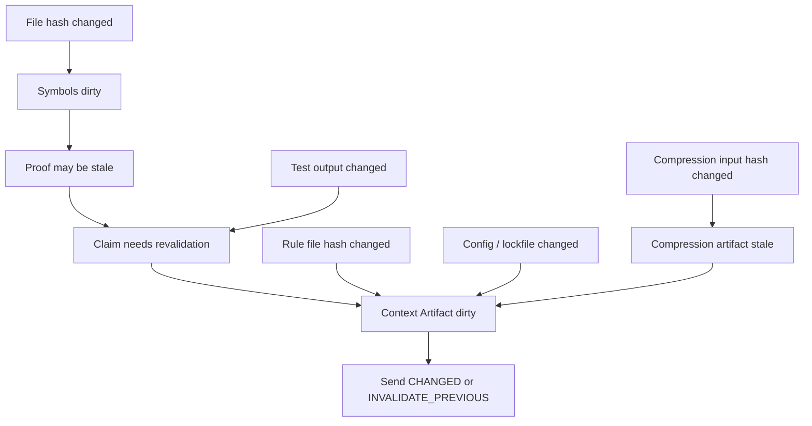

### 22.2 DependencyStrength

```ts
type DependencyStrength =
  | "direct"
  | "symbol"
  | "test"
  | "rule"
  | "config"
  | "compression"
  | "weak_related";
```

### 22.3 Invalidation behavior

| Change | Behavior |
|---|---|
| direct file proof changes | mark proof stale, claim stale/needs_revalidation |
| symbol body changes | mark symbol-linked claims needs_revalidation |
| test output changes | create new test_result claim |
| rule file changes | recompile active rules section |
| config/lockfile changes | invalidate dependency context |
| compression input changes | mark compression artifact stale; never use as proof |
| branch changes | validate scope; resend or invalidate branch context |
| session reset | resend pinned context |
| package lock changes | invalidate dependency context |

---

## 23. Task-Specific Context Compiler

The compiler does not perform generic top-k retrieval. It compiles by task type and risk overlay.

### 23.0 Compression-aware compilation rule

The compiler may use compression artifacts for **routing, prioritization, deduplication, and budget planning**, but never as proof.

```text
Compression can answer:
- Which module is probably relevant?
- Which previously sent section can be omitted?
- Which stable context can be replaced by a short reminder?
- Which large file can be represented by an outline unless exact spans are required?

Compression cannot answer:
- Is this claim true?
- Is this behavior correct?
- Is this security-sensitive code safe?
- Has this invariant been verified?
```

Hard rules:

- Any active `RiskOverlay` means required context cannot be summary-only.
- Any compressed section must list its source input hashes.
- If any source input hash changes, the compression artifact is stale.
- The compiler must prefer exact source spans over compression when any risk overlay is active.
- Compression is a budget optimization, not a trust source.


Compression is part of compilation, but it is not proof. The compiler can use compression artifacts to avoid resending unchanged symbol outlines, rule digests, context-pack summaries, failure timelines, and decision digests. For any active `RiskOverlay`, compressed context can supplement exact context; it cannot replace exact code, config, proof, rule, contradiction, invariant, stale-warning, or missing-verification sections.

### 23.1 Context compiler flow

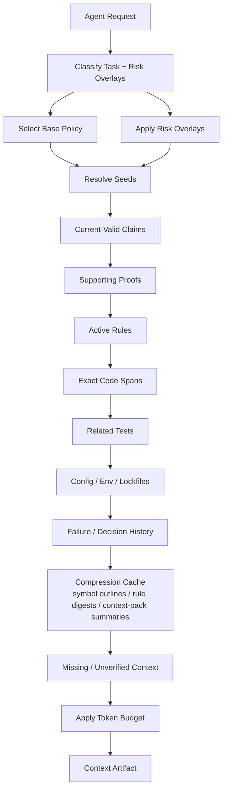

### 23.2 Compiler policy object

```ts
type CompilerPolicy = {
  taskType: TaskType;
  riskOverlays: RiskOverlay[];
  requiredSections: string[];
  optionalSections: string[];
  pinnedSections: string[];
  forbiddenOmissions: string[];
  allowedCompressionArtifacts: CompressionArtifactType[];
  compressionForbiddenForSections: string[];
  minimumSafetyBudget: number;
  fallbackMode: CompileMode;
};
```

### 23.3 Bug fix policy

Prioritize:

- failing test output
- bug claims
- target code spans
- recent diffs
- previous related fixes
- related tests
- active contradictions
- missing verification notes

Required sections:

- task summary
- dirty worktree status
- target code spans
- related tests if found
- known risks
- missing verification notes

Recommended budget:

| Section | Budget |
|---|---:|
| task summary/rules | 10% |
| failure memory | 20% |
| exact target code | 30% |
| related tests | 20% |
| recent diffs | 10% |
| proofs/open questions | 10% |

### 23.4 Security/auth/payment/webhook policy

Hard rule:

```text
Never summary-only for any active RiskOverlay.
```

Prioritize:

- exact sensitive code
- middleware
- auth/session/permission logic
- config and environment variable names
- webhook/payment handlers
- security tests
- known risks
- active invariants
- pinned rules

Required sections:

- exact code spans
- active rules
- relevant config names, not raw secret values
- risk overlay explanation
- missing verification notes
- pinned safety context

### 23.5 Refactor policy

Prioritize:

- impact candidate set
- known callers/callees
- public interfaces
- types
- related tests
- invariants
- dependency confidence

Rule:

```text
Use impact candidate set, not complete impact cone.
```

### 23.6 Migration policy

Prioritize:

- migration files
- schema files
- ORM models
- rollback notes
- deployment notes
- config
- test data / seed data
- affected code paths

### 23.7 Feature policy

Prioritize:

- similar existing features
- architecture decisions
- project rules
- interfaces/types
- examples
- tests
- open questions

### 23.8 Test repair policy

Prioritize:

- failing test output
- exact test file spans
- implementation under test
- previous flaky-test claims
- recent diffs
- environment assumptions

---

## 24. Token Budget Planner

### 24.1 Budget principles

The budget planner should save tokens, but not by removing critical context.

Rules:

1. Current-valid safety filter happens before budget pruning.
2. Pinned safety context cannot be removed due to budget.
3. Exact code spans are required for high-risk tasks.
4. Summaries can route retrieval but cannot replace required proof/code.
5. Compression artifacts are eligible for omission/reuse only if their input hashes still match.
6. Omitted items must be restoreable when possible.
7. If safe context does not fit, return `partial_with_risk` or `cannot_compile_safely`.

### 24.2 Omission order

Omit in this order:

1. low-relevance summaries
2. weak-related historical notes
3. low-confidence inferred candidates
4. distant dependency nodes
5. unchanged non-pinned claims
6. unchanged non-pinned code spans

Never omit silently:

- active security rules
- active invariants
- exact sensitive code required by risk policy
- stale-context invalidation warnings
- active contradictions relevant to task
- missing verification warnings

### 24.3 Budget decision logic

```ts
function evaluateCompileSafety(artifact: ContextArtifact, policy: CompilerPolicy): CompileMode {
  if (policy.forbiddenOmissions.some(item => artifact.omittedRequired.includes(item))) {
    return "cannot_compile_safely";
  }

  if (artifact.tokenBudget !== undefined && artifact.tokenBudget < policy.minimumSafetyBudget) {
    return "cannot_compile_safely";
  }

  if (artifact.criticalBlindSpots.length > 0 && artifact.riskOverlays.length > 0) {
    return "partial_with_risk";
  }

  if (artifact.graphConfidence === "low" && artifact.taskType === "refactor") {
    return "partial_with_risk";
  }

  if (artifact.impactCandidateSetTooLarge) {
    return "broad_context_required";
  }

  return "safe_minimum";
}
```

---

## 25. Context Artifact

The Context Artifact is Grape’s central product.

### 25.1 Shared context artifact schemas

```ts
type ContextInput = {
  id: string;
  kind:
    | "source"
    | "claim"
    | "proof"
    | "file"
    | "rule"
    | "symbol"
    | "test"
    | "config"
    | "lockfile"
    | "compression_artifact"
    | "repo_snapshot"
    | "worktree_state"
    | "session_ledger";
  ref: string;
  hash: string;
  scope: Scope;
  dependencyStrength: DependencyStrength;
  requiredForSafety: boolean;
};

type ContextSectionType =
  | "task_summary"
  | "repo_state"
  | "rule"
  | "claim"
  | "proof"
  | "code_span"
  | "test"
  | "config"
  | "compression_summary"
  | "symbol"
  | "risk"
  | "contradiction"
  | "blind_spot"
  | "open_question"
  | "missing_context"
  | "omitted_manifest"
  | "diff_summary";

type ContextSection = {
  id: string;
  type: ContextSectionType;
  title: string;
  text: string;

  itemRefs: Array<{
    kind: ContextInput["kind"];
    ref: string;
    hash: string;
  }>;

  riskOverlays: RiskOverlay[];
  tokenCount: number;
  contentHash: string;

  pinned: boolean;
  safetyCritical: boolean;
  requiresExactCode: boolean;
  canCompress: boolean;

  containsActiveContradiction: boolean;
  containsStaleInvalidationWarning: boolean;
  containsMissingVerificationWarning: boolean;

  compressionArtifactId?: string;
  restoreable: boolean;
  restoreHint?: string;
};

type ContextDependency = {
  id: string;
  kind:
    | "file"
    | "source"
    | "claim"
    | "proof"
    | "rule"
    | "config"
    | "lockfile"
    | "symbol"
    | "test"
    | "compression_artifact"
    | "repo_snapshot"
    | "worktree_state"
    | "session_ledger";
  ref: string;
  hash: string;
  scope: Scope;
  strength: DependencyStrength;
  requiredForSafety: boolean;
  invalidates: Array<"claim" | "proof" | "section" | "artifact" | "compression_artifact" | "sent_item">;
};

type ContextDependencyManifest = {
  manifestVersion: number;
  artifactId: string;
  dependencies: ContextDependency[];
  inputHash: string;
  generatedAt: string;
};

type ContextPackItem = {
  id: string;
  state: DiffState;
  itemKind:
    | "claim"
    | "proof"
    | "code_span"
    | "rule"
    | "test_output"
    | "symbol_summary"
    | "compression_artifact"
    | "open_question"
    | "context_summary"
    | "invalidation"
    | "restore_hint";
  itemRef: string;
  sectionId?: string;
  title: string;
  content: string;
  contentHash: string;
  tokenCount: number;
  pinned: boolean;
  safetyCritical: boolean;
  invalidatesSentItemId?: string;
  restoreId?: string;
  inputRefs: ContextInput[];
};
```

Dependency manifest rules:

- Every exact source span, proof, rule, config, lockfile, symbol edge, test result, and compression artifact used by an artifact must appear in `dependencies`.
- If any dependency hash changes, the affected section and artifact are dirty until recompiled or invalidated.
- If a dependency was previously sent to a session and becomes stale, the next diff must include `INVALIDATE_PREVIOUS`.
- Compression artifacts are dependencies, never proof.

### 25.2 ContextArtifact schema

```ts
type ContextArtifact = {
  id: string;

  projectId: string;
  repoId: string;
  repoSnapshotId: string;
  worktreeStateId: string;
  sessionId: string;
  taskId?: string;

  artifactFormatVersion: number;

  taskType: TaskType;

  compileMode: CompileMode;

  riskOverlays: RiskOverlay[];

  branch: string;
  headCommit: string;

  dirtyWorktree: boolean;
  stagedDiffHash?: string;
  unstagedDiffHash?: string;
  untrackedRelevantFilesHash?: string;

  environmentScope: "local" | "test" | "ci" | "staging" | "production" | "unknown";

  inputRefs: ContextInput[];
  compressionArtifactRefs: string[];
  outputSections: ContextSection[];
  compressionArtifactsUsed: string[];

  dependencyManifest: ContextDependencyManifest;

  confidence: "high" | "medium" | "low";
  graphConfidence: "high" | "medium" | "low" | "unknown";
  impactCandidateSetTooLarge: boolean;

  missingContext: string[];
  unverifiedAssumptions: string[];
  activeContradictions: string[];
  blindSpots: string[];
  criticalBlindSpots: string[];

  omittedRequired: string[];
  omittedDueToBudget: OmittedContextItem[];

  tokenBudget?: number;
  tokenCost: number;
  contentHash: string;

  createdAt: string;
  invalidatedAt?: string;
  invalidatedReason?: string;
};
```

### 25.3 Artifact sections

A V1 artifact may include:

- task summary
- branch and commit
- dirty worktree status
- environment scope
- risk overlays
- active project rules
- current-valid claims
- supporting proofs
- exact code spans
- valid compression summaries/outlines where allowed
- related symbols
- related tests
- relevant config
- known risks
- active contradictions
- graph confidence
- blind spots
- open questions
- missing/unverified context
- omitted due to budget
- omitted item manifest
- restore hints
- context diff summary

### 25.4 Dual output

Each artifact must be written as:

```text
.grape/artifacts/ctx_<id>.json
.grape/artifacts/ctx_<id>.md
```

The JSON is the canonical machine contract for agents/tools. The Markdown is a human- and model-readable rendering of the same structured context pack. It must include, at minimum, artifact identity/branch metadata, diff-state counts, context pack item metadata and input refs, omitted/restore metadata, output section summaries, dependency manifest details, token/budget status, and warning/safety fields.

---

## 26. Context Diff Engine

This is Grape’s main token-saving feature.

Grape tracks what each agent session has already seen and sends only what changed, what is new, what is pinned, or what must be invalidated.

### 26.1 Diff protocol

```text
NEW
CHANGED
PINNED
OMIT_UNCHANGED
INVALIDATE_PREVIOUS
RESTORE_AVAILABLE
```

These values are the canonical `DiffState` values. Do not use `INVALIDATED` as a protocol value; use `INVALIDATE_PREVIOUS`.

### 26.2 Meaning

| State | Meaning |
|---|---|
| NEW | Send item fully. |
| CHANGED | Send changed item and explain what changed. |
| PINNED | Resend short version because safety-critical. |
| OMIT_UNCHANGED | Do not resend if safe, unchanged, and not pinned. |
| INVALIDATE_PREVIOUS | Tell agent previously sent context is stale/wrong. |
| RESTORE_AVAILABLE | Omitted item can be requested by ID/tool. |

### 26.3 ContextSentItem

```ts
type ContextSentItem = {
  id: string;
  sessionId: string;
  taskId?: string;
  artifactId: string;

  itemKind: ContextPackItem["itemKind"];

  itemRef: string;
  itemHash: string;

  branchName: string;
  commitSha: string;

  wasPinned: boolean;
  lastDiffState: DiffState;
  omitReason?: string;
  restoreHint?: string;
  sessionResetId?: string;

  firstSentAt: string;
  lastSentAt: string;
  sendCount: number;

  tokenCount: number;
};
```

### 26.4 OmittedContextItem

```ts
type OmittedContextItem = {
  id: string;
  sessionId: string;
  artifactId: string;
  sectionId: string;

  itemKind: ContextPackItem["itemKind"];
  itemRef: string;
  itemHash: string;
  contentHash: string;

  branchName: string;
  commitSha: string;
  dependencyManifestHash: string;
  lastDiffState: DiffState;

  reasonOmitted: string;
  canRestore: boolean;
  restoreId?: string;
  restoreCommand?: string;
  sendCount: number;
  tokenCount: number;
};
```

The diff engine must produce structured `ContextPackItem[]` first. Markdown is only a rendering of that array for human inspection and model delivery.

### 26.5 Diff flow

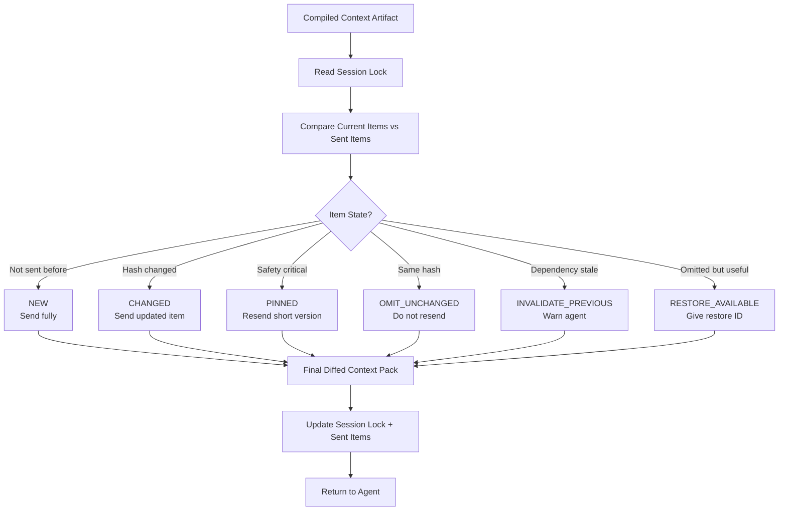

### 26.6 Agent memory loss rule

Do not assume the model remembers everything previously sent.

Pinned rules, invariants, and safety-critical constraints should be resent as short reminders when:

- task changes
- agent session resets
- context window may have dropped previous pack
- branch changes
- risk overlay is active
- any high-risk task or `RiskOverlay` is active

---

## 27. Session-Scoped Locks

A single global lockfile is unsafe.

V1 must support:

- two agents running at once
- two terminals in the same repo
- two tasks on the same branch
- branch changes mid-session
- agent session reset
- agent switching

### 27.1 ContextSession

```ts
type ContextSession = {
  id: string;
  projectId: string;
  repoId: string;

  agentName?: string;
  agentSessionId?: string;

  taskId?: string;
  taskType?: TaskType;

  branchName: string;
  baseCommit?: string;
  headCommit: string;

  repoSnapshotId: string;
  worktreeStateId: string;

  status: "active" | "paused" | "completed" | "invalidated";

  startedAt: string;
  lastSeenAt: string;
};
```

### 27.2 Lock rules

- Context diff is per session.
- Same branch does not mean same task.
- Same agent does not mean same session.
- Branch change invalidates branch-scoped sent context unless global.
- Session reset resends pinned context.
- Cross-process writes require coordination, not only in-process queues.

---

## 28. MCP and CLI Interfaces

### 28.1 MCP principle

MCP tools should be mostly read-only by default.

Agents can request context and record evidence. They cannot directly promote durable truth without proof or user confirmation.

### 28.2 Required read tools

- `grape_get_context`
- `grape_get_claims`
- `grape_get_proofs`
- `grape_get_rules`
- `grape_get_omitted_item`
- `grape_get_artifact`
- `grape_get_stale_items`
- `grape_get_conflicts`
- `grape_get_status`

### 28.3 Restricted write tools

- `grape_record_candidate`
- `grape_record_test_result`
- `grape_record_command_result`
- `grape_record_user_decision`
- `grape_request_user_confirmation`

Restricted write tools create evidence records only. They do not directly create durable claims unless the Trust Kernel can verify the proof and scope rules.

```ts
type GrapeRecordCommandResultInput = {
  observedRunId?: string;
  command: string;
  commandHash: string;
  cwd: string;
  exitCode: number;
  startedAt: string;
  endedAt: string;
  stdoutHash: string;
  stderrHash: string;
  observedByGrape: boolean;
};

type GrapeRecordTestResultInput = GrapeRecordCommandResultInput & {
  testFramework?: string;
  testFiles?: string[];
  testNames?: string[];
};

type GrapeRecordUserDecisionInput = {
  prompt: string;
  promptHash: string;
  response: string;
  responseHash: string;
  confirmationChannel: "cli_prompt" | "mcp_user_confirmation" | "config_file" | "rule_file";
  confirmedByUser: boolean;
  confirmedAt: string;
  scope: Scope;
};
```

Rules:

- Agent-reported command/test results are temporary unless tied to a Grape-observed `observedRunId`.
- A command/test result is trusted only when `observedByGrape = true`, hashes are recorded, and the working directory is scoped.
- User decisions require direct confirmation with prompt hash, response hash, timestamp, confirmation channel, and scope.
- `grape_record_user_decision` may record a candidate decision, but durable decision claims require Trust Kernel promotion from direct confirmation proof.

### 28.4 Forbidden autonomous actions

- `grape_promote_claim_without_proof`
- `grape_mark_claim_verified_without_source`
- `grape_delete_memory_without_user_confirmation`
- `grape_override_ignored_file_policy_without_confirmation`
- `grape_read_ignored_file_without_confirmation`

### 28.5 `grape_get_context` input

```ts
type GrapeGetContextInput = {
  query: string;

  taskType?: Exclude<TaskType, "bootstrap">;

  files?: string[];
  symbols?: string[];
  tests?: string[];

  environmentScope?: "local" | "test" | "ci" | "staging" | "production" | "unknown";

  tokenBudget?: number;

  sessionId?: string;
  agentName?: string;
  agentSessionId?: string;
};
```

`files` are explicit repository source hints. `symbols` and non-path `tests`
contribute retrieval terms. Path-like `tests` entries, such as
`tests/auth.test.ts` or `src/foo.spec.ts`, are treated as explicit test source
hints when they match allowed snapshot sources. Test source hints can select
exact, hash-backed source excerpts, but they do not prove behavior or test
success unless a separate trusted test-run proof exists. When the lightweight
index records that a test file imports a task-selected source file, Grape may
include that test file as related exact source context for orientation only.
When any source refs are selected through files, path-like tests, symbols,
lexical matches, or related-test imports, exact source proof rows are created
from those selected refs instead of backfilling unrelated repository files.
If retrieval finds no selected source refs, Grape may fall back to bounded
generic exact-source excerpts so the artifact remains inspectable.

### 28.6 `grape_get_context` output

```ts
type GrapeGetContextOutput = {
  artifactId: string;
  sessionId: string;

  branch: string;
  headCommit: string;
  dirtyWorktree: boolean;

  taskType: TaskType;
  riskOverlays: RiskOverlay[];
  compileMode: CompileMode;

  contextPackItems: ContextPackItem[];
  contextPackMarkdown: string;

  diffSummary: {
    newItems: number;
    changedItems: number;
    pinnedItems: number;
    omittedItems: number;
    invalidatedItems: number;
    restoreAvailableItems: number;
  };

  warnings: string[];
  restoreAvailable: boolean;
};
```

### 28.7 Required CLI commands

Everyday:

```bash
grape help
grape status
grape doctor
```

Setup/MCP:

```bash
grape init --connect
grape mcp
grape mcp --print-config
grape mcp --stdio
```

Manual fallback:

```bash
grape sync
grape compile
grape diff-context
```

Inspection/debugging:

```bash
grape sessions
grape artifacts
grape claims --active
grape proofs
grape proofs --proof <proof_id>
grape proofs --source <source_id>
grape proofs <claim_id>
grape stale
grape conflicts
grape omitted
grape bench
```

Decision recording:

```bash
grape add-decision "Use thin route handlers for auth routes"
grape decisions review
```

Privacy/data:

```bash
grape doctor --privacy
grape export
grape purge
```

Do not ship `grape ask` in V1. It makes Grape look like another coding assistant.

---

## 29. Bootstrap Mode

New projects have little or no durable context. Grape should not invent history.

### 29.1 Bootstrap detects

- language/framework
- package manager
- scripts
- test command
- entry points
- config files
- routes when possible
- ignored/generated files
- first repo snapshot
- first worktree state
- candidate project rules
- bootstrap confidence levels

### 29.2 Bootstrap artifact example

```md
Detected project:
- Next.js app
- TypeScript
- Tailwind
- Vitest

Detected commands:
- pnpm dev
- pnpm build
- pnpm test

Known rules:
- none confirmed yet

Candidate rules:
- Use existing folder structure.
- Run pnpm test before final changes.
- Do not edit generated files.

Confidence:
- medium for framework detection
- low for architecture assumptions
```

### 29.3 Bootstrap rule

Candidate rules are not durable decisions until confirmed.

---

## 30. Legacy/Brownfield Mode

Legacy systems are where Grape must be most honest.

### 30.1 Assumption

In legacy mode, assume:

- naming may lie
- tests may be wrong
- docs may contradict code
- duplicate logic may serve undocumented cases
- graph edges may be incomplete
- production state may not match branch state
- user confirmation may be incomplete

### 30.2 Legacy compile behavior

In legacy mode:

- downgrade broad behavior claims
- prefer exact implementation observations
- use `impact candidate set`, never complete impact cone
- mark dynamic/framework blind spots
- do not auto-resolve contradictions
- include known variants and undocumented contract candidates
- surface missing verification
- prefer `partial_with_risk` when graph/evidence is weak

### 30.3 Legacy-safe claim phrasing

Bad:

```text
createInvite prevents duplicate pending invites.
```

Better:

```text
In src/invites/service.ts, createInvite contains a code path that checks pending invites before insert.
No claim is made about other invite creation paths.
```

### 30.4 BlindSpot object

```ts
type BlindSpot = {
  id: string;
  class:
    | "dynamic_import"
    | "reflection"
    | "dependency_injection"
    | "event_bus"
    | "stored_procedure"
    | "external_service"
    | "manual_deploy"
    | "feature_flag"
    | "unknown_runtime";
  affectedScope: Scope;
  risk: "low" | "medium" | "high" | "critical";
  suggestedProbe?: string;
};
```

---

## 31. Privacy and Security

### 31.1 Local-first rule

V1.0 is local-first.

No cloud sync. No telemetry by default. No remote embeddings by default.

### 31.2 Ignored files

Respect:

- `.gitignore`
- `.cursorignore`
- `.aiignore`
- `.grapeignore`

Ignored files are not indexed by default.

If a user explicitly asks to include ignored files:

1. require confirmation
2. record approval source
3. apply redaction policy
4. scope access to current session unless configured otherwise

### 31.3 Secret handling

If a secret appears in a proof excerpt or artifact:

- redact if possible
- block persistence if unsafe
- mark redaction status
- validate proof hashes against the canonical source span hash, not against redacted display text
- store redacted excerpt/display hashes separately when needed for artifact diffing
- warn in `grape doctor`
- never include raw `.env` values in context artifacts
- include environment variable names only when useful

Final context artifacts must pass artifact-level secret scan before they are stored or returned.

---

## 32. Database Model

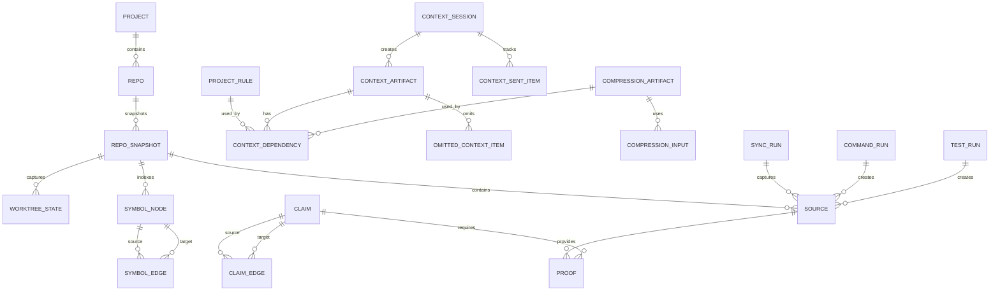

Minimum tables:

- `projects`
- `repos`
- `repo_snapshots`
- `worktree_states`
- `sources`
- `claims`
- `proofs`
- `claim_edges`
- `symbol_nodes`
- `symbol_edges`
- `project_rules`
- `context_sessions`
- `context_artifacts`
- `context_dependencies`
- `compression_artifacts`
- `compression_inputs`
- `context_sent_items`
- `omitted_context_items`
- `sync_runs`
- `command_runs`
- `test_runs`
- `schema_migrations`

---

## 33. Normal Workflow

### 33.1 Setup

```bash
npm install -g grape-context
grape init --connect
```

### 33.2 Agent workflow

```text
Developer asks agent to perform task.
Agent calls grape_get_context through MCP.
Grape preflights repo/worktree state.
Grape syncs changed files if needed.
Grape detects task type and risk overlays.
Grape resolves scope matches for candidate context.
Grape retrieves current-valid context.
Grape loads or rebuilds valid compression artifacts from unchanged dependencies.
Grape compiles context artifact.
Grape diffs against session-sent context.
Grape returns diffed context pack.
Agent uses context to work.
Agent records command/test results when available.
Grape updates evidence, claims, stale state, and sent-item state.
```

### 33.3 No mandatory manual workflow

Users should not need to run these during normal usage:

```bash
grape sync
grape compile
grape diff-context
```

Those commands are for debugging and fallback.

---

## 34. Logic Engine Summary

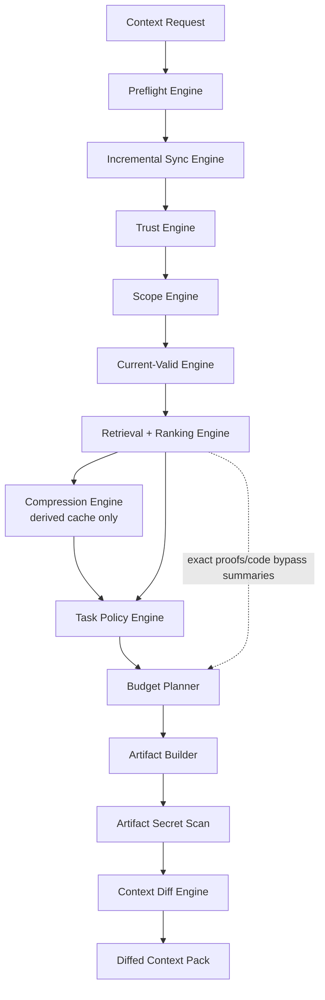

### 34.1 Main compile pseudocode

```ts
async function getContext(input: GrapeGetContextInput): Promise<GrapeGetContextOutput> {
  const preflight = await preflightRepo(input);
  await syncChangedEvidence(preflight);

  const session = await resolveContextSession(input, preflight);
  const task = classifyTask(input.query, input.taskType, input.files);
  const overlays = detectRiskOverlays(input.query, input.files, preflight);

  const seeds = await resolveSeeds(input, preflight, task, overlays);
  const candidates = await retrieveCandidates(seeds, task, overlays);
  const scoped = await resolveScopeMatches(candidates, preflight, input.environmentScope);
  const currentValid = await filterCurrentValid(scoped, preflight, input.environmentScope);
  const ranked = rankForTask(currentValid, task, overlays, seeds);

  const compressionHints = await loadOrBuildCompressionArtifacts({
    ranked,
    task,
    overlays,
    preflight,
  });

  const artifact = await compileArtifact({
    input,
    preflight,
    session,
    task,
    overlays,
    ranked,
    compressionHints,
  });

  const scanned = await scanArtifactForSecrets(artifact);
  if (scanned.blocked) throw new UnsafeArtifactError(scanned.reason);

  const diff = await diffAgainstSession(scanned.artifact, session);
  await persistSentItems(diff, session);

  return formatMcpOutput(diff);
}
```

---

## 35. Default Handling Matrix

| Situation | Default handling |
|---|---|
| Claim has no proof | Reject durable persistence |
| Source is assistant response | Scratch/session only |
| Source is ignored file | Do not index without approval |
| Secret appears in proof excerpt | Redact or block persistence |
| Proof hash mismatch | Mark proof and claim stale |
| Branch changed mid-session | Invalidate branch-scoped context |
| Environment scope differs | Do not retrieve as active truth |
| Feature flag differs | Do not retrieve as global truth |
| Summary dependency changed | Mark summary stale |
| Summary used as proof | Block as critical violation |
| Supersession uncertain | `needs_review`, no automatic supersession |
| Contradiction detected | Surface conflict, do not merge silently |
| Security task lacks exact code | Warn/block unsafe compile |
| Token budget too small | Return `partial_with_risk` or `cannot_compile_safely` |
| Multiple agents in one repo | Use session-scoped locks |
| Architecture docs conflict with code | Surface architecture drift |
| No related tests found | Continue with verification warning |
| Agent session reset | Resend pinned safety context |
| Omitted item needed | Restore by item ID/tool |
| New project | Bootstrap mode, candidate rules only |
| Manual memory edit | Treat as candidate source |
| Package lock changed | Invalidate dependency context |
| SQLite DB locked | Retry with busy timeout, then fail clearly |
| Schema migration fails | Stop and report migration error |
| Tree-sitter parser fails | Fallback to file-level indexing |
| Unsupported language | Index file path/text only |
| Huge file detected | Skip or truncate with warning |
| Binary file detected | Skip |
| Windows path issue | Normalize path separators |
| Symlink detected | Resolve safely or skip with warning |
| Dynamic import detected | Add blind spot and widen candidate set |
| Event bus detected | Include known event names/listeners and mark coverage partial |
| Stored procedure reference found | Create external dependency stub |
| Manual deploy process found | Do not claim production validity without deployment evidence |

---

## 36. Benchmarking Strategy

Benchmarks are mandatory from the start.

Benchmark targets are not valid unless each fixture defines:

- a labeled gold corpus for claims, proofs, scopes, stale states, and expected current-valid results
- a scripted naive baseline that uses fixed grep/read-file/tool-call behavior
- expected first-turn, second-turn, and changed-file token counts
- expected pinned, omitted, invalidated, and restored context items
- expected unsafe omission count of zero

Do not report token reduction against an ad hoc baseline.

### 36.1 Belief and trust benchmarks

- `canonical_final_spec_is_single_source_of_truth`
- `belief_gate_rejects_model_inferred_claims`
- `assistant_summary_never_enters_durable_memory`
- `repository_claim_requires_code_span_proof`
- `test_result_claim_requires_test_output_proof`
- `user_decision_requires_explicit_confirmation`
- `user_decision_requires_direct_confirmation_prompt_hash`
- `session_claim_cannot_promote_to_repository_without_code_proof`
- `summary_never_used_as_proof`
- `compression_artifact_never_promotes_durable_claim`
- `fake_agent_test_result_remains_temporary`
- `manual_memory_edit_creates_candidate_source_not_verified_claim`
- `ignored_file_not_indexed_by_default`
- `secret_excerpts_redacted_or_blocked`
- `ci_job_source_classified_explicitly`

### 36.2 Retrieval and validity benchmarks

- `scope_resolution_precedes_current_valid_filter`
- `superseded_claim_hidden_by_default`
- `contradicted_claim_hidden_or_flagged`
- `branch_invalid_claim_not_retrieved`
- `stale_file_hash_marks_claim_stale`
- `current_valid_retrieval_respects_environment_scope`
- `feature_flag_scope_prevents_false_global_claim`
- `feature_flag_unknown_does_not_match_global_truth`
- `test_output_only_partially_validates_broad_behavior_claim`
- `current_valid_claims_ranked_by_task_relevance`

### 36.3 Context artifact and diff benchmarks

- `context_section_schema_validates_required_flags`
- `context_pack_output_contains_structured_items`
- `invalidated_state_name_is_consistent`
- `context_diff_omits_unchanged_claims`
- `context_diff_omits_unchanged_compression_artifacts`
- `context_diff_invalidates_stale_claims`
- `agent_session_reset_resends_pinned_context`
- `omitted_context_has_restore_path`
- `task_transition_recompiles_context_artifact`
- `same_branch_parallel_tasks_do_not_share_sent_items`
- `lockfile_is_session_scoped`
- `branch_change_resends_or_invalidates_branch_context`
- `dependency_manifest_invalidates_on_rule_proof_code_hash_change`
- `redacted_excerpt_hash_validation_is_defined`

### 36.4 Compiler benchmarks

- `security_task_includes_exact_code_not_summary_only`
- `risk_overlay_compression_forbidden_for_security_migration_secrets_crypto`
- `security_overlay_applies_to_refactor_task`
- `refactor_task_includes_callers_and_callees`
- `bug_fix_task_includes_failure_memory`
- `new_project_bootstrap_marks_rules_as_candidate`
- `dirty_worktree_claims_are_not_branch_global`
- `package_lock_change_invalidates_dependency_context`
- `compression_input_hash_change_marks_summary_stale`
- `compression_does_not_replace_high_risk_exact_spans`
- `summary_replaced_context_has_restore_path`
- `token_budget_too_small_returns_partial_with_risk`

### 36.5 Cross-platform benchmarks

- `install_succeeds_on_macos_arm64`
- `install_succeeds_on_macos_x64`
- `install_succeeds_on_linux_x64`
- `install_succeeds_on_linux_arm64`
- `native_free_install_smoke_test`
- `paths_normalize_across_platforms`
- `repo_with_spaces_in_path_initializes`
- `symlink_loop_does_not_hang`
- `parser_failure_falls_back_to_file_index`
- `no_bash_required_for_core_commands`
- `concurrent_mcp_processes_do_not_corrupt_sqlite`
- `case_only_rename_warns_on_case_insensitive_filesystem`
- `wsl_mounted_windows_repo_warns_about_performance`

### 36.6 Minimum correctness targets

| Metric | Target |
|---|---:|
| model-derived durable claims | 0 |
| reasoning leak rate | 0 |
| cross-layer contamination | 0 |
| summary-as-proof violations | 0 |
| stale compression artifact used as current | 0 |
| ignored-file indexing violations | 0 |
| secret persistence violations | 0 |
| artifact-level secret leak violations | 0 |
| cross-process write corruption | 0 |
| current-valid retrieval correctness on labeled gold fixtures | >= 95% |
| typed claim retrieval precision on labeled claim fixtures | >= 80% |
| context token reduction after first turn versus scripted naive baseline | >= 50% |
| deterministic supersession correctness | >= 90% |
| session lock collision rate | 0 |

### 36.7 Token reduction measurement

Track per session:

```ts
type TokenSavingsMetric = {
  sessionId: string;
  taskId?: string;
  turnNumber: number;
  fixtureName: string;
  baselineName: string;
  naiveEstimatedTokens: number;
  artifactTokenCost: number;
  diffTokenCost: number;
  omittedUnchangedTokens: number;
  pinnedTokenCost: number;
  invalidationTokenCost: number;
  restoreRequestCount: number;
  unsafeOmissionCount: number;
  wallClockMs: number;
  toolCallsAvoided: number;
  savingsRatio: number;
};
```

Formula:

```text
savingsRatio = 1 - (diffTokenCost / naiveEstimatedTokens)
```

Minimum target:

```text
After first turn, context token reduction >= 50% on benchmark fixtures versus the scripted naive baseline, with unsafeOmissionCount = 0.
```

Stretch target:

```text
After first turn, context token reduction >= 70% for stable bug-fix/refactor sessions.
```

---

## 37. Testing Plan

### 37.1 Unit tests

- source trust classification
- proof validation
- claim atomicity validation
- canonical enum/schema validation
- current-valid filtering
- scope matching
- scope match unknown/partial/mismatch handling
- supersession deterministic rules
- contradiction detection deterministic rules
- budget pruning
- compression artifact invalidation
- compression artifact trust boundaries
- high-risk compression blocking
- dependency manifest invalidation
- context pack structured item rendering
- diff state transitions
- secret scan/redaction

### 37.2 Integration tests

- `grape init --connect` in fixture repos
- MCP `grape_get_context` returns artifact
- MCP `grape_get_context` returns structured `contextPackItems`
- MCP command/test result writes remain temporary without observed run IDs
- user decision writes require direct confirmation proof
- changed file invalidates proof/claim/artifact/compression artifact
- branch change invalidates branch-scoped context
- two agent sessions do not collide
- parser failure fallback works
- ignored files stay ignored
- high-risk task blocks summary-only compile

### 37.3 End-to-end tests

Fixtures:

1. clean TypeScript Next.js project
2. Python FastAPI project
3. dirty worktree fixture
4. legacy fixture with duplicate logic and weak tests
5. repo with ignored secret files
6. monorepo fixture
7. branch switch fixture
8. concurrent MCP sessions fixture

E2E assertions:

- install/init works
- first context artifact is generated
- second request omits unchanged context
- stale context is invalidated
- pinned context is resent after session reset
- omitted item can be restored
- final artifact has no raw secrets

### 37.4 Performance tests

| Operation | V1 target |
|---|---:|
| CLI startup | < 700ms |
| `grape status` | < 1s |
| `grape doctor` | < 5s |
| small repo init | < 10s |
| medium repo init | < 45s |
| no-change sync | < 300ms |
| changed-file sync, 1-10 files | < 2s |
| changed-file sync, 100 files | < 10s |
| context compile, small repo | < 1.5s |
| context compile, medium repo | < 5s |
| diff-context | < 500ms |
| MCP get context, no changes | < 1s |
| MCP get context, changed files | < 3-6s |

### 37.5 Implementation-readiness checklist

Before implementation starts, all of the following must be true:

- this file is the only canonical final V1 spec
- shared V1 types compile as TypeScript
- `RiskOverlay`, `DiffState`, `TaskType`, `SourceType`, and `CompressionArtifactType` are used consistently
- dependency manifest rules are implemented for source, proof, rule, config, test, symbol, and compression inputs
- MCP write tools create evidence only and cannot directly promote durable truth
- `grape_get_context` returns structured `contextPackItems` plus rendered Markdown
- scope matching returns deterministic `match`, `mismatch`, `partial`, or `unknown`
- high-risk overlays block summary-only required context
- basic install works without local native compilation on supported platforms
- benchmark fixtures define gold labels and scripted naive baselines

---

## 38. Implementation Order

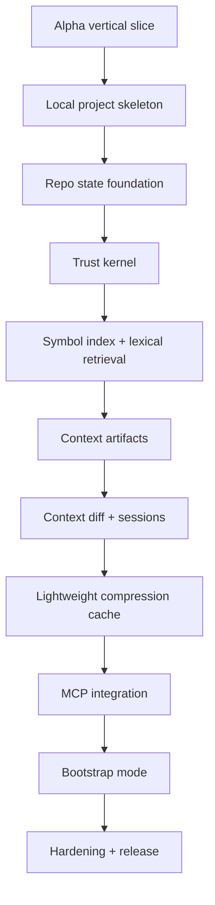

### Alpha vertical slice

Build:

- package skeleton
- CLI binary
- `grape init --connect` minimal path
- SQLite WAL database and migrations
- Git RepoSnapshot and WorktreeState
- ignore policy and secret baseline
- lexical file/rule index
- MCP `grape_get_context`
- Context Artifact JSON/Markdown output
- session sent-item diff

Tests:

- two-command setup works in fixture repo
- MCP returns context artifact without manual sync/compile/diff
- no-change request avoids full repo scan
- final artifact redaction blocks test secrets
- two concurrent Grape processes do not corrupt session/artifact state

### Local project skeleton

Build:

- monorepo/package structure
- TypeScript CLI
- `.grape/` directory creation
- SQLite setup
- migrations
- config file
- `grape init`
- `grape help`
- `grape status`
- `grape doctor`

### Repo state foundation

Build:

- Git repo detection
- repo snapshots
- worktree state
- file manifest
- file hashing
- ignore policy
- basic secret scan/redaction

### Trust kernel

Build:

- sources
- claims
- proofs
- deterministic validator
- belief gate
- layer isolation

### Symbol index and lexical retrieval

Build:

- parser adapter
- basic TS/JS/Python extraction
- symbol nodes
- symbol edges
- lexical source index tables
- current-valid filter
- task relevance ranking

### Context artifacts

Build:

- context artifact schema
- dependency manifest
- task policies
- risk overlays
- missing/unverified context section
- dual JSON/Markdown output

### Context diff and sessions

Build:

- context sessions
- session-scoped locks
- sent item tracking
- omitted item manifest
- restore path
- pinned context behavior

Reason:

Compression depends on knowing what was previously sent, omitted, pinned, and restoreable. Build the diff/session substrate before richer compression behavior.

### Lightweight compression cache

Build:

- compression artifact schema
- deterministic symbol outlines
- rule digests
- context-pack summaries from sent-item state
- module outlines when safely derivable
- failure timelines and decision digests from current-valid inputs
- input hash tracking and stale invalidation
- rule that summaries can route/reduce context but never prove truth

### MCP integration

Build:

- MCP server
- `grape_get_context`
- read inspection tools
- command/test result recording
- safe write boundaries
- `grape mcp --print-config`

### Bootstrap mode

Build:

- framework detection
- package manager detection
- script detection
- candidate rules
- bootstrap artifact
- confidence labels

### V1 hardening

Build:

- benchmark runner
- privacy doctor
- purge/export commands
- performance profiling
- packaging polish
- npm release pipeline

---

## 39. Final V1 Acceptance Criteria

Grape V1.0 succeeds if it reliably does this:

```text
Given a repo, branch, worktree state, task, rules, proofs, tests, and prior sent context,
Grape compiles a current, proof-backed, task-specific context artifact,
tracks exactly what was sent per session,
invalidates stale context when dependencies change,
resends pinned safety-critical context when needed,
and exposes the result to AI coding agents through MCP.
```

Grape V1.0 fails if:

- assistant speculation becomes durable truth
- summaries become proof
- a single global context lock causes session collision
- stale branch claims are retrieved as active truth
- compression summaries become proof
- stale compression artifacts are treated as current context
- high-risk tasks get summary-only context
- agent memory loss causes omitted safety context
- manual setup requires more than two commands
- MCP setup is confusing
- no-change sync is slow
- debugging requires reading internal files manually
- macOS works but Linux/WSL breaks
- install requires native compilation for basic usage
- cross-process writes corrupt session/artifact state
- agent-reported test output becomes trusted evidence without verification
- final artifact leaks raw secrets

Final rule:

> **Grape should be conservative, inspectable, local-first, cross-platform, and useful in two commands.**

> **The token win comes from incremental context diffing, not from pretending weak evidence is strong.**

---

## 40. Final Framework Summary

Grape V1 is best understood as:

```text
Evidence Store
+ Trust Kernel
+ Scope Engine
+ Dependency Invalidation
+ Compression Cache
+ Task-Specific Compiler
+ Context Artifact
+ Context Diff
+ Session Locks
+ MCP Delivery
= Incremental AI Coding Context Framework
```

The thing Grape does better than generic RAG, repo maps, or memory stores is not merely retrieving relevant context.

It compiles a **safe delta**:

```text
NEW: context the agent has not seen
CHANGED: context whose hash/evidence changed
PINNED: safety-critical context that must be resent
INVALIDATE_PREVIOUS: previous context now stale
OMITTED: unchanged context safely left out
RESTORE_AVAILABLE: omitted context the agent can fetch by ID
```

That is the defensible V1 wedge.
