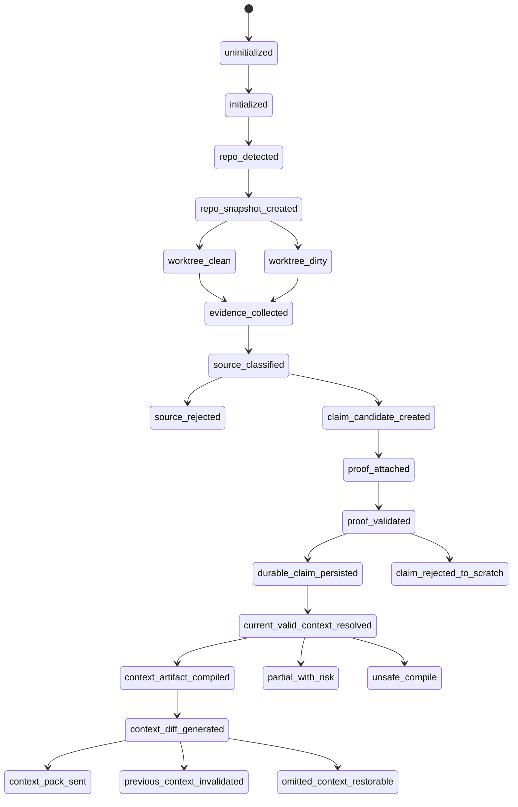

# V1 State Machine

## Purpose

Define Grape V1 as one explicit state machine. No major behavior should happen through hidden side effects.

## Required Contents

- state names
- state meanings
- entry conditions
- allowed transitions
- forbidden transitions
- invariants
- failure behavior
- required tests

## Readers

Core implementers, reviewers, and AI agents changing workflow behavior.

## Update Triggers

- a state is added, renamed, or removed
- a transition is added or changed
- failure behavior changes
- persistence side effects change

## Agent Checks

Before editing stateful code, agents must check:

- the transition is documented here
- the transition has tests
- durable truth is not promoted implicitly
- artifacts and compression caches include dependency/input hashes

## Core States

```text
uninitialized
initialized
repo_detected
repo_snapshot_created
worktree_clean
worktree_dirty
evidence_collected
source_classified
source_rejected
claim_candidate_created
proof_attached
proof_validated
durable_claim_persisted
claim_rejected_to_scratch
current_valid_context_resolved
compression_cache_used
compression_cache_invalidated
context_artifact_compiled
context_artifact_dirty
context_diff_generated
context_pack_sent
previous_context_invalidated
omitted_context_restorable
session_active
session_invalidated
unsafe_compile
partial_with_risk
```

## Strict Rules

- No implicit state transitions.
- No hidden promotion from scratch/session data into durable truth.
- No context artifact without a dependency manifest.
- No compression artifact without input hashes.
- No sent-item omission without safe omission reason or restore metadata.

## Lifecycle Diagram


