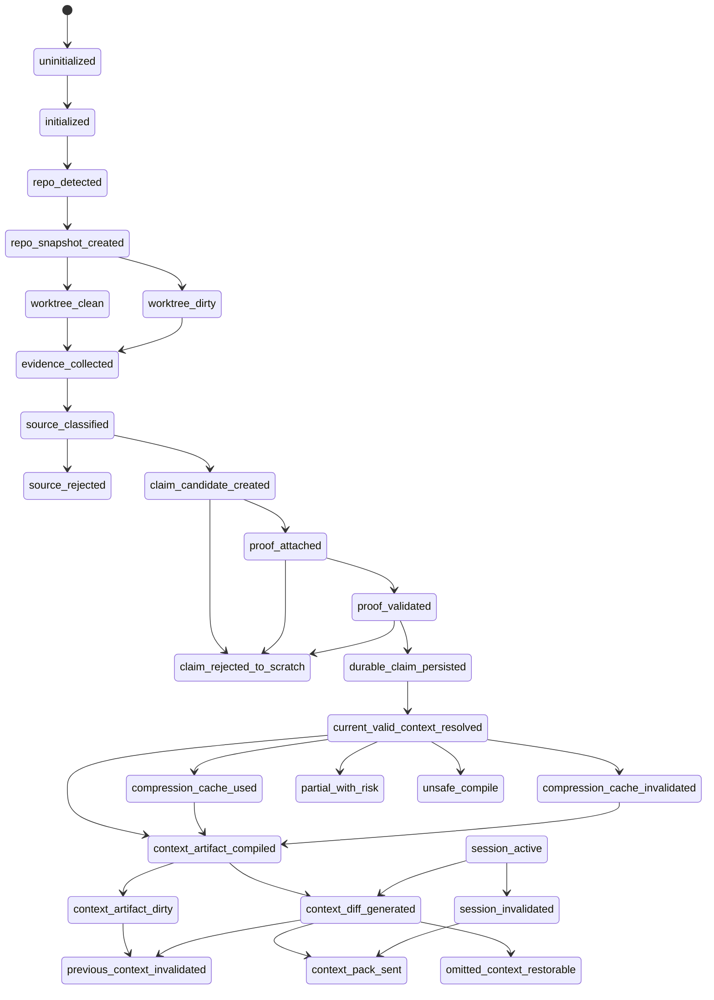

# V1 State Machine

## Purpose

Define Grape V1 as one explicit state machine. No major behavior should happen through hidden side effects.

## Source Of Truth

The canonical states and constraints come from `docs/v1/SPEC.md`. This file makes them implementation-operable.

## Update Triggers

- a state is added, renamed, or removed
- a transition is added or changed
- failure behavior changes
- persistence or invalidation side effects change
- a test exposes an undocumented transition

## Strict Rules

- No implicit state transitions.
- No hidden promotion from scratch/session data into durable truth.
- No context artifact without a dependency manifest.
- No compression artifact without input hashes.
- No sent-item omission without safe omission reason or restore metadata.
- No durable state write without a named event and a transition test.

## State Table

| State | Meaning | Entry conditions | Allowed next states | Forbidden transitions | Invariants | Failure behavior | Required tests |
|---|---|---|---|---|---|---|---|
| `uninitialized` | No project config or database is ready. | No valid local Grape project exists. | `initialized` | any evidence, claim, artifact, or diff state | No storage writes except init metadata. | return setup-needed status | `state_uninitialized_blocks_compile` |
| `initialized` | Local config and storage are ready. | init completed and migrations valid. | `repo_detected`, `unsafe_compile` | durable claim states | schema version matches code. | fail closed with doctor output | `state_initialized_requires_schema_version` |
| `repo_detected` | A repository root and VCS state are detected. | repo root, branch, commit inputs are readable. | `repo_snapshot_created`, `unsafe_compile` | evidence or artifact states | repo identity is stable for this run. | unsafe compile with missing repo warning | `repo_detected_requires_root_and_head` |
| `repo_snapshot_created` | Branch, commit, dirty tree, ignored inputs, and file hashes are captured. | snapshot record persisted with dependency inputs. | `worktree_clean`, `worktree_dirty` | claim promotion | snapshot hash is immutable. | invalidate dependent artifacts for failed snapshot | `snapshot_persists_hashes` |
| `worktree_clean` | No relevant dirty tracked/untracked files affect scope. | snapshot marks clean. | `evidence_collected`, `session_active` | branch-local temporary claims | clean facts may be branch-scoped. | fail closed if status cannot be verified | `clean_worktree_allows_branch_scope` |
| `worktree_dirty` | Dirty files may affect current facts. | snapshot marks dirty or unknown. | `evidence_collected`, `session_active`, `partial_with_risk` | branch-global durable claim activation from dirty proof | dirty facts are worktree-scoped. | attach dirty warning to retrieval/artifacts | `dirty_worktree_not_branch_global` |
| `evidence_collected` | Raw sources were observed and recorded. | source path, type, hash, scope, and privacy status known. | `source_classified` | durable claim persisted | raw evidence is not truth. | rejected evidence goes to diagnostics only | `evidence_collection_records_source_hash` |
| `source_classified` | Source trust class is assigned. | evidence record exists and source type is known. | `claim_candidate_created`, `source_rejected` | `durable_claim_persisted` | classification alone cannot create truth. | low-trust source remains scratch/session only | `source_classification_does_not_promote` |
| `source_rejected` | Source cannot be used safely. | ignored, secret, stale, unsupported, or untrusted source. | terminal for that source | claim/proof/artifact states for that source | rejected source not indexed as active context. | record rejection reason | `ignored_source_rejected_without_approval` |
| `claim_candidate_created` | A possible claim was extracted. | source classified and extraction passed schema validation. | `proof_attached`, `claim_rejected_to_scratch` | durable persistence | candidates are non-durable. | keep in scratch/session with reason | `claim_candidate_requires_source_ref` |
| `proof_attached` | Candidate has a proposed proof reference. | proof source, span/hash, and scope are present. | `proof_validated`, `claim_rejected_to_scratch` | current-valid retrieval | proof must be exact or allowed proof type. | reject to scratch if hash/support missing | `proof_attachment_requires_hash` |
| `proof_validated` | Proof hash and support were checked. | validator confirms source span and support level. | `durable_claim_persisted`, `claim_rejected_to_scratch` | artifact compilation directly | summary is never proof. | reject with validation error | `summary_as_proof_rejected` |
| `durable_claim_persisted` | Claim is durable but not necessarily active. | proof validated, scope resolved, belief gate accepted. | `current_valid_context_resolved` | compression states | no proof means no durable claim. | rollback transaction on persistence error | `durable_claim_requires_valid_proof_and_scope` |
| `claim_rejected_to_scratch` | Candidate remains non-durable. | proof, trust, scope, or policy gate failed. | terminal or future re-evaluation | active current-valid truth | scratch cannot be promoted without replaying gates. | return warning if needed | `rejected_claim_not_current_valid` |
| `current_valid_context_resolved` | Active safe context set is selected. | branch/worktree/env/feature scope matches current run. | `compression_cache_used`, `compression_cache_invalidated`, `context_artifact_compiled`, `partial_with_risk`, `unsafe_compile` | sent context states directly | current-valid is safety filter, not ranking. | emit partial/unsafe state when coverage missing | `current_valid_filters_before_ranking` |
| `compression_cache_used` | Valid deterministic compression artifact was read. | input hashes match and policy allows use. | `context_artifact_compiled` | proof validation or claim promotion | compression is cache, not truth. | fall back to exact source if stale/unsafe | `compression_used_only_with_matching_hashes` |
| `compression_cache_invalidated` | Existing compression no longer matches inputs. | input hash, policy, or scope changed. | `context_artifact_compiled`, `previous_context_invalidated` | compression use without regeneration | stale compression cannot be returned silently. | emit invalidation if previously sent | `stale_compression_emits_invalidation` |
| `context_artifact_compiled` | Artifact was built for task and current scope. | current-valid set exists, dependencies listed, secret scan passes. | `context_diff_generated`, `context_artifact_dirty` | context pack sent | every artifact has dependency manifest. | return unsafe compile if manifest/scan fails | `artifact_requires_dependency_manifest` |
| `context_artifact_dirty` | Existing artifact has stale dependencies. | dependency manifest no longer matches current inputs. | `context_artifact_compiled`, `previous_context_invalidated` | context pack sent as unchanged | stale artifact is not active context. | force recompile or unsafe state | `artifact_dirty_blocks_unchanged_send` |
| `context_diff_generated` | New artifact is compared to session ledger. | session active, artifact valid, sent ledger loaded. | `context_pack_sent`, `previous_context_invalidated`, `omitted_context_restorable` | durable claim states | diff is session-scoped. | return full context on unknown session | `diff_requires_session_scope` |
| `context_pack_sent` | Structured context pack was returned to agent/CLI. | pack items validated and ledger update committed. | `session_active`, `previous_context_invalidated` | source/claim mutation | pinned safety context cannot be omitted. | rollback ledger on transport failure if not observed | `sent_pack_updates_ledger` |
| `previous_context_invalidated` | Previously sent context is no longer valid. | stale sent item, branch switch, dependency change, or session reset. | `context_pack_sent`, `session_invalidated` | omit without warning | invalidation must name prior item IDs. | force resend or invalidate session | `invalidate_previous_names_item_ids` |
| `omitted_context_restorable` | Unchanged context was omitted with restore metadata. | safe omission reason and restore handle exist. | `context_pack_sent` | omit pinned safety context | restorable items have metadata. | omit as unsafe only if no restore possible | `omitted_item_restore_metadata_required` |
| `session_active` | Agent session has valid identity and lock. | session created/loaded and lock acquired. | `context_diff_generated`, `session_invalidated` | cross-session ledger use | context diff is session-scoped. | full resend or lock conflict error | `session_lock_is_per_session` |
| `session_invalidated` | Session ledger cannot be trusted. | reset, branch conflict, corrupted ledger, or lock expiry. | `session_active`, `context_pack_sent` | omit unchanged context | unknown session cannot omit context. | force full resend with invalidation notices | `session_reset_forces_full_resend` |
| `unsafe_compile` | Grape cannot compile safe context. | missing required proof, secret scan failure, manifest failure, or unsafe scope. | terminal for request | context pack sent as safe | unsafe state must be explicit. | return blocking warnings and no unsafe omissions | `unsafe_compile_blocks_safe_pack` |
| `partial_with_risk` | Grape can return limited context with explicit risk warnings. | partial graph coverage, unknown flags, dirty scope, or missing optional proof. | `context_artifact_compiled`, `unsafe_compile` | durable truth promotion | partial is not complete truth. | include blind spots and missing verification | `partial_with_risk_surfaces_blind_spots` |

## Transition Matrix

| From | To | Trigger | Required validation | Side effects | Persisted records | Invalidates | Required tests |
|---|---|---|---|---|---|---|---|
| `uninitialized` | `initialized` | `init_project` | config path writable, schema migration succeeds | create project metadata | project, schema_migrations | none | `init_creates_project_and_schema` |
| `initialized` | `repo_detected` | `detect_repo` | repo root and VCS metadata readable | capture repo identity | repo | stale repo diagnostics | `repo_detection_records_identity` |
| `repo_detected` | `repo_snapshot_created` | `create_snapshot` | file hashes, branch, commit, dirty status collected | store immutable snapshot | repo_snapshot, worktree_state | stale snapshots for same run | `snapshot_records_dirty_and_hashes` |
| `repo_snapshot_created` | `worktree_clean` | `classify_worktree` | clean status confirmed | set clean scope | worktree_state | dirty warnings | `clean_classification_requires_status` |
| `repo_snapshot_created` | `worktree_dirty` | `classify_worktree` | dirty/unknown status confirmed | set worktree-local scope | worktree_state | branch-global activation | `dirty_classification_scopes_local` |
| `worktree_clean` | `evidence_collected` | `collect_evidence` | source allowed by ignore/security rules | store source hash and excerpt metadata | sources | previous evidence with changed hash | `evidence_hash_change_invalidates` |
| `worktree_dirty` | `evidence_collected` | `collect_evidence` | dirty scope attached | store source hash and dirty scope | sources | branch-global claims from dirty source | `dirty_evidence_is_worktree_scoped` |
| `evidence_collected` | `source_classified` | `classify_source` | source type and trust class resolved | assign trust metadata | sources | none | `source_type_classified` |
| `source_classified` | `source_rejected` | `reject_source` | rejection reason exists | block indexing/promotion | source_rejections | dependent candidates | `rejected_source_not_indexed` |
| `source_classified` | `claim_candidate_created` | `extract_claim_candidate` | extractor output validates schema | create non-durable candidate | claim_candidates | none | `candidate_is_not_durable` |
| `claim_candidate_created` | `proof_attached` | `attach_proof` | proof source, span, hash, scope present | attach proof ref | proof_candidates | none | `proof_candidate_requires_hash` |
| `claim_candidate_created` | `claim_rejected_to_scratch` | `reject_candidate` | reason recorded | keep scratch/session-only note | scratch_claims | none | `candidate_rejection_records_reason` |
| `proof_attached` | `proof_validated` | `validate_proof` | hash matches source and support level is sufficient | mark proof valid | proofs | stale prior proof rows | `proof_hash_must_match_source` |
| `proof_attached` | `claim_rejected_to_scratch` | `reject_proof` | invalid hash/support/type reason | reject candidate | scratch_claims | proof candidate | `invalid_proof_rejects_claim` |
| `proof_validated` | `durable_claim_persisted` | `promote_claim` | source trust, proof, scope, belief gate pass | persist durable claim atomically | claims, claim_proofs, claim_edges | superseded claims | `promotion_requires_scope_and_proof` |
| `proof_validated` | `claim_rejected_to_scratch` | `fail_belief_gate` | reason recorded | non-durable diagnostic | scratch_claims | none | `belief_gate_rejection_not_active` |
| `durable_claim_persisted` | `current_valid_context_resolved` | `resolve_current_valid` | branch/worktree/env/feature scopes match | produce active claim/code/rule set | retrieval_run | stale retrieval cache | `scope_mismatch_excludes_claim` |
| `current_valid_context_resolved` | `compression_cache_used` | `read_compression_cache` | method allowed, input hashes match, no high-risk replacement | attach cache refs | compression_usage | none | `compression_cache_requires_input_hash_match` |
| `current_valid_context_resolved` | `compression_cache_invalidated` | `invalidate_compression` | input/policy/scope mismatch detected | mark cache stale | compression_artifacts | sent items using cache | `compression_mismatch_invalidates_sent_items` |
| `current_valid_context_resolved` | `partial_with_risk` | `detect_partial_coverage` | missing graph/flag/env coverage identified | attach warnings | compile_warnings | unsafe omissions | `partial_coverage_returns_warnings` |
| `current_valid_context_resolved` | `unsafe_compile` | `detect_blocking_risk` | required proof/context/secret scan missing | block safe context pack | compile_failures | pending artifact | `blocking_risk_prevents_artifact` |
| `compression_cache_used` | `context_artifact_compiled` | `compile_artifact` | artifact manifest includes compression input hashes | render artifact | artifacts, artifact_dependencies | older artifacts with changed deps | `artifact_records_compression_dependencies` |
| `compression_cache_invalidated` | `context_artifact_compiled` | `compile_without_stale_cache` | exact context available or cache regenerated | render without stale cache | artifacts, artifact_dependencies | stale cache use | `stale_cache_not_used_in_artifact` |
| `context_artifact_compiled` | `context_artifact_dirty` | `check_manifest` | dependency mismatch detected | mark artifact stale | artifact_invalidations | sent artifact items | `manifest_mismatch_marks_dirty` |
| `context_artifact_compiled` | `context_diff_generated` | `generate_diff` | session lock held, ledger loaded | compute structured pack items | diff_run | none | `diff_output_is_structured` |
| `context_artifact_dirty` | `previous_context_invalidated` | `invalidate_previous_context` | prior sent item refs exist | emit invalidations | context_pack_items | stale sent items | `dirty_artifact_invalidates_prior_items` |
| `context_diff_generated` | `omitted_context_restorable` | `omit_unchanged` | item unchanged, not pinned, restore metadata exists | store omission record | omitted_items | none | `omitted_unchanged_has_restore` |
| `context_diff_generated` | `previous_context_invalidated` | `emit_invalidations` | stale prior item refs identified | add invalidation items | context_pack_items | stale sent ledger rows | `invalidation_items_name_prior_ids` |
| `context_diff_generated` | `context_pack_sent` | `send_pack` | pack passes secret scan and policy validation | update sent ledger | sent_items, sessions | none | `sent_pack_persists_ledger` |
| `session_active` | `session_invalidated` | `invalidate_session` | reset/branch/lock/corruption reason exists | close or reset ledger | sessions, session_events | omitted unchanged context | `session_invalidation_blocks_omission` |
| `session_invalidated` | `context_pack_sent` | `force_full_resend` | artifact valid, all required items included | send full pack with invalidation | sent_items, context_pack_items | previous context | `unknown_session_forces_full_resend` |

## Lifecycle Diagram

