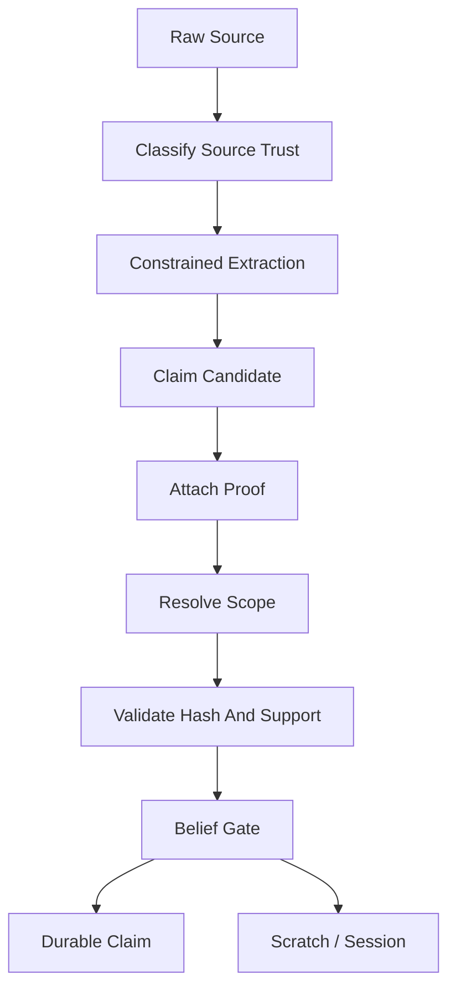

# V1 Trust Model

## Purpose

Define how raw evidence becomes, or does not become, durable truth.

## Required Contents

- source trust classes
- proof requirements
- claim promotion rules
- layer isolation rules
- current-valid preconditions
- forbidden promotions
- required tests

## Readers

Evidence, proof, claim, trust, retrieval, compiler, MCP, and agent implementers.

## Update Triggers

- new source type
- new proof type
- new claim type
- new promotion rule
- source trust classification changes

## Agent Checks

Before editing trust-related code, agents must verify:

- source trust is not durable truth
- proof exists and matches source
- scope is resolved before durable activation
- summaries cannot be proof
- MCP writes cannot promote directly

## Trust Pipeline

