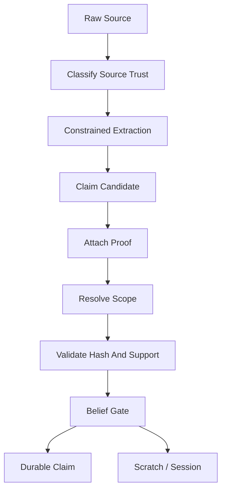

# V1 Trust Model

## Purpose

Define how raw evidence becomes, or does not become, durable truth.

## Source Of Truth

This document implements the trust contract from `docs/v1/SPEC.md`. The spec remains canonical.

## Update Triggers

- new source type
- new proof type
- new claim type
- new promotion rule
- source trust classification changes

## Agent Checks

Before editing trust-related code, agents must verify:

- source trust is not durable truth
- proof exists and matches source
- scope is resolved before durable activation
- summaries cannot be proof
- MCP writes cannot promote directly

## Core Rule

Raw evidence, source trust, model output, command output, and user text are not durable truth by themselves. A durable claim requires:

1. a known source type,
2. a proof with a verifiable hash or directly scoped confirmation,
3. scope resolution,
4. a Trust Kernel belief gate, and
5. persistence through the claim repository in the same transaction as its proof link.

## Canonical Trust Objects

```ts
type SourceType =
  | "repo_file"
  | "project_rule"
  | "config_file"
  | "test_result"
  | "command_result"
  | "user_confirmation"
  | "agent_reported"
  | "model_summarized";

type VerificationStatus =
  | "unverified"
  | "partially_verified"
  | "verified"
  | "stale"
  | "contradicted"
  | "rejected";

type ScopeMatchResult = "match" | "mismatch" | "partial" | "unknown";

interface ProofRef {
  proofId: string;
  sourceId: string;
  sourceType: SourceType;
  sourceHash: string;
  excerptHash?: string;
  scope: {
    branch?: string;
    commit?: string;
    worktreeHash?: string;
    environment?: string;
    featureFlags?: Record<string, string | boolean>;
  };
  observedBy: "grape" | "direct_user_confirmation" | "agent_reported";
  observedAt: string;
}
```

## Source Trust Classes

| Source type | Trust posture | May create durable proof? | Notes |
|---|---|---:|---|
| `repo_file` | Direct repository evidence. | Yes, if file is allowed and hash matches. | A code span proves existence, not behavior/correctness. |
| `project_rule` | Local policy evidence. | Yes, if rule source and hash match. | Rules are pinned when safety-critical. |
| `config_file` | Config evidence. | Yes, if not ignored/private or explicitly approved. | High-risk config requires exact spans. |
| `test_result` | Observed execution evidence. | Yes, only when tied to a Grape-observed run ID. | Agent-reported test results are temporary. |
| `command_result` | Observed execution evidence. | Yes, only when tied to a Grape-observed run ID. | Store command hash, cwd, exit code, stdout/stderr hashes. |
| `user_confirmation` | Direct user decision evidence. | Yes, only with prompt hash, response hash, timestamp, and confirmation channel. | Scoped to the exact prompt and subject. |
| `agent_reported` | Agent-provided statement. | No. | Scratch/session-only unless independently proven. |
| `model_summarized` | Derived language output. | No. | Never proof, never durable truth. |

## Promotion Rules

- No proof means no durable claim.
- Source classification does not promote truth.
- Scope resolution must run before durable activation and current-valid filtering.
- `partially_verified` claims are not current-valid truth by default. They may be returned only as warnings/context when task policy explicitly allows partial context.
- Repository-derived facts may prove textual existence, imports, symbols, or config values. They must not overclaim runtime behavior, correctness, security, or deploy state without execution/user proof.
- Dirty worktree proofs may be worktree-scoped. They must not become branch-global.
- Branch-invalid, stale, contradicted, rejected, ignored, or secret-blocked claims must not be active context.
- MCP write tools can record evidence candidates. They cannot call durable promotion directly.

## Current-Valid Preconditions

A claim is eligible for current-valid retrieval only when:

1. `verificationStatus === "verified"`;
2. scope result is `match`;
3. source hash and proof hash still match current inputs;
4. no active contradiction supersedes it;
5. no ignored/private/secret policy blocks the source;
6. dirty worktree scope matches the current dirty snapshot if the proof came from dirty files.

`ScopeMatchResult` handling:

| Result | Behavior |
|---|---|
| `match` | Eligible for current-valid filtering if all proof gates pass. |
| `partial` | Warning/context only unless task policy explicitly accepts partial context. |
| `unknown` | Warning/context only; high-risk tasks become `unsafe_compile` if required context depends on unknown scope. |
| `mismatch` | Excluded and, if previously sent, emits `INVALIDATE_PREVIOUS`. |

## Trust Pipeline



## Required Tests

- `no_proof_rejects_durable_claim`
- `summary_as_proof_rejected`
- `agent_reported_test_result_remains_temporary`
- `grape_observed_command_result_can_attach_proof`
- `user_confirmation_requires_prompt_and_response_hash`
- `scope_resolution_precedes_current_valid_filter`
- `partially_verified_not_current_valid_by_default`
- `dirty_worktree_claim_not_branch_global`
- `branch_invalid_claim_excluded`
- `repo_file_claim_does_not_overclaim_runtime_behavior`
