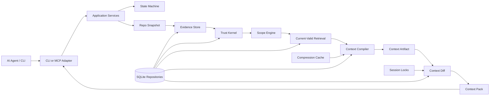
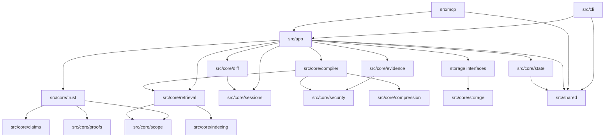

# V1 Architecture

## Purpose

Define the system layers, module boundaries, and dependency direction for Grape V1.

V1 has two cooperating layers (ADR-0010):

1. **Compile layer** — evidence, git snapshot, indexing, trust, compiler, compression → `ContextArtifact`.
2. **Transport layer** — sessions, diff engine → `ContextPack` / `ContextPackItem` ledger.

Adapters (`src/cli/`, `src/mcp/`) expose transport. Most product differentiation lives in `src/core/diff/` and `src/core/sessions/`, not in turning Grape into a standalone graph database.

## Source Of Truth

This document explains how to implement the architecture in `docs/v1/SPEC.md`. If this document and `SPEC.md` disagree, stop and update the docs before coding.

## Update Triggers

- a module is added, renamed, or removed
- orchestration moves between layers
- dependency direction changes
- storage, trust, compiler, compression, diff, MCP, or CLI responsibilities change
- a new cross-cutting policy is introduced

## High-Level Architecture

## Layer Responsibilities

| Layer | Owns | Must not own |
|---|---|---|
| CLI adapter | Argument parsing, terminal output, exit codes, local debug workflows. | Trust decisions, state transitions, storage SQL, compiler policy. |
| MCP adapter | Tool schemas, transport, request/response mapping, contract validation. | Durable truth promotion, direct SQLite writes, secret scanning logic. |
| Application services | End-to-end orchestration, transaction boundaries, state transition calls. | Low-level SQL, proof validation details, compression algorithms. |
| Core state | Explicit state/event definitions and transition validation. | Storage schema, adapter behavior, relevance ranking. |
| Core evidence | Source ingestion, source classification, evidence records. | Claim promotion, current-valid filtering, artifact rendering. |
| Core trust/proofs/claims | Proof validation, claim candidate evaluation, durable claim promotion. | MCP authority, compression, context omission. |
| Core scope/retrieval | Scope matching, current-valid filtering, safe retrieval sets. | Ranking stale facts, source ingestion, artifact rendering. |
| Core compiler | Task policy application, artifact sections, dependency manifests. | Proof promotion, storage SQL, session ledger ownership. |
| Core compression | Deterministic derived cache and invalidation. | Proof generation, claim promotion, authoritative summaries. |
| Core diff/sessions | Session locks, sent-item ledger, omitted-item restore, context pack deltas. | Trust decisions, source classification, compression truth. |
| Core security | Ignore policy, redaction, secret scan contracts, path privacy rules. | Product workflow orchestration. |
| Storage repositories | SQLite access, migrations, transactions, indexes. | Business policy, trust promotion, compiler decisions. |
| Shared | Types, schemas, constants, errors, path utilities. | Behavior that belongs to a domain module. |

## Proposed Source Tree

| Directory | Responsibility | Allowed dependencies | Forbidden dependencies | Related docs |
|---|---|---|---|---|
| `src/cli/` | CLI commands and rendering. | `src/app/`, `src/shared/`. | `src/core/storage/sqlite` internals, trust internals. | `../interfaces/cli.md` |
| `src/mcp/` | MCP server, tool schemas, adapter validation. | `src/app/`, `src/shared/`. | direct storage writes, compiler internals. | `../interfaces/mcp-tools.md` |
| `src/app/` | Use-case orchestration and transaction boundaries. | `src/core/*`, `src/shared/`. | CLI or MCP rendering. | `overview.md`, `state-machine.md` |
| `src/app/local-project/` | Local repository application services for `.grape/`, grouped by setup, context compilation, inspection, omission restore, restricted writes, observation, source excerpts, and public contracts. | `src/core/git/`, `src/core/storage/`, local app services. | CLI rendering, MCP transport, trust promotion internals, compiler policy internals. | `../interfaces/cli.md`, `../core/storage.md`, `../core/security.md` |
| `src/app/benchmark/` | Scripted fixture benchmark orchestration, fixture repo preparation, and benchmark result shaping. | `src/app/local-project/`, Node filesystem/process APIs, shared benchmark types. | CLI rendering, ad hoc baselines, durable truth promotion, compiler policy. | `../quality/benchmarks.md`, `../interfaces/cli.md` |
| `src/core/state/` | State names, events, transition guards. | `src/shared/`. | storage SQL, CLI/MCP. | `state-machine.md` |
| `src/core/evidence/` | Sources, evidence records, source classification. | `state`, `security`, storage interfaces, shared types. | claim promotion. | `../core/trust-model.md` |
| `src/core/trust/` | Belief gates and promotion policy. | `claims`, `proofs`, `scope`, shared types. | compression, CLI/MCP. | `../core/trust-model.md` |
| `src/core/claims/` | Claim types, claim edges, lifecycle. | `proofs`, `scope`, shared types. | adapters. | `../core/trust-model.md` |
| `src/core/proofs/` | Proof validators and proof hash checks. | `evidence`, `security`, shared types. | compression. | `../core/trust-model.md`, `../core/security.md` |
| `src/core/scope/` | Branch/worktree/env/feature scope matching. | `git`, shared types. | ranking and artifact rendering. | `../core/trust-model.md` |
| `src/core/retrieval/` | Current-valid filtering and retrieval assembly. | `claims`, `scope`, `indexing`, shared types. | trust promotion. | `../core/trust-model.md` |
| `src/core/compiler/` | Context artifact assembly and task policies. Public exports stay in `index.ts`; internal ownership is split into `artifact/` for artifact output mapping and guards, `pack/` for context-pack item and budget mapping, and `repository/` for repository-derived compilation with focused ownership folders. | `retrieval`, `compression`, `security`, shared types. | proof validation bypasses, direct SQL. | `../contracts/context-artifact.md` |
| `src/core/compression/` | Compression artifact creation and invalidation. | `security`, storage interfaces, shared types. | trust, proofs, claim promotion. | `../core/compression.md` |
| `src/core/diff/` | Diff states and context pack item generation. | `sessions`, `compiler`, shared types. | retrieval mutation. | `../contracts/context-diff.md` |
| `src/core/sessions/` | Session identity, locks, sent ledgers. | storage interfaces, shared types. | compiler policy. | `../contracts/context-diff.md` |
| `src/core/storage/` | Repositories, migrations, SQLite connection policy. | `src/shared/`. | CLI/MCP, compiler policy, trust decisions. | `../core/storage.md` |
| `src/core/git/` | Git state, branch, commit, dirty tree, ignore inputs. | `security`, shared types. | storage SQL. | `../core/storage.md`, `../core/security.md` |
| `src/core/indexing/` | File/symbol/lexical indexing. | `git`, `security`, storage interfaces. | trust promotion. | `../core/storage.md` |
| `src/core/indexing/languages/` | Language and framework index providers that emit normalized nodes, edges, capabilities, and diagnostics. | indexing types, path/security helpers, parser libraries. | retrieval policy, compiler policy, trust promotion, storage SQL. | `../core/language-indexing.md`, `../core/retrieval.md` |
| `src/core/security/` | Redaction, ignored-file approval, artifact scans. | shared types. | adapter transport. | `../core/security.md` |
| `src/shared/` | Shared types, schemas, errors, constants, path utilities. | none or platform libraries. | domain workflows. | all docs |
| `tests/` | Test helpers and fixtures. | production public APIs. | production import of test helpers. | `../quality/testing.md` |

## Dependency Direction

## Hard Dependency Rules

- CLI and MCP are adapters. They call application services and render results.
- Application services orchestrate workflows and call state transitions explicitly.
- Core trust logic must not import CLI, MCP, compression, benchmark helpers, or test helpers.
- Compression may be read by the compiler but cannot import trust promotion or proof validators in a way that lets summaries become proof.
- Storage repositories expose typed methods. No module outside storage repositories writes SQL directly.
- Storage must not contain business logic. It persists validated objects and returns typed rows.
- Production code must not import from `tests/`, benchmark harnesses, or fixture helpers.
- Shared utilities must stay narrow. If a utility needs domain vocabulary, it belongs in that domain module.
- Shared agent transport contracts may define the stable serialized shapes consumed by both MCP and benchmark code, such as compact `agent_pack` graph cuts and agent Markdown summaries. They must not own repository IO, trust decisions, retrieval policy, or MCP adapter behavior.
- Language and framework providers are extraction adapters inside indexing. They may produce normalized symbols, edges, capability metadata, and diagnostics, but retrieval and compiler policy decide what context is selected and rendered. Provider facts remain orientation and cannot become proof.

`npm run architecture:check` enforces the basic import boundaries from this section. It is intentionally conservative and only checks layer direction. Domain-specific behavior still needs normal review and tests.

## Naming And Simplicity Standards

- Use lowercase kebab-case for docs and fixture names.
- Use PascalCase for TypeScript types, interfaces, classes, schemas, and error classes.
- Use camelCase for functions and fields.
- Use snake_case for state names, event names, database tables, and serialized enum values that are stored or sent across MCP.
- Name state events as `verb_object`, for example `validate_proof` or `compile_context_artifact`.
- Name implementation files and source symbols after their purpose, not their release stage. Avoid release-stage prefixes such as `v1`, `alpha`, or `final` in implementation filenames unless the name is an external protocol, artifact format, or versioned documentation namespace.
- Prefer a functional core and imperative shell. Pure planning, classification, row mapping, projection, and policy functions should accept explicit inputs and return explicit values; adapters and app services should own filesystem, Git, SQLite, clock, process, and transport effects.
- Use composable same-shape transforms only when they make the pipeline clearer. A `CompilePlan -> CompilePlan` or `BenchmarkResult -> BenchmarkResult` transform is acceptable when each step has a named domain purpose; do not force IO-heavy orchestration into fake functional pipelines.
- Keep logging, recovery guidance, and error rendering around core logic rather than embedded inside pure domain functions. Prefer typed domain errors or explicit result objects that CLI/MCP adapters classify at the boundary.
- Name functions as verbs and parameters as nouns where practical. Avoid acronym-heavy names and single-letter domain variables outside tight local callbacks; clarity is more valuable than symbol compression.
- Use guard clauses for invalid or missing inputs, but do not bury domain behavior in nested conditionals. When branching selects policy, transport shape, or recovery behavior, prefer named classifiers, typed result objects, dispatch tables, or small functions with one reason to change.
- Keep modules small enough that a future agent can read the whole module before editing it.
- Do not create generic `utils` folders for domain behavior. Prefer `path-normalization.ts`, `redaction.ts`, or `claim-scope.ts` with a single owner.
- Centralize shared enums and serialized schemas in `src/shared/` only after two domain modules need the same contract.

## Code Modularity Standards

- One file should own one reason to change. If a file starts owning orchestration, persistence mapping, validation, and transport at once, split it.
- Treat 300 lines as a review checkpoint. Treat 500 lines as a split-before-expanding checkpoint unless the file is a generated artifact, SQL migration, fixture, or intentionally flat test data.
- Do not add a second responsibility to a file that is already past the split checkpoint. Split first, then add behavior.
- Keep application services as orchestration. Move record mapping, rendering, serialization, and persistence conversion into named helper modules owned by the same layer.
- Keep storage repositories boring: SQL execution, row mapping, and typed repository methods only. Trust, compiler, and diff policy do not belong in storage.
- Keep core modules independent. A core module should expose explicit functions and records, not hidden singleton state.
- Prefer narrow files such as `durable-context-build.ts` and `durable-context-records.ts` over a single context-build godfile.
- Prefer domain-specific helper names. `storage-row-mappers.ts` is acceptable; `utils.ts`, `helpers.ts`, and `misc.ts` are not.
- Split tests by behavior once one test file mixes unrelated contracts. Behavior tests live in domain folders under `tests/behavior/`; add or extend the folder that owns the contract instead of returning to a flat test layout. A larger test file is acceptable only when it covers one cohesive behavior surface.
- Public exports should flow through the owning folder's `index.ts`; do not deep-import private helper files from unrelated layers.

## Split Triggers

Split a module when any of these happen:

- it has more than one public API family
- it contains both state transition orchestration and low-level record conversion
- it contains SQL for unrelated table families
- it needs comments to explain where new code should be inserted
- a future agent cannot inspect the whole file quickly before editing
- tests for the module need unrelated fixture setup paths

Storage repository ownership is split under `src/core/storage/` by table family. `repositories.ts` keeps shared storage record types and the public aggregate `createStorageRepositories` factory only. Project/repo setup lives in `project/`, session state/events in `session/`, context artifact/dependency persistence in `context-artifact/`, sent/omitted/pack ledger rows in `context-ledger/`, source evidence in `evidence/`, claims in `claims/`, proofs in `proofs/`, compression cache rows in `compression/`, and symbol/lexical indexing in `indexing/`. Future storage table families should follow the same subdirectory ownership pattern instead of expanding the aggregate repository file.

The local project app path is split under `src/app/local-project/` by workflow ownership. `setup/` owns config/layout, migration-backed local storage, Git exclusion, initialization, status, doctor diagnostics, MCP guidance, recovery, manual sync, and scanner diagnostics. `context/` owns local context compilation orchestration, compile IDs/proofs/session mapping, compression orientation, repository-derived artifacts, task retrieval, artifact files, and context-pack summaries. `inspection/` owns read-only app services for artifacts, claims, proofs, rules, sessions, stale invalidations, conflicts, and claim current-valid resolution. `omission/` owns omitted-context listing, restore validation, and omitted artifact loading. `writes/` owns restricted local write validation, candidate recording, and session-context write guards. `observation/` owns Grape-observed and MCP-reported command/test observation types, validation, path normalization, source construction, local runner orchestration, and persistence recording. `source-excerpts/` owns bounded source excerpt reads. `types/` owns local-project public contract families, while root `index.ts`, `types.ts`, and `observations.ts` remain narrow compatibility/export surfaces.

CLI command handlers and MCP tools must keep calling local-project app services instead of taking ownership of filesystem, Git, SQLite, storage transactions, recovery guidance, or diagnostic policy. Local-project implementation files should import through owning folder boundaries unless they are in the same ownership folder.

Observed-run result proof/claim promotion is an application service boundary in `src/app/persist-observed-run-claims.ts`: core proofs/claims own validation and gates, storage repositories persist already-validated rows, and the local runner owns the transaction that keeps source, proof, candidate, claim, and proof link atomic.

The Git snapshot path is split under `src/core/git/` by responsibility: `repo-snapshot.ts` owns Git command orchestration, branch/worktree identity, dirty-path filtering, and snapshot hash construction; `file-manifest.ts` owns file read gates, source-kind classification, source file hashes, and privacy-safe file rejection metadata. Future scanner safety checks belong in `file-manifest.ts` unless they require Git command orchestration.

The indexing path should split language-specific extraction under `src/core/indexing/languages/` before adding broad parser support. The top-level indexing orchestrator owns provider dispatch, safe fallback, and normalized output assembly; provider files own only one language or framework's extraction rules. Monorepo/package boundary detection should live in focused indexing modules, not in retrieval ranking or compiler section builders.

The compiler path is split under `src/core/compiler/` by artifact ownership rather than by generic helper type. `artifact/` owns public artifact shape guards and public artifact builders, `pack/` owns context-pack item mapping, budget evaluation, and optional budget pruning, and `repository/` owns repository-derived artifact compilation. Inside `repository/`, `manifest/` owns dependency manifest construction, `proofs/` owns compiler proof-ref helpers, `validation/` owns artifact and manifest integrity checks, `selection/` owns bounded source/symbol selection, `sections/` owns section assembly plus section-local dependency helpers, `sections/builders/` owns individual section builders, `policy/` owns compiler task/risk policy, `rendering/` owns JSON/render input contracts, and `markdown/` owns agent-facing Markdown rendering for compiled repository context packs. External layers should import through `src/core/compiler/index.ts` unless a same-layer implementation test needs a focused internal function.

The shared agent transport path owns only reusable serialized transport helpers: compact pack projection, the default MCP `agent_pack` graph-cut shape, and compact agent Markdown rendering used by MCP and benchmark output estimation. The graph cut is adjacency over already-compiled context pack items; it is not a durable graph database and must not replace proof-backed exact spans, dependency manifests, or current-valid filtering.

The benchmark path is split under `src/app/benchmark/` so scripted fixture setup and token-reduction result shaping stay outside CLI rendering and outside core compiler policy. Benchmarks must run named fixture workflows and must fail on unsafe omissions or stale sends instead of treating token reduction as sufficient.

## Quality Gate

Any pull request that changes architecture must update this file, `../planning/spec-changelog.md`, and an ADR when the dependency direction, source tree, or ownership model changes.
