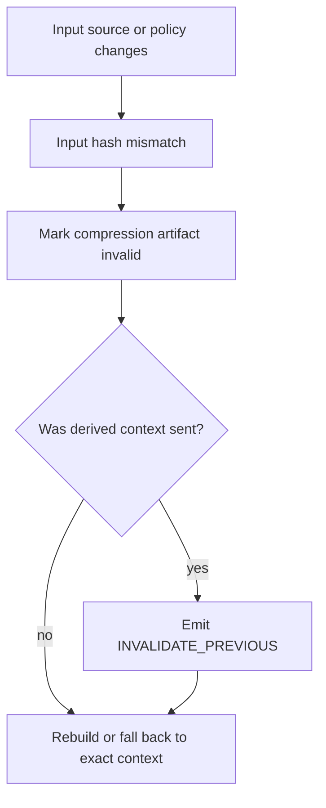

# V1 Compression

## Purpose

Define compression as deterministic derived cache, not truth.

## Source Of Truth

Compression follows the cache-only contract in `docs/v1/SPEC.md`.

## Update Triggers

- compression artifact type changes
- invalidation behavior changes
- compiler policy uses compression differently
- benchmark metrics change

## Agent Checks

Before editing compression code, agents must verify:

- compression artifacts cannot become proofs
- summaries cannot promote claims
- stale compression emits invalidation when previously sent
- high-risk overlays use exact required context

## V1 Rule

V1 compression is deterministic only. Model-written summaries, branch summaries, and session summaries are V1.1+ unless explicitly re-scoped through a spec change.

## Allowed Artifact Types

```ts
type CompressionArtifactType =
  | "symbol_outline"
  | "rule_digest"
  | "context_pack_summary"
  | "decision_digest"
  | "failure_timeline"
  | "module_outline"
  | "test_summary";

type CompressionMethod = "deterministic";

interface CompressionArtifact {
  compressionId: string;
  type: CompressionArtifactType;
  method: CompressionMethod;
  inputRefs: string[];
  inputHashes: string[];
  policyHash: string;
  scopeHash: string;
  outputHash: string;
  createdAt: string;
  invalidatedAt?: string;
  invalidationReason?: string;
}
```

## Invariants

- Compression is cache, not truth.
- Summary is never proof.
- A compression artifact must never appear in a `ProofRef`.
- A compression artifact is invalid unless every input hash still matches.
- `context_pack_summary` is a deterministic ledger of sent item IDs, labels, hashes, states, and timestamps. It is not a freeform summary.
- Active contradictions, stale warnings, missing verification warnings, pinned invariants, and high-risk exact sections are never compressed away.

## High-Risk Rule

If any active `RiskOverlay` is present, compression may provide orientation only. It must not replace exact required code, config, proof, rule, contradiction, invariant, stale-warning, or missing-verification sections.

High-risk overlays:

```text
security
auth
permissions
payments
webhooks
secrets
crypto
migration
production_config
```

## Invalidation Flow



## Compiler And Diff Interaction

- The compiler may read valid compression artifacts for orientation sections.
- The compiler must list used compression artifacts in the artifact dependency manifest.
- The diff engine must invalidate previously sent items if their compression dependency becomes stale.
- Token savings from compression must be measured separately from token savings from diff omission.

## Required Tests

- `compression_artifact_requires_input_hashes`
- `compression_artifact_never_valid_proof`
- `high_risk_overlay_forbids_summary_replacement`
- `context_pack_summary_is_deterministic`
- `stale_compression_emits_invalidated_previous_when_sent`
- `compression_dependency_is_in_artifact_manifest`
