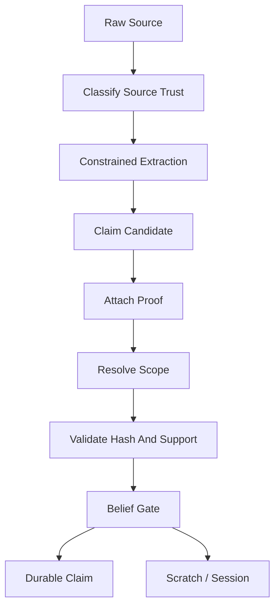

# V1 Trust Model

## Purpose

Define how raw evidence becomes, or does not become, durable truth.

## Source Of Truth

This document implements the trust contract from `docs/v1/SPEC.md`. The spec remains canonical.

## Update Triggers

- new source type
- new proof type
- new claim type
- new promotion rule
- source trust classification changes

## Agent Checks

Before editing trust-related code, agents must verify:

- source trust is not durable truth
- proof exists and matches source
- scope is resolved before durable activation
- summaries cannot be proof
- MCP writes cannot promote directly

## Core Rule

Raw evidence, source trust, model output, command output, and user text are not durable truth by themselves. A durable claim requires:

1. a known source type,
2. a proof with a verifiable hash or directly scoped confirmation,
3. scope resolution,
4. a Trust Kernel belief gate, and
5. persistence through the claim repository in the same transaction as its proof link.

## Canonical Trust Objects

```ts
type SourceType =
  | "repository_file"
  | "git_diff"
  | "test_run"
  | "command_run"
  | "user_message"
  | "tool_call"
  | "runtime_log"
  | "ci_job"
  | "assistant_response"
  | "manual_import"
  | "rule_file"
  | "config_file"
  | "lockfile"
  | "migration_file"
  | "commit_message";

type VerificationStatus =
  | "verified"
  | "partially_verified"
  | "unverified"
  | "refuted"
  | "stale";

type ScopeMatchResult = "match" | "mismatch" | "partial" | "unknown";

interface ProofRef {
  proofId: string;
  sourceId: string;
  sourceType: SourceType;
  sourceHash: string;
  excerptHash?: string;
  scope: {
    branch?: string;
    commit?: string;
    worktreeHash?: string;
    environment?: string;
    featureFlags?: Record<string, string | boolean>;
  };
  observedBy: "grape" | "direct_user_confirmation" | "agent_reported";
  observedAt: string;
}
```

## Source Trust Classes

| Source type | Trust posture | May create durable proof? | Notes |
|---|---|---:|---|
| `repository_file` | Direct repository evidence. | Yes, if file is allowed and hash matches. | A code span proves existence, not behavior/correctness. |
| `rule_file` | Local policy evidence. | Yes, if rule source and hash match. | Rules are pinned when safety-critical. |
| `config_file` | Config evidence. | Yes, if not ignored/private or explicitly approved. | High-risk config requires exact spans. Allowed package manifests may support narrow declaration claims. |
| `test_run` | Observed execution evidence. | Yes, only when tied to a Grape-observed run ID. | Agent-reported test results are temporary. |
| `command_run` | Observed execution evidence. | Yes, only when tied to a Grape-observed run ID. | Store command hash, cwd, exit code, stdout/stderr hashes. |
| `user_message` | Direct user decision evidence. | Yes, only with prompt hash, response hash, timestamp, and confirmation channel. | Scoped to the exact prompt and subject. |
| `assistant_response` | Agent-provided statement. | No. | Scratch/session-only unless independently proven. |
| `manual_import` | User-provided context bundle. | No by default. | Requires independent proof before durable truth. |
| `runtime_log` / `ci_job` | Runtime or CI evidence. | Yes, when locally observed or imported with verifiable hashes. | Scope must include environment. |
| `git_diff` / `commit_message` | VCS evidence. | Partial only unless backed by exact source proof. | Useful for orientation, not behavior proof. |

Current implementation note: repo snapshot source ingestion persists allowed repository files, rule files, config files, lockfiles, and migration files as trusted source records only when they pass Git ignore and local privacy ignore filtering plus scanner size/binary gates. Git-visible ignored paths, privacy-ignored paths, unreadable paths, oversized files, and binary-looking files become `source_rejections` and are not proof material. Ignored untracked paths are skipped rather than enumerated. Allowed dirty snapshot files are scoped from Git porcelain status as `staged`, `unstaged`, or `untracked`; clean tracked files remain `committed`.

The repository artifact compiler now attaches bounded exact source proof refs for selected allowed source records. The local reader verifies the current source bytes still match the stored source hash before creating excerpt hashes and proof refs. When task retrieval selects source refs, exact-source proof creation stays scoped to those selected refs plus pinned rule excerpts instead of backfilling unrelated repository files from the same commit. When retrieval finds no selected refs, Grape may still fall back to bounded generic exact-source excerpts so the artifact remains inspectable. When task retrieval supplies symbol line anchors, exact proof creation can emit up to two non-overlapping windows for the selected source, anchored around those symbols. Query-term windows are used only when no symbol anchors exist for that source, then fall back to the first bounded window. Local compile then validates those proof candidates against trusted, allowed, non-blocked source records and persists accepted rows in `proofs` with `proof_type = "exact_source_excerpt"` and `support_status = "direct"`. Trusted `rule_file` excerpts are also rendered as pinned active-project-rules context.

For package-local source refs under recognized workspace prefixes (`packages/`, `apps/`, `services/`, or `libs/`), source-excerpt, parsed project-rule, and package manifest dependency claim scopes record `packageRoot`. During compile, package root becomes current scope only when explicit file/task/test refs resolve to exactly one such root. This is a package-boundary guard for current-valid retrieval, not proof of package ownership, dependency closure, or package-aware invalidation.

After rule excerpt proof validation, local compile deterministically parses safe rule-file lines into the narrow claim type `project_rule`. Each parsed rule claim is backed by a direct `exact_project_rule_excerpt` proof whose proof hash is the exact parsed rule text hash, while the pinned active-project-rules section continues to render the exact source excerpt. Parsed rule claims are current-valid only when the rule file source hash, proof hash, branch, commit, and worktree scope still match. They do not create generated/candidate rules, infer unstated policy, merge nested scopes, or resolve rule conflicts.

Compile also creates conservative `needs_review` claim edges between parsed `project_rule` claims when deterministic rule text signals opposing instructions over an overlapping topic. These edges are conflict-review metadata, not automatic contradiction proof and not a decision about which rule wins. Manual CLI resolution records a non-conflict edge such as `coexists_with` or `variant_of`; MCP write tools cannot resolve durable conflicts.

Current-valid filtering consumes only explicit active contradiction/supersession edge semantics. An unresolved `contradicts` edge blocks both linked claims, an unresolved `violates` edge blocks the violating source claim, and a `supersedes` edge blocks the superseded target claim only when the linked claims have compatible claim type, subject, and scope. Incompatible supersession edges are surfaced as warnings and do not suppress current-valid context. A later applicable `coexists_with` or `variant_of` resolution edge keeps the pair eligible. A `needs_review` edge remains visible to conflict inspection but does not deactivate either claim by itself.

Claim scope compatibility is resolved through the shared scope module before current-valid activation or claim-edge blocking. Branch and commit are required for current snapshot matches. Dirty or external source scopes require the current worktree hash; missing dirty scope is `unknown`, not a match. Environment scope is a caller-supplied label for compile/current-valid matching, not proof that code ran in that environment; non-`unknown` environment input is recorded on newly persisted source-excerpt and project-rule claims and used to reject mismatched environment claims. Feature flag scope is a caller-supplied current-valid filter only in the current implementation. CLI and MCP callers may provide safe feature flag names and boolean/string values, but those labels are not rendered in public output and are not stamped onto newly persisted durable claims by this slice. Feature-scoped claims require matching current feature flag values; unknown or missing feature-flag scope remains conservative rather than proof of global applicability. Package scope is recorded on newly persisted source-excerpt and project-rule claims when their exact source ref is inside a common workspace root such as `packages/<name>`, `apps/<name>`, `services/<name>`, or `libs/<name>`. Compile derives the current package root only from explicit task/seed source refs, and leaves it unknown for broad or multi-package tasks. Package-scoped claims require a matching current package root; repo/root-scoped claims without a package root remain eligible under branch, commit, worktree, source, and proof checks. This is not manifest-backed package discovery or package-aware invalidation. Session scope is checked when the caller supplies a current session and the claim itself is session-scoped; claims without a `sessionId` remain governed by branch, commit, worktree, source, and any other recorded scope. Broad inspection surfaces may list otherwise-current session-scoped observed-run claims when no current session is supplied, while compile-scoped rendering filters observed-run claims to the active session. Claim-to-claim edge overlap compares branch, commit, environment, feature flags, package/service root, session scope when present, and dirty/worktree scope. Disjoint contradiction/violation edges do not deactivate claims. Unknown contradiction/violation overlap remains blocking and warning-bearing until scope is discovered. Supersession requires compatible scope and exact source-ref replacement; unknown or disjoint scope is warning metadata only.

Claim-edge authority is explicit metadata, not inferred from edge type alone. Each new edge should record who or what created it, a bounded confidence score, a short non-secret reason, and optional hash-only metadata. `deterministic_rule`, `model_suggestion`, and `review_metadata` authority are review/orientation signals only and cannot create blocking `contradicts`, `violates`, or `supersedes` behavior by themselves. `user_confirmation`, `test_verification`, `grape_observed`, and `trusted_import` are eligible blocking authorities when the edge type, proof policy, and scope compatibility also allow blocking. Legacy edges without recorded authority are treated conservatively: legacy `contradicts` and `violates` remain blocking with warnings because conflict uncertainty must not be rendered as active truth, while legacy `supersedes` and legacy resolution edges do not suppress context because hiding context requires explicit authority. MCP write tools cannot mint blocking durable edge authority. Local CLI conflict resolution records `user_confirmation` authority and does not refute, merge, or promote either claim.

Path-like MCP `tests` seed refs and import-related test refs can select allowed test files for exact source excerpts. That proof still means only that the excerpt exists in the current source input. A test file excerpt is not proof that the test was run, that the behavior passed, or that the implementation is correct. Runtime test claims still require a trusted test-run proof.

After proof validation, local compile creates claim candidates for the narrow claim type `repository_source_excerpt_exists`. The belief gate accepts only direct exact-source proofs from trusted allowed source/config/lockfile/migration/rule records, then persists verified durable claims and links the proof row to the claim. Context artifacts render only the current-valid source-excerpt claims whose source refs match the task-selected refs when retrieval has selected refs; `grape claims --active` and `grape_get_claims` remain broader inspection surfaces over all current-valid claims. These claims prove only that a selected exact excerpt exists in the current scoped source input. They do not prove runtime behavior, correctness, root cause, deployment state, or broad architecture conclusions.

Local compile may also create the narrow claim type `repository_symbol_declaration_exists` for high-confidence TypeScript/JavaScript AST declarations whose source file already has an accepted exact source excerpt window covering the declaration. The proof type is `provider_symbol_declaration`, uses direct support, and stores the deterministic declaration body hash in the existing proof hash column. The claim scope records the source ref/hash, declaration lines, symbol kind/name, symbol id, and signature/body hashes. This claim proves only that the parser-backed declaration span exists in the current scoped source input. It does not prove imports, exports, call graph completeness, runtime behavior, correctness, root cause, API ownership, or architecture conclusions. Regex fallback symbols, unsupported-language symbols, module/file nodes, unresolved imports, and graph-expanded candidates cannot satisfy this policy.

Local compile may also create the narrow claim type `package_manifest_dependency_exists` for supported npm `package.json` dependency entries. The proof type is `package_manifest_dependency_entry`, uses direct support, and stores the exact manifest-entry hash in the existing proof hash column. The claim scope records branch, commit, worktree hash, manifest source ref/source ID/source hash, line span, manifest kind, dependency section, dependency name, package root ref, provider ID/capability codes, and a hash of the dependency specifier. Public claim text uses only the form `Manifest declares dependency <dependency-name>.` This claim proves only that the allowed package manifest declares that dependency entry in the current scoped source input. It does not prove the package is installed, used, required by runtime, safe, valid, resolved by a lockfile, or correctly configured. Other manifest formats and import-derived dependency claims remain disabled until separate proof policies and fixtures exist.

Grape-observed command/test runs can create the narrow claim type `grape_observed_run_result`. The proof type is `grape_observed_run_result`, uses direct support, and stores the observed-run result hash in the existing proof hash column. The result hash is derived only from scoped metadata: observed run ID, command hash, cwd, exit code, stdout/stderr hashes, timestamps, branch, commit, worktree hash, snapshot/session IDs, test pass/framework labels, and explicit safe test file refs when present. It never includes raw command, stdout, or stderr bodies. This claim proves only that local Grape observed that run result. It does not prove the implementation is correct, that a root cause was fixed, or that product behavior is globally true. When a compile artifact has selected task source refs, current-session observed test-run claims render only if their explicit `testFiles` metadata intersects those refs; broad or unrelated observed runs remain available through inspection surfaces.

Failed Grape-observed test runs may also create the narrow claim type `observed_test_failure_span_link`. The proof type is `observed_test_failure_relation`, uses direct support, and stores a deterministic relation hash in the existing proof hash column. The claim scope records observed command metadata, stdout/stderr/failure-output hashes, explicit safe `testFiles` when present, linked candidate test/source span proof refs, and separate evidence slots for import edges, filename convention, package boundary, and manifest package-root metadata when available. Missing evidence is recorded as conservative warnings inside each candidate link. Grape parses failure output only ephemerally during `grape test`; raw stdout/stderr bodies are never persisted. Public claim text uses only the form `This test was observed failing and is linked to these candidate source/test spans.` plus an explicit no-causality/no-fix-proof disclaimer. This claim proves only that Grape observed a failed test run and linked available evidence to candidate spans. It does not prove the code is wrong, caused the failure, or that any fix is valid.

## Durable Claim Policy Registry

The Trust Kernel must enforce durable claim policy as data, not only as prose.
Each enabled claim type needs a policy entry that names accepted proof types,
accepted source types, required support status, required observer, scope
requirements, and forbidden interpretations. Unknown claim types are rejected by
default.

Current enabled durable claim policies:

| Claim type | Accepted proof type | Accepted source type | Required support | Required observer | May prove | Must reject as overclaim |
|---|---|---|---|---|---|---|
| `repository_source_excerpt_exists` | `exact_source_excerpt` | trusted allowed source/config/lockfile/migration/rule record | `direct` | local source reader | exact excerpt existence in the current scoped source input | behavior, correctness, root cause, deploy state, architecture conclusions |
| `project_rule` | `exact_project_rule_excerpt` | trusted allowed `rule_file` record | `direct` | local source reader | exact parsed rule text exists in the scoped rule file | generated policy, unstated implications, precedence, conflict resolution |
| `repository_symbol_declaration_exists` | `provider_symbol_declaration` | trusted allowed repository source file with high-confidence AST symbol metadata | `direct` | local source reader | parser-backed declaration span exists in the current scoped source input | imports, exports, call graph completeness, behavior, correctness, root cause, ownership, architecture conclusions |
| `package_manifest_dependency_exists` | `package_manifest_dependency_entry` | trusted allowed npm `package.json` source stored as `config_file` with package source metadata | `direct` | local source reader | manifest declares one dependency entry in the current scoped source input | installed package, imported/used package, runtime requirement, safety, validity, lockfile resolution, correct configuration |
| `grape_observed_run_result` | `grape_observed_run_result` | trusted Grape-observed `command_run` or `test_run` record | `direct` | `grape` | one scoped observed command/test result happened | correctness, root cause, fix success, production behavior, broader runtime truth |
| `observed_test_failure_span_link` | `observed_test_failure_relation` | trusted Grape-observed failed `test_run` record | `direct` | `grape` | failed test run linked to candidate test/source spans from available evidence | code wrong, caused failure, root cause, fix success, correctness, production behavior |

Future policy entries for import/export, AST edge, decision, runtime, CI, bug,
or fix claims must be added with fixtures and current-valid tests before
promotion code can persist them. Semantic candidates, graph expansion,
compression artifacts, summaries, assistant text, and agent-reported runs cannot
satisfy a durable policy entry unless a separate trusted proof validates the
same claim.

Semantic candidates are advisory ranking signals only. They may appear in task
retrieval artifact sections with explicit non-authoritative wording, may reorder
compiler preference refs, and are rejected at the durable claim policy layer when
used as `proofSignalKind = semantic_candidate`. They do not prove correctness,
root cause, fix validity, benchmark savings, or agent enforcement.

## Trust Wording Guardrails

Grape must use conservative, evidence-based wording in generated claim text,
artifact sections, CLI/MCP inspection output, compression orientation, status
messages, and benchmark reports. Wording guardrails do not weaken proof-backed
claims; they prevent agents and reviewers from treating narrow evidence as root
cause, correctness proof, fix validity, semantic authority, benchmark savings,
or guaranteed background enforcement.

Allowed wording examples:

- `possible cause`
- `candidate source span`
- `candidate test span`
- `observed failure relation`
- `evidence suggests`
- `linked candidate span`
- `needs verification`
- `not proven`
- `not guaranteed`
- `non-authoritative candidate`
- `requires supporting evidence`
- `proof_policy_accepted` (inspection gloss for `verificationStatus = verified`)

Forbidden wording examples in generated or agent-submitted claim text:

- `this is correct`
- `this definitely caused the bug`
- `this code is wrong`
- `this fix is proven correct`
- `guaranteed root cause`
- `proven fix`
- `root cause confirmed`
- `Grape guarantees every agent uses this context`
- `benchmark-proven savings`
- `semantic result is proof`

Current implementation:

- `src/shared/trust-wording.ts` centralizes forbidden phrase detection and
  shared disclaimer strings.
- Durable claim generators append narrow negative disclaimers for observed runs,
  manifest dependencies, symbol declarations, source excerpts, and repository
  rules. Observed failure span links keep explicit no-causality wording.
- Context artifact active-claim sections render as
  `Scoped Proof-Backed Claims (Current-Valid)` with a scope footer.
- MCP `grape_record_candidate` rejects forbidden trust wording before persisting
  non-durable candidate text.
- CLI `grape claims` labels `verified` as `proof_policy_accepted (verified)`.
- Status `fresh` is advisory and does not claim guaranteed agent enforcement.
- Benchmark and token-metric output labels reductions as fixture estimates, not
  production savings guarantees.

Evidence vs proof vs candidate relation:

- **Evidence** is raw or hashed observation material (source rows, run metadata).
- **Proof** is a validated, hash-backed support row under a narrow proof policy.
- **Claim** is a durable statement allowed only when proof policy accepts a
  narrow meaning for the current scope.
- **Candidate relation** (for example `observed_test_failure_span_link`) links
  available evidence to spans without proving causality or fix validity.

## Promotion Rules

- No proof means no durable claim.
- Source classification does not promote truth.
- Scope resolution must run before durable activation and current-valid filtering.
- `partially_verified` claims are not current-valid truth by default. They may be returned only as warnings/context when task policy explicitly allows partial context.
- Repository-derived facts may prove textual existence, manifest declarations, symbols, or config values. They must not overclaim install state, usage, runtime behavior, correctness, security, or deploy state without execution/user proof.
- Dirty worktree proofs may be worktree-scoped. They must not become branch-global.
- Branch-invalid, stale, contradicted, rejected, ignored, or secret-blocked claims must not be active context.
- MCP write tools can record evidence candidates. They cannot call durable promotion directly.

Current implementation note: MCP `grape_record_command_result` and `grape_record_test_result` persist agent-reported command/test observations as temporary `sources` rows only. `grape_record_candidate` creates a temporary `assistant_response` source when needed and links it to a non-durable `claim_candidates` row. `grape_record_user_decision` persists direct-confirmation metadata as a temporary redacted `user_message` source. `grape_request_user_confirmation` returns a non-durable confirmation request ID and does not persist truth. These tools require an existing current context session, reject agent-minted Grape-observed authority, store hashes/scoped metadata, and intentionally do not persist raw command/stdout/stderr/prompt/response bodies or create proof/claim rows.

The local CLI runner commands `grape run --session <id> -- <cmd...>` and `grape test --session <id> -- <cmd...>` are the current Grape-observed command/test path. They execute the command from the repository root, create a Grape `observedRunId`, and persist trusted redacted `command_run` / `test_run` source rows with `observedBy = "grape"` and `observedByGrape = true`. In the same storage transaction, they validate the source metadata, persist a direct `grape_observed_run_result` proof row, create a claim candidate, persist a verified `grape_observed_run_result` claim, and link the proof to the claim. These rows store command/stdout/stderr hashes, exit code, cwd, timestamps, branch, commit, worktree hash, and session scope. They do not persist raw command or output bodies, and they do not promote broader behavior, correctness, root-cause, rule, or conflict claims.

## Current-Valid Preconditions

A claim is eligible for current-valid retrieval only when:

1. `verificationStatus === "verified"`;
2. shared scope result is `match`;
3. source hash and proof hash still match current inputs;
4. no active contradiction, violation, or supersession edge with eligible authority blocks it;
5. no ignored/private/secret policy blocks the source;
6. dirty worktree scope matches the current dirty snapshot if the proof came from dirty files.

`ScopeMatchResult` handling:

| Result | Behavior |
|---|---|
| `match` | Eligible for current-valid filtering if all proof gates pass. |
| `partial` | Warning/context only unless task policy explicitly accepts partial context. |
| `unknown` | Warning/context only; high-risk tasks become `unsafe_compile` if required context depends on unknown scope. |
| `mismatch` | Excluded and, if previously sent, emits `INVALIDATE_PREVIOUS`. |

## Trust Pipeline



## Required Tests

- `no_proof_rejects_durable_claim`
- `summary_as_proof_rejected`
- `agent_reported_test_result_remains_temporary`
- `grape_observed_command_result_can_attach_proof`
- `user_confirmation_requires_prompt_and_response_hash`
- `scope_resolution_precedes_current_valid_filter`
- `partially_verified_not_current_valid_by_default`
- `dirty_worktree_claim_not_branch_global`
- `branch_invalid_claim_excluded`
- `current_session_does_not_reject_branch_scoped_claims_without_session_scope`
- `current_valid_resolution_rejects_claims_scoped_to_another_current_session`
- `current_valid_resolution_rejects_claims_scoped_to_another_current_environment`
- `current_valid_resolution_rejects_claims_scoped_to_another_current_package_root`
- `claim_edge_authority_required_for_blocking_supersession`
- `legacy_contradiction_edge_blocks_with_warning`
- `review_metadata_edge_cannot_block_current_valid_claim`
- `manual_resolution_edge_requires_user_confirmation_authority`
- `repository_file_claim_does_not_overclaim_runtime_behavior`
- `manifest_dependency_claim_proves_manifest_declaration_only`
- `package_manifest_dependency_claim_requires_current_manifest_hash_and_scope`
