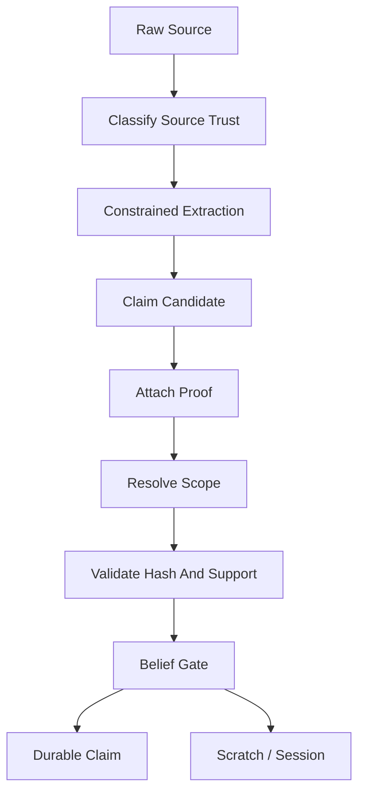

# V1 Trust Model

## Purpose

Define how raw evidence becomes, or does not become, durable truth.

## Source Of Truth

This document implements the trust contract from `docs/v1/SPEC.md`. The spec remains canonical.

## Update Triggers

- new source type
- new proof type
- new claim type
- new promotion rule
- source trust classification changes

## Agent Checks

Before editing trust-related code, agents must verify:

- source trust is not durable truth
- proof exists and matches source
- scope is resolved before durable activation
- summaries cannot be proof
- MCP writes cannot promote directly

## Core Rule

Raw evidence, source trust, model output, command output, and user text are not durable truth by themselves. A durable claim requires:

1. a known source type,
2. a proof with a verifiable hash or directly scoped confirmation,
3. scope resolution,
4. a Trust Kernel belief gate, and
5. persistence through the claim repository in the same transaction as its proof link.

## Canonical Trust Objects

```ts
type SourceType =
  | "repository_file"
  | "git_diff"
  | "test_run"
  | "command_run"
  | "user_message"
  | "tool_call"
  | "runtime_log"
  | "ci_job"
  | "assistant_response"
  | "manual_import"
  | "rule_file"
  | "config_file"
  | "lockfile"
  | "migration_file"
  | "commit_message";

type VerificationStatus =
  | "verified"
  | "partially_verified"
  | "unverified"
  | "refuted"
  | "stale";

type ScopeMatchResult = "match" | "mismatch" | "partial" | "unknown";

interface ProofRef {
  proofId: string;
  sourceId: string;
  sourceType: SourceType;
  sourceHash: string;
  excerptHash?: string;
  scope: {
    branch?: string;
    commit?: string;
    worktreeHash?: string;
    environment?: string;
    featureFlags?: Record<string, string | boolean>;
  };
  observedBy: "grape" | "direct_user_confirmation" | "agent_reported";
  observedAt: string;
}
```

## Source Trust Classes

| Source type | Trust posture | May create durable proof? | Notes |
|---|---|---:|---|
| `repository_file` | Direct repository evidence. | Yes, if file is allowed and hash matches. | A code span proves existence, not behavior/correctness. |
| `rule_file` | Local policy evidence. | Yes, if rule source and hash match. | Rules are pinned when safety-critical. |
| `config_file` | Config evidence. | Yes, if not ignored/private or explicitly approved. | High-risk config requires exact spans. |
| `test_run` | Observed execution evidence. | Yes, only when tied to a Grape-observed run ID. | Agent-reported test results are temporary. |
| `command_run` | Observed execution evidence. | Yes, only when tied to a Grape-observed run ID. | Store command hash, cwd, exit code, stdout/stderr hashes. |
| `user_message` | Direct user decision evidence. | Yes, only with prompt hash, response hash, timestamp, and confirmation channel. | Scoped to the exact prompt and subject. |
| `assistant_response` | Agent-provided statement. | No. | Scratch/session-only unless independently proven. |
| `manual_import` | User-provided context bundle. | No by default. | Requires independent proof before durable truth. |
| `runtime_log` / `ci_job` | Runtime or CI evidence. | Yes, when locally observed or imported with verifiable hashes. | Scope must include environment. |
| `git_diff` / `commit_message` | VCS evidence. | Partial only unless backed by exact source proof. | Useful for orientation, not behavior proof. |

Current implementation note: repo snapshot source ingestion persists allowed repository files, rule files, config files, lockfiles, and migration files as trusted source records only when they pass Git ignore and local privacy ignore filtering plus scanner size/binary gates. Git-visible ignored paths, privacy-ignored paths, unreadable paths, oversized files, and binary-looking files become `source_rejections` and are not proof material. Ignored untracked paths are skipped rather than enumerated. Allowed dirty snapshot files are scoped from Git porcelain status as `staged`, `unstaged`, or `untracked`; clean tracked files remain `committed`.

The repository-derived scaffold compiler now attaches bounded exact source proof refs for selected allowed source records. The local reader verifies the current source bytes still match the stored source hash before creating excerpt hashes and proof refs. When task retrieval selects source refs, exact-source proof creation stays scoped to those selected refs plus pinned rule excerpts instead of backfilling unrelated repository files from the same commit. When retrieval finds no selected refs, Grape may still fall back to bounded generic exact-source excerpts so the artifact remains inspectable. When task retrieval supplies symbol line anchors, exact proof creation can emit up to two non-overlapping windows for the selected source, anchored around those symbols. Query-term windows are used only when no symbol anchors exist for that source, then fall back to the first bounded window. Local compile then validates those proof candidates against trusted, allowed, non-blocked source records and persists accepted rows in `proofs` with `proof_type = "exact_source_excerpt"` and `support_status = "direct"`. Trusted `rule_file` excerpts are also rendered as pinned active-project-rules context.

After rule excerpt proof validation, local compile deterministically parses safe rule-file lines into the narrow claim type `project_rule`. Each parsed rule claim is backed by a direct `exact_project_rule_excerpt` proof whose proof hash is the exact parsed rule text hash, while the pinned active-project-rules section continues to render the exact source excerpt. Parsed rule claims are current-valid only when the rule file source hash, proof hash, branch, commit, and worktree scope still match. They do not create generated/candidate rules, infer unstated policy, merge nested scopes, or resolve rule conflicts.

Compile also creates conservative `needs_review` claim edges between parsed `project_rule` claims when deterministic rule text signals opposing instructions over an overlapping topic. These edges are conflict-review metadata, not automatic contradiction proof and not a decision about which rule wins. Manual CLI resolution records a non-conflict edge such as `coexists_with` or `variant_of`; MCP write tools cannot resolve durable conflicts.

Current-valid filtering consumes only explicit active contradiction/supersession edge semantics. An unresolved `contradicts` edge blocks both linked claims, an unresolved `violates` edge blocks the violating source claim, and a `supersedes` edge blocks the superseded target claim only when the linked claims have compatible claim type, subject, and scope. Incompatible supersession edges are surfaced as warnings and do not suppress current-valid context. A later applicable `coexists_with` or `variant_of` resolution edge keeps the pair eligible. A `needs_review` edge remains visible to conflict inspection but does not deactivate either claim by itself.

Path-like MCP `tests` seed refs and import-related test refs can select allowed test files for exact source excerpts. That proof still means only that the excerpt exists in the current source input. A test file excerpt is not proof that the test was run, that the behavior passed, or that the implementation is correct. Runtime test claims still require a trusted test-run proof.

After proof validation, local compile creates claim candidates for the narrow claim type `repository_source_excerpt_exists`. The belief gate accepts only direct exact-source proofs from trusted allowed source/config/lockfile/migration/rule records, then persists verified durable claims and links the proof row to the claim. Context artifacts render only the current-valid source-excerpt claims whose source refs match the task-selected refs when retrieval has selected refs; `grape claims --active` and `grape_get_claims` remain broader inspection surfaces over all current-valid claims. These claims prove only that a selected exact excerpt exists in the current scoped source input. They do not prove runtime behavior, correctness, root cause, deployment state, or broad architecture conclusions.

Grape-observed command/test runs can create the narrow claim type `grape_observed_run_result`. The proof type is `grape_observed_run_result`, uses direct support, and stores the observed-run result hash in the existing proof hash column. The result hash is derived only from scoped metadata: observed run ID, command hash, cwd, exit code, stdout/stderr hashes, timestamps, branch, commit, worktree hash, snapshot/session IDs, and test pass/framework labels when present. It never includes raw command, stdout, or stderr bodies. This claim proves only that local Grape observed that run result. It does not prove the implementation is correct, that a root cause was fixed, or that product behavior is globally true.

## Durable Claim Policy Registry

The Trust Kernel must enforce durable claim policy as data, not only as prose.
Each enabled claim type needs a policy entry that names accepted proof types,
accepted source types, required support status, required observer, scope
requirements, and forbidden interpretations. Unknown claim types are rejected by
default.

Current enabled durable claim policies:

| Claim type | Accepted proof type | Accepted source type | Required support | Required observer | May prove | Must reject as overclaim |
|---|---|---|---|---|---|---|
| `repository_source_excerpt_exists` | `exact_source_excerpt` | trusted allowed source/config/lockfile/migration/rule record | `direct` | local source reader | exact excerpt existence in the current scoped source input | behavior, correctness, root cause, deploy state, architecture conclusions |
| `project_rule` | `exact_project_rule_excerpt` | trusted allowed `rule_file` record | `direct` | local source reader | exact parsed rule text exists in the scoped rule file | generated policy, unstated implications, precedence, conflict resolution |
| `grape_observed_run_result` | `grape_observed_run_result` | trusted Grape-observed `command_run` or `test_run` record | `direct` | `grape` | one scoped observed command/test result happened | correctness, root cause, fix success, production behavior, broader runtime truth |

Future policy entries for provider-backed symbol, import/export, AST edge,
decision, runtime, CI, bug, or fix claims must be added with fixtures and
current-valid tests before promotion code can persist them. Semantic candidates,
graph expansion, compression artifacts, summaries, assistant text, and
agent-reported runs cannot satisfy a durable policy entry unless a separate
trusted proof validates the same claim.

## Promotion Rules

- No proof means no durable claim.
- Source classification does not promote truth.
- Scope resolution must run before durable activation and current-valid filtering.
- `partially_verified` claims are not current-valid truth by default. They may be returned only as warnings/context when task policy explicitly allows partial context.
- Repository-derived facts may prove textual existence, imports, symbols, or config values. They must not overclaim runtime behavior, correctness, security, or deploy state without execution/user proof.
- Dirty worktree proofs may be worktree-scoped. They must not become branch-global.
- Branch-invalid, stale, contradicted, rejected, ignored, or secret-blocked claims must not be active context.
- MCP write tools can record evidence candidates. They cannot call durable promotion directly.

Current implementation note: MCP `grape_record_command_result` and `grape_record_test_result` persist agent-reported command/test observations as temporary `sources` rows only. `grape_record_candidate` creates a temporary `assistant_response` source when needed and links it to a non-durable `claim_candidates` row. `grape_record_user_decision` persists direct-confirmation metadata as a temporary redacted `user_message` source. `grape_request_user_confirmation` returns a non-durable confirmation request ID and does not persist truth. These tools require an existing current context session, reject agent-minted Grape-observed authority, store hashes/scoped metadata, and intentionally do not persist raw command/stdout/stderr/prompt/response bodies or create proof/claim rows.

The local CLI runner commands `grape run --session <id> -- <cmd...>` and `grape test --session <id> -- <cmd...>` are the current Grape-observed command/test path. They execute the command from the repository root, create a Grape `observedRunId`, and persist trusted redacted `command_run` / `test_run` source rows with `observedBy = "grape"` and `observedByGrape = true`. In the same storage transaction, they validate the source metadata, persist a direct `grape_observed_run_result` proof row, create a claim candidate, persist a verified `grape_observed_run_result` claim, and link the proof to the claim. These rows store command/stdout/stderr hashes, exit code, cwd, timestamps, branch, commit, worktree hash, and session scope. They do not persist raw command or output bodies, and they do not promote broader behavior, correctness, root-cause, rule, or conflict claims.

## Current-Valid Preconditions

A claim is eligible for current-valid retrieval only when:

1. `verificationStatus === "verified"`;
2. scope result is `match`;
3. source hash and proof hash still match current inputs;
4. no active contradiction, violation, or supersession edge blocks it;
5. no ignored/private/secret policy blocks the source;
6. dirty worktree scope matches the current dirty snapshot if the proof came from dirty files.

`ScopeMatchResult` handling:

| Result | Behavior |
|---|---|
| `match` | Eligible for current-valid filtering if all proof gates pass. |
| `partial` | Warning/context only unless task policy explicitly accepts partial context. |
| `unknown` | Warning/context only; high-risk tasks become `unsafe_compile` if required context depends on unknown scope. |
| `mismatch` | Excluded and, if previously sent, emits `INVALIDATE_PREVIOUS`. |

## Trust Pipeline



## Required Tests

- `no_proof_rejects_durable_claim`
- `summary_as_proof_rejected`
- `agent_reported_test_result_remains_temporary`
- `grape_observed_command_result_can_attach_proof`
- `user_confirmation_requires_prompt_and_response_hash`
- `scope_resolution_precedes_current_valid_filter`
- `partially_verified_not_current_valid_by_default`
- `dirty_worktree_claim_not_branch_global`
- `branch_invalid_claim_excluded`
- `repository_file_claim_does_not_overclaim_runtime_behavior`
